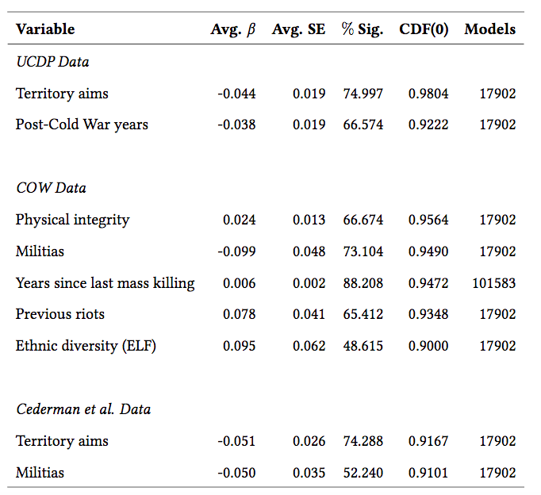
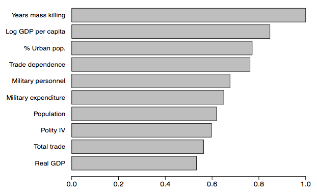
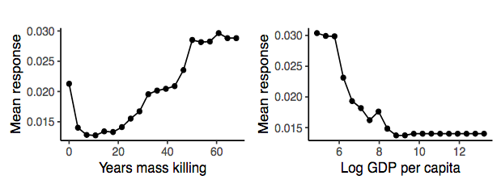
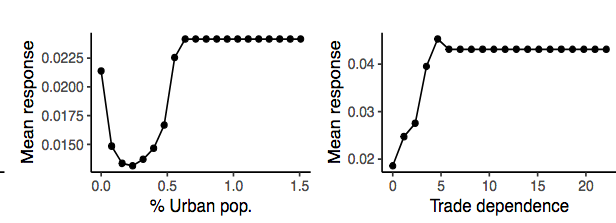
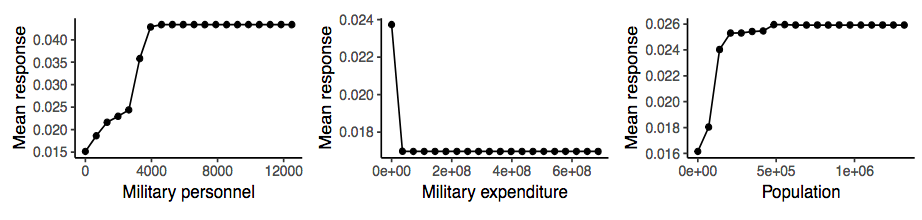
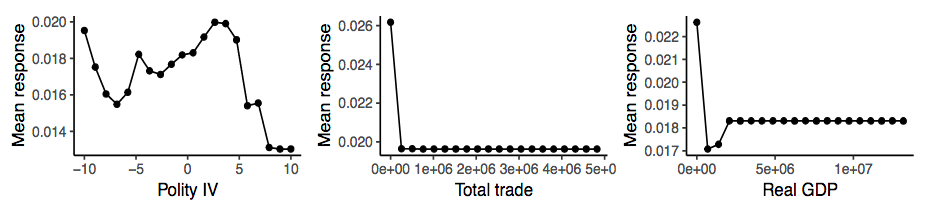
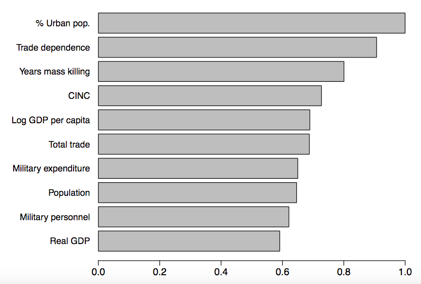
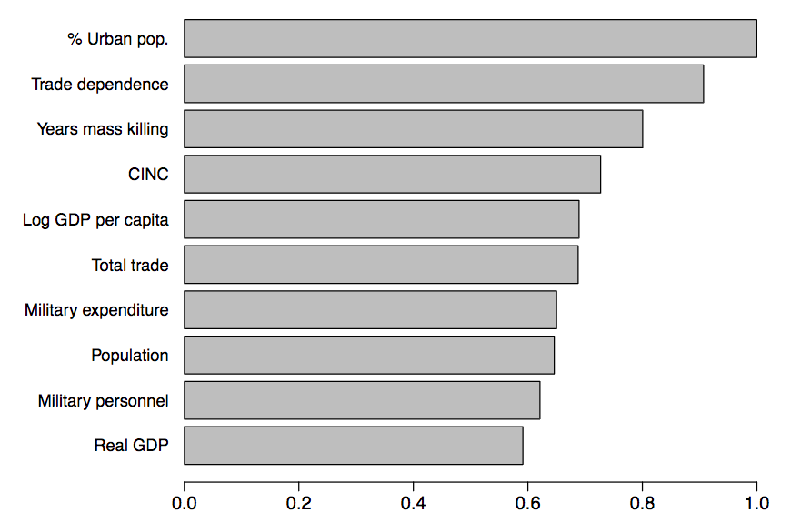
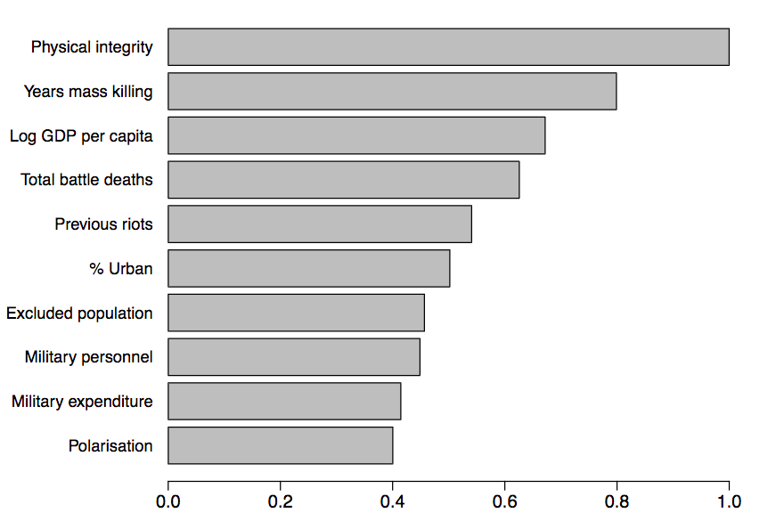

class: inverse, center, middle

# Motivation

<html>

</html> 
---

class: clear

background-image: url(cambodia.jpg)
---

class: clear

background-image: url(rwanda.jpg)
---
class: clear

.center[]
---

class: clear

background-image: url(un.png)
---

class: clear

background-image: url(syria.jpg)
---

# What we know about genocides

.font150[
* Government atrocity follows an opportunity logic

* As threat increases, so does the likelihood of genocide

* Mass killings are associated with other types of large-scale violence

* Genocides during wartime and peacetime have different dynamics
]

---

# What we do not know

.font140[
* Long-term factors that influence the level of threat leaders

* Variables that directly trigger mass killings

* Generalisations: 
  - Qualitative work may not generalise well
  - In-sample quantitative methods are _also_ prone to overfitting

* Effect sizes: marginal effects can be calculated even when the true effect is virtually zero
]
---

# Our study

.font140[
* _Out-of-sample predictions_
]
--
.font140[
* Goals: 
  - Produce accurate out-of-sample predictions of mass killings
  - Use prediction heuristics to test existing theories 
  - Reduce model heterogeneity
]
--
.font140[
* Findings:
  - Predict 80-85% of the cases correctly
  - Statistically significant variables have little predictive power
  - Different set of variables predict genocides in wartime and peacetime
  - Results strongly dataset-dependent
]
---

class: inverse, center, middle

# Research Design

<html>

</html> 
---

# Research design

.font130[
* All articles on genocide published in the last 20 years

* Included all variables that appear in at least two papers

* 30 concepts divided into 5 groups:
  - Welfare and the economy
  - Political regimes
  - Ethnic/social composition
  - Security forces
  - Violence indicators

* 40 variables, sample of 177 countries, from 1945 to 2013

* Extreme Bounds Analysis and Distributed Random Forests
]
---

# Baseline: Extreme bounds analysis

.font130[
* Estimates the distribution of coefficients of each predictor in an exhaustive combination of regression models

* Dependent variable: 
  - Mass killing onset

* Three base variables:
  - Log GDP per capita
  - Polity IV
  - Years since last mass killing
  
* About 3 million models

* AUC: 0.50-0.55
]
---

# EBA: Main results

.center[]
---

# EBA: Genocides during civil wars

.center[]
---

# Robusteness tests

.font150[
* Linear probability models, logit, probit

* Bayesian priors to address complete separation

* Variance inflation factors

* Number of base variables
]
--
.font150[
* _Virtually identical results_
]
---

# Decision trees and random forests

.font150[
* Machine learning algorithm, collection of decision trees

* Looks for the vector of covariates that splits a binary variable into two increasingly homogeneous parts

* Many useful properties: 
  - Non-parametric
  - Detects interactions without pre-specification
  - Robust to outliers
  - Internally unbiased
  - Handles large dimensions and many predictors
]
---

# Hyperparameters

.font130[
* Tuning hyperparameters:
  - Number of trees
  - Depth of each tree
  - Number of variables 
  - Balacing the classes the dependent variable
  
* Fully automated approach: grid search

* Three stages:
  - Start with a random combination of predictors
  - Fit random forest model using one set of hyperparameters
  - Repeat
  - Stop if the last 5 models do not increase predictive power
]
---

# Random forests: Main results

.center[]
---

# Random forests: Main results

.center[]

.center[]

---

# Random forests: Main results

.center[]

.center[]
---

# Findings

.font150[
* Only GDP per capita and Polity IV appear in EBA and RF

* Variables related to the military forces are important, yet they are understudied in the literature

* Variables that are _not_ strong predictors
  - Ethnic polarisation
  - Civil war indicators
  - Economic inequality
  - Economic shocks
  - Power-sharing agreements
]

---
# Wartime genocides (UCDP data)

.center[]
---

# Wartime genocides (COW data)

.center[]
---

# Wartime genocides (Cederman et al)

.center[]
---

# Findings

.font150[
* EBA shows that wartime genocide is different from peacetime genocide

* RF suggest roughly the same variables consistently predict both wartime and peacetime genocides

* Indicators on ethnicity, social composition, economic inequality, power-sharing regimes, economic shocks, again are not strong predictors of wartime genocide
]
---

class: inverse, center, middle

# Discussion

<html>

</html> 
---

# Discussion

.font150[
* We are unable to make specific statements about genocides

* Prediction results support only broad generalisations

* Lack of predictive power puts into question the validity of existing the theories

* Statistical significance is a potentially misleading indicator of variable relevance

* Previous results might be due to overfitting
]
---

# Next steps

.font150[
* Expand the models and use near real-time data (stock fluctuations, Google search data)

* Add survey data to the estimations

* Measure which factors predict large increases/decreases in genocide risk
]

---
class: inverse, center, middle

# Thank You!

<html>

</html> 
---

# Thank You!

.font150[
* Paper: [`https://osf.io/9rzgt`](https://osf.io/9rzgt/)

* Replication materials: [`http://github.com/danilofreire/mass-killings`](http://github.com/danilofreire/mass-killings)

* Email: [`danilo_freire@brown.edu`](mailto:danilo_freire@brown.edu)

* Personal website: [`http://danilofreire.github.io`](http://danilofreire.github.io)
] 