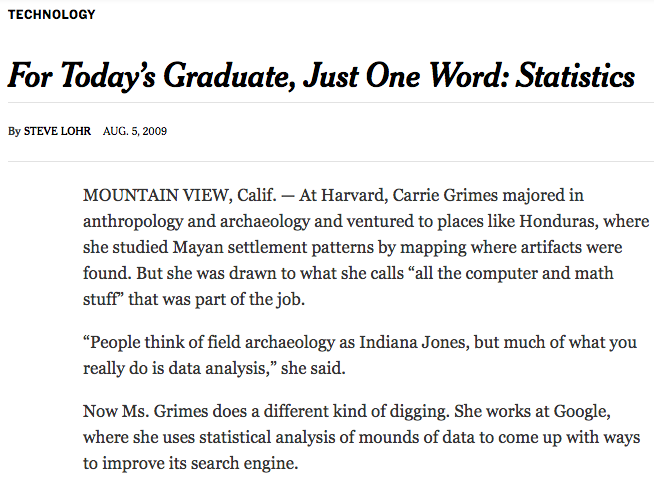
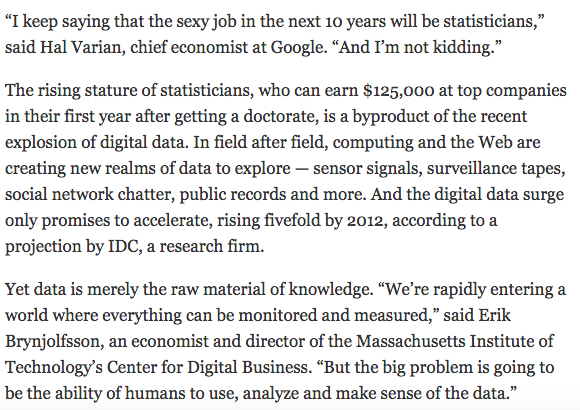
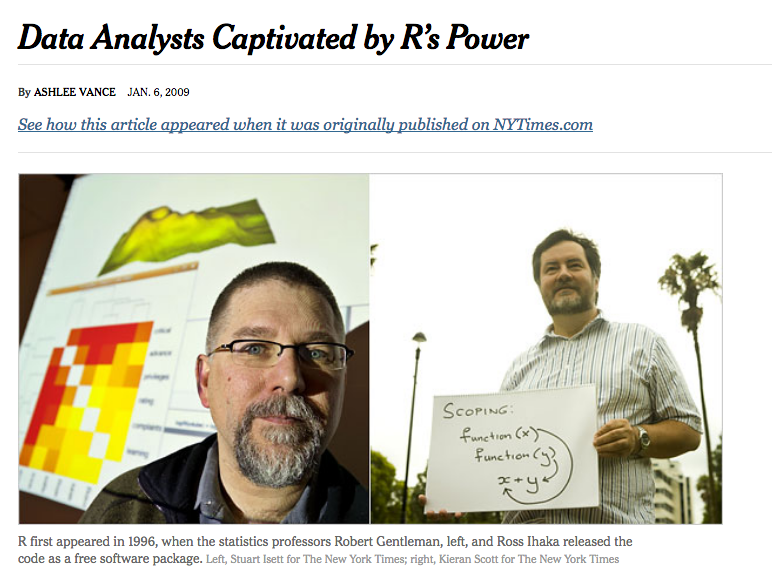
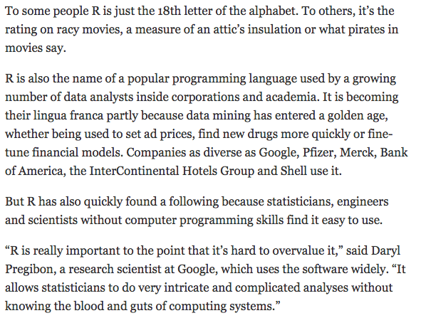
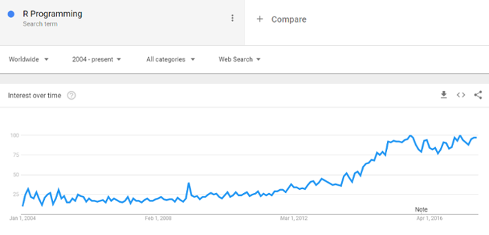
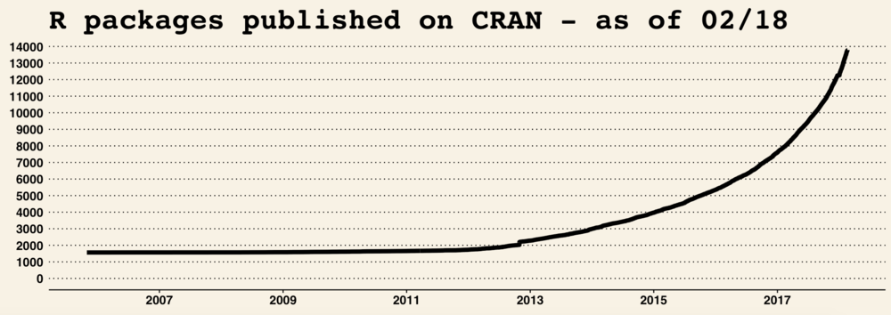
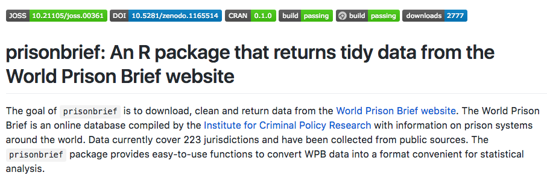
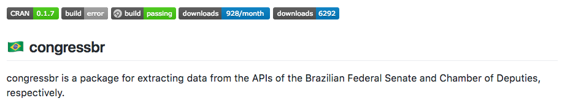

```{r setup, include=FALSE}
options(htmltools.dir.version = FALSE)
r <- getOption("repos")
r["CRAN"] <- "http://cran.cnr.berkeley.edu/"
options(repos = r)
install.packages("swirl")

# Load packages
library("swirl")

# Install course on swirl. You have to do it just once.
install.packages("devtools")
install_course_github("kosukeimai", "qss-swirl")
```

<style>

.remark-slide-number {
  position: inherit;
}

.remark-slide-number .progress-bar-container {
  position: absolute;
  bottom: 0;
  height: 6px;
  display: block;
  left: 0;
  right: 0;
}

.remark-slide-number .progress-bar {
  height: 100%;
  background-color: #EB811B;
}

.orange {
  color: #EB811B;
}
</style>

# Today's Agenda

.font150[
* Why R?

* Installing R and RStudio

* Basic functions

* How to use `swirl()`

* Chapter 1 review

* Questions
]

---
class: inverse, center, middle

# Why R?

<html><div style='float:left'></div><hr color='#EB811B' size=1px width=720px></html> 
---

# Why R?

.center[]
---

# Why R?

.center[]
---

# Why R?

.center[]
---

# Why R?

.center[]
---

# Why R?

.center[]
---

# Why R?

.center[]
---

# Why R?

.center[]
---

# Why R?

.center[]

.center[]
---

class: inverse, center, middle

# Installing R and RStudio

<html><div style='float:left'></div><hr color='#EB811B' size=1px width=720px></html> 
---

# Installing R and RStudio

.font150[
* <https://cran.r-project.org/>

* <https://www.rstudio.com/products/rstudio/download/>

]

---

# Arithmetic Operations

```{r arith}
2 + 2
10 - 8
5^2
sqrt(81)
2/3
```
---

# Objects

```{r obj}
x <- 5 # arrow (<-) is the assignment operator in R 
y <- 16
x + y
sqrt(x*y)
```
---

# Relational operations

```{r operations}
x > y
x <= 5
y == 16
x != 5
```
---

# Vectors

```{r vec}
world.pop <- c(2525779, 3026003, 3691173, 4449049, 5320817, 6127700, 6916183)
pop.first <- c(2525779, 3026003, 3691173) 
pop.second <- c(4449049, 5320817, 6127700, 6916183)
pop.all <- c(pop.first, pop.second) 
pop.all
class <- "POLS 1600" # you can add characters too
class
```
---

# Functions

```{r func}
mean(world.pop) #function name, parentheses, object
min(world.pop)
max(world.pop)
median(world.pop)
summary(world.pop)
```
---

# Selecting observations

```{r obs}
world.pop[2]
world.pop[c(1,2)] # c() for combine. 
```
---

# Data frames

```{r df}
year <- seq(from = 1950, to = 2010, by = 10)
pop <- data.frame(year, world.pop) # add variables
summary(pop)
dim(pop) # row, column
pop$world.pop # access one column
```
---

# Read data files

```{r read}
{{df <- read.csv("/Users/politicaltheory/Documents/github/pols1600/files/datasets/turnout.csv")}}
dim(df)
summary(df)
```
---

# Read data files

```{r read2}
str(df) # structure, quick way to visualise data
```
---

# Install and load packages

```{r swirl2, eval=FALSE, highlight=5}
install.packages("swirl")

# Load packages
library("swirl")

# Install course on swirl. You have to do it just once.
install.packages("devtools")
install_course_github("kosukeimai", "qss-swirl")
swirl()
```
---

class: inverse, center, middle

# Questions?

<html><div style='float:left'></div><hr color='#EB811B' size=1px width=720px></html> 
---

# Homework

.font150[
* Recommended: read QSS chapter 1 again, writing the code in R this time

* Install `swirl()` and Kosuke's course and go through modules `INTRO1` and `INTRO2`
]

```{r, eval=FALSE}
install.packages("swirl")

# Load packages
library("swirl")

# Install Kosuke's course on swirl. 
install.packages("devtools")
install_course_github("kosukeimai", "qss-swirl")
swirl() # type 1 and good luck :)
```


---
class: inverse, center, middle

# Have a great weekend!

<html><div style='float:left'></div><hr color='#EB811B' size=1px width=720px></html> 