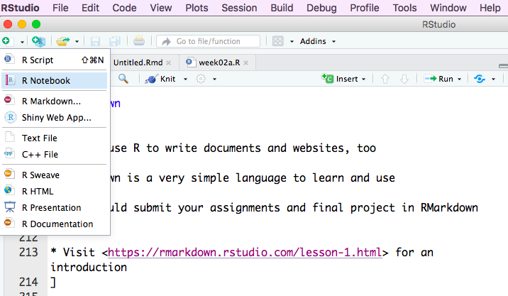
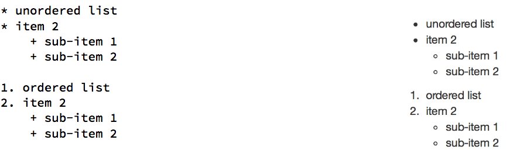
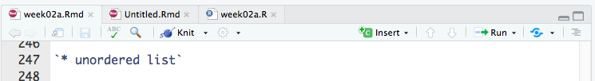
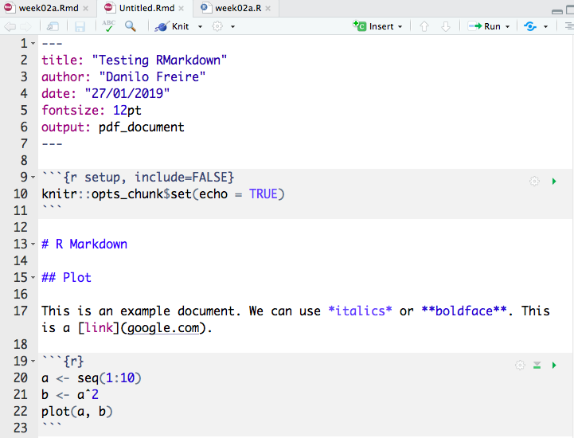
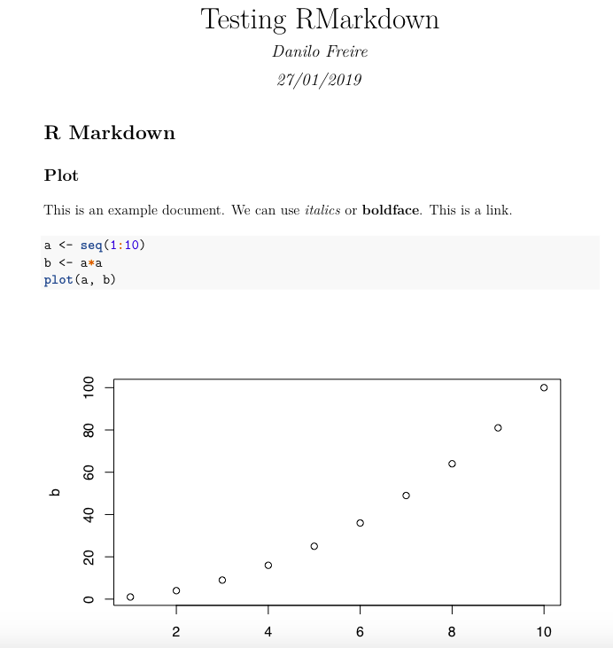

```{r setup, include=FALSE}
options(htmltools.dir.version = FALSE)
r <- getOption("repos")
r["CRAN"] <- "http://cran.cnr.berkeley.edu/"
options(repos = r)
install.packages("swirl")
library("swirl")
install.packages("devtools")
install_course_github("kosukeimai", "qss-swirl")
```

<style>

.remark-slide-number {
  position: inherit;
}

.remark-slide-number .progress-bar-container {
  position: absolute;
  bottom: 0;
  height: 6px;
  display: block;
  left: 0;
  right: 0;
}

.remark-slide-number .progress-bar {
  height: 100%;
  background-color: #EB811B;
}

.orange {
  color: #EB811B;
}
</style>

# Today's Agenda

.font150[
* Course website

* Brief recap

* Questions about `swirl()`

* Create and run R scripts

* Read `.csv` datasets

* Homework: install RMarkdown and write your first document
]
---

# Course website

.font150[
* The course website has a new address:

* <http://pols1600.github.io>

* Syllabus, lecture slides, R scripts, assignments, datasets

* Updated syllabus at <https://cab.brown.edu/>

* [danilo_freire@brown.edu](mailto:danilo_freire@brown.edu)

]

---

# Brief recap

.font150[
* Last week you learned how to:

  - Install R and RStudio
    
  - Do arithmetic operations in R

  - Manipulate vectors

  - Install packages from CRAN

  - Use `swirl()`
  
  - Do the course exercises
]
---

# Brief recap

```{r recap, cache=TRUE}
(2^5)*3.5
vec <- seq(from = 1, to = 100, by = 2)
vec[c(5:10)]
summary(vec)
install.packages("congressbr")
library("swirl")
```

```{r swirl, eval=FALSE}
swirl()
# R won't read this line
```
---

# Swirl

.font150[

* Questions?
]
---

# R scripts

.font150[
* Why should we write scripts?

  - Save time: automate boring tasks

  - Reproducibility

  - Allow complex tasks to be performed in small steps

  - Faster to run
]
---

# R scripts

.center[]
---

# Read data files

.font150[
* R can read files of many types and formats

* Usually, data are either in `.csv` or `.Rdata` format

* R can also read Excel spreadsheets with the [readxl package](https://readxl.tidyverse.org/)

]
---

# Read csv files

.center[
.font200[
name_object <- read.csv("data_path/file.csv")
]
]

---
# Read csv files

```{r csv2}
{{df <- read.csv("/Users/politicaltheory/Documents/github/pols1600.github.io/datasets/turnout.csv")}}
summary(df)
```
---

# Read csv files from the internet

```{r csv3}
{{df <- read.csv("https://raw.githubusercontent.com/pols1600/pols1600.github.io/master/datasets/turnout.csv")}}
summary(df)
```

---

# Read csv files from the internet

.font150[
* In this course, you will be able to download all datasets directly from our website

* Just go to <http://pols1600.github.io/datasets>, click with the left buttom over the name of the dataset, then copy the code to your R script

]
---

# RMarkdown

.font150[
* We can use R to write documents and websites, too

* RMarkdown is a very simple language to learn and use

* You should submit your assignments and final project in RMarkdown format

* Visit <https://rmarkdown.rstudio.com/lesson-1.html> for an introduction
]
---

# RMarkdown

.center[]
---

# RMarkdown basics

.font120[
Add `fontsize: 12pt` to the header (the section above `---`)

Basic commands:

`# Section`

`## Subsection`

Formatting: `*italics*` `**boldface**` 

Weblink: `[POLS1600 website](http://pols1600.github.io)`

Image: ``


]
---

# RMarkdown

.font150[
Lists: 
]

.center[]

.font150[
You need to add four spaces or one tab to write sub-items
]

---

# RMarkdown

.font135[
R code:

` ```{r}`

`library(swirl)`

` ``` `

Just click on the `insert` buttom to add code
]

.center[]

.font135[
Then press the `knit` buttom to see your document
]
---

# Homework

.font130[
* Install LaTeX: <https://www.latex-project.org/get/> (it is a _big_ file, ~2Gb)

* Download this pdf: <https://www.rstudio.com/wp-content/uploads/2015/02/rmarkdown-cheatsheet.pdf>

* Create a new RMarkdown document

* If RStudio asks you to download some packages, click `yes`

* Write a few paragraphs and add this code to the file:
]

.font120[
a <- seq(1:10)

b <- a*a

plot(a, b)
]

---

# Homework

.center[]
---

# Homework

.center[]
---

class: inverse, center, middle

# See you on Wednesday!

<html><div style='float:left'></div><hr color='#EB811B' size=1px width=720px></html> 