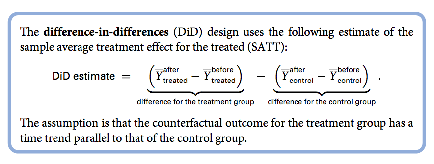
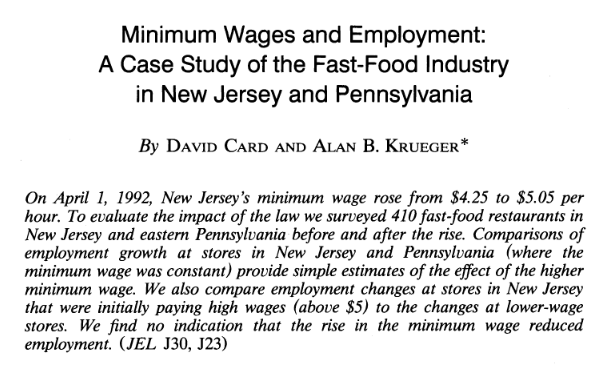
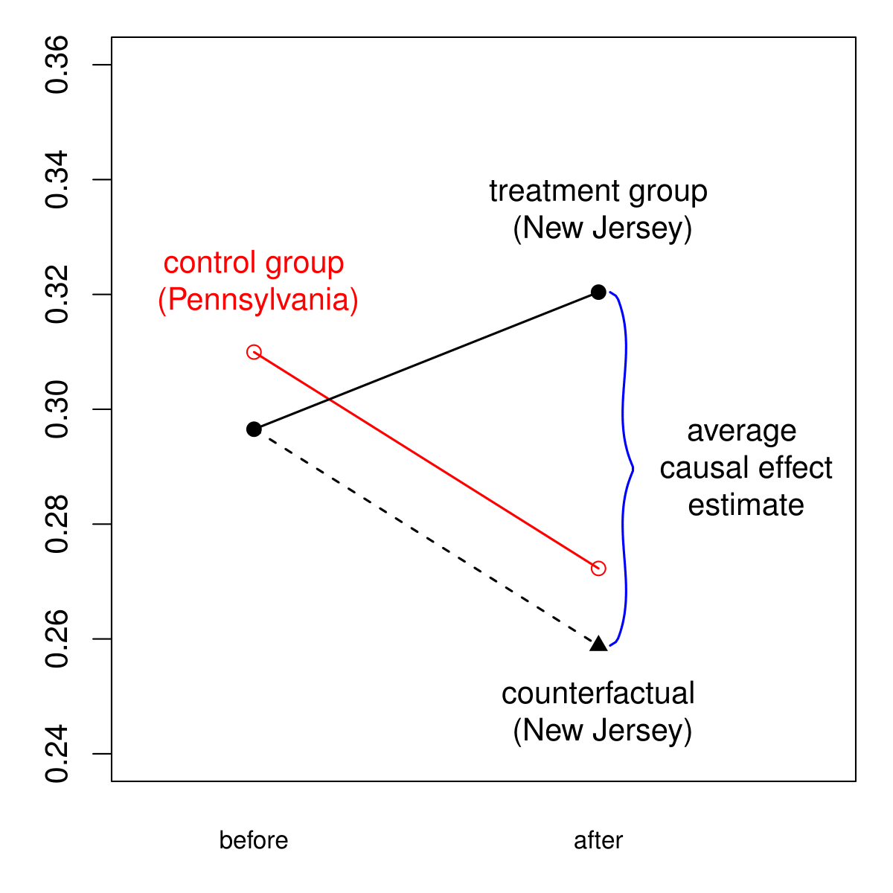

```{r setup, include=FALSE}
options(htmltools.dir.version = FALSE)
r <- getOption("repos")
r["CRAN"] <- "http://cran.cnr.berkeley.edu/"
options(repos = r)
```

<style>

.remark-slide-number {
  position: inherit;
}

.remark-slide-number .progress-bar-container {
  position: absolute;
  bottom: 0;
  height: 6px;
  display: block;
  left: 0;
  right: 0;
}

.remark-slide-number .progress-bar {
  height: 100%;
  background-color: #EB811B;
}

.orange {
  color: #EB811B;
}
</style>

# Today's Agenda

.font150[
* Brief revision

* Observational studies vs RCTs (QSS 2.5-2.6)

* Homework: finish `CAUSALITY01` and our first assignment 
]
---

# Revision

.font150[
* What is the fundamental problem of causal inference?
]
--
.font150[
* How can we (try to) solve that problem?
]
--
.font150[
* .orange[Randomisation]
]

---

# Randomisation

.font150[
* Randomisation ensures the treatment .orange[is not correlated] with any other variable

* Randomisation .orange[generates balance] between treatment and control groups 

* Treatment and control groups .orange[identical on average]

* Allows us to estimate the average treatment effect simply as a .orange[difference in means]: $\frac{1}{n} \sum_{i=1}^n \{Y_i(1) - Y_i(0)\}$
]

---

# Social Pressure Example

.font150[
* August 2006 Primary State-wide Election in Michigan

* Send postcards with different, randomly-assigned messages
  - no message (control group)
  - civic duty message
  - "you are being studied" message (Hawthorne effect)
  - neighbourhood social pressure message
]

---

# Social Pressure Example

```{r social1, highlight.output=c(2), echo=FALSE}
social <- read.csv("https://raw.githubusercontent.com/pols1600/pols1600.github.io/master/datasets/causality/social.csv")
```

```{r social2, highlight.output=c(2)}
tapply(social$yearofbirth, social$messages, mean) # Year of Birth
tapply(social$hhsize, social$messages, mean) # Household size
tapply(social$primary2006, social$messages, mean) # Outcome
tapply(social$primary2006, social$messages, mean)[-2] -
    mean(social$primary2006[social$messages == "Control"]) # SATE for each group
```
---

# Observational Studies

.font150[
* Often, it is unethical or infeasible to randomise the treatment. 
  - Smoking and cancer 
  - Gender and salary
  - Death penalty and crime

* .orange[Observational data]: the treatment is naturally assigned
]

---

# Observational Studies 

.font150[
* Why is it harder to make causal inference with observational data? 
]

--
.font150[
* .orange[Confounders/confounding variables:] variables that are associated both with the treatment and the outcome 
]
--

.font150[
* If the treatment is not independent from pre-treatment variables, we cannot be sure about what causes what
]

---

# Examples of Confounders:

.font150[
* Are incumbents more likely to win elections?
  - Maybe, but they also receive more campaign donations
]
--

.font150[
*  Are democratic countries more peaceful than authoritarian ones?
   - Maybe, but they also tend to be richer
]

--

.font150[
* .orange[Selection bias]: groups are not directly comparable
]

---

# Observation Studies

.font150[
* Pre-treatment variables have to be .orange[controlled for], that is, _held constant_ in the analysis

* .orange[Statistical control]: we use statistical methods to create balance between treatment and control and emulate an experiment as best as we can. E.g:
  - Instrumental variables (IV)
  - Regression discontinuity designs (RDD)
  - Differences-in-differences (DD/DiD/Diff-in-diff)
]

---

# Differences-in-Differences (DiD)

.font150[
* Compare trends before and after the treatment across the same units

* Controls for the initial conditions

* Requires data for two time periods (before and after treatment) and at least two units

* .orange[Parallel time trends assumption]
]

---

# Differences-in-Differences (DiD)

.center[]

---

# Minimum Wage and Unemployment

.font120[
* How does the increase in minimum wage affect unemployment?

* Economists believe the effect is positive: higher wages lead to higher unemployment

* Difficult to randomise minimum wage legislation

* In 1992, NJ minimum wage increased from $4.25 to $5.05...

* ... but neighbouring PA stays at $4.25

* NJ and (eastern) PA are similar, and fast food chains are similar too: wages, prices, products, etc

* [David Card and Alan Krueger (1994)](http://davidcard.berkeley.edu/papers/njmin-aer.pdf) see this change as a natural experiment
]

---

# Minimum Wage and Unemployment

.center[]

---

# Minimum Wage and Unemployment

```{r dd}
minwage <- read.csv("https://raw.githubusercontent.com/pols1600/pols1600.github.io/master/datasets/causality/minwage.csv")
str(minwage)
```

---

# Minimum Wage and Unemployment

```{r dd2}
# Subset the data into NJ and PA
minwageNJ <- subset(minwage, subset = (location != "PA"))
minwagePA <- subset(minwage, subset = (location == "PA"))
```

```{r dd3, highlight.output=1}
# Compute the proportion of restaurants whose wage is less than $5.05
mean(minwageNJ$wageBefore < 5.05) # NJ before
mean(minwageNJ$wageAfter < 5.05) # NJ after
mean(minwagePA$wageBefore < 5.05) # PA before
mean(minwagePA$wageAfter < 5.05) # PA after
```

---

# Minimum Wage and Unemployment

```{r dd4, highlight.output=1}
# Are the NJ and PA Restaurants Comparable?
mean(minwageNJ$wageBefore)
mean(minwagePA$wageBefore)

# Compute the proportion of full-time employees after the increase
minwageNJ$fullPropBefore <- minwageNJ$fullBefore / (minwageNJ$fullBefore + minwageNJ$partBefore)
minwagePA$fullPropBefore <- minwagePA$fullBefore / (minwagePA$fullBefore + minwagePA$partBefore)
mean(minwageNJ$fullPropBefore) # Proportion full-time workers NJ
mean(minwagePA$fullPropBefore) # Proportion full-time workers PA
```

---

# Minimum Wage and Unemployment

```{r dd5}
# Compute the proportion of full-time employees after the increase
minwageNJ$fullPropAfter <- minwageNJ$fullAfter / (minwageNJ$fullAfter + minwageNJ$partAfter)
minwagePA$fullPropAfter <- minwagePA$fullAfter / (minwagePA$fullAfter + minwagePA$partAfter)
mean(minwageNJ$fullPropAfter) # Proportion full-time workers NJ
mean(minwagePA$fullPropAfter) # Proportion full-time workers PA
```

---

# Minimum Wage and Unemployment

```{r dd6, highlight.output=1}
# Compare NJ before and after the change
NJdiff <- mean(minwageNJ$fullPropAfter) - mean(minwageNJ$fullPropBefore)
NJdiff
```
.font120[
However, the region as a whole could have changed too. So we use PA as a control case
]

```{r dd7, highlight.output=1}
# PA before/after difference to control for possible changes over time
PAdiff <- mean(minwagePA$fullPropAfter) - mean(minwagePA$fullPropBefore)
PAdiff

# Difference in difference
NJdiff - PAdiff
```

---

# Minimum Wage and Unemployment

.center[]

.font150[
* .orange[Parallel trends assumption:] NJ would have followed the same trend as PA had it not received the treatment. However, _we can't test that_.
]

---

# Animation of DiD

.center[]

---

class: inverse, center, middle

# Questions?

<html><div style='float:left'></div><hr color='#EB811B' size=1px width=720px></html> 

---

# Homework

.font150[
* Watch this video, it is very good: 
  - <https://youtu.be/dSlCBJSh96w>

* `swirl()` `CAUSALITY02`
]

---

class: inverse, center, middle

# See you on Friday!

<html><div style='float:left'></div><hr color='#EB811B' size=1px width=720px></html> 