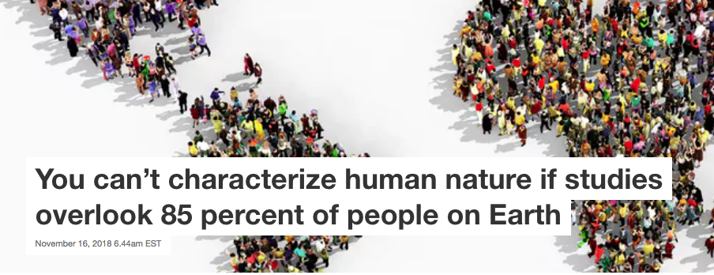
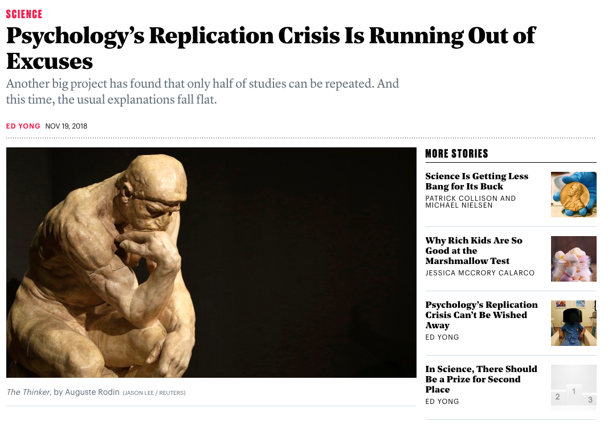
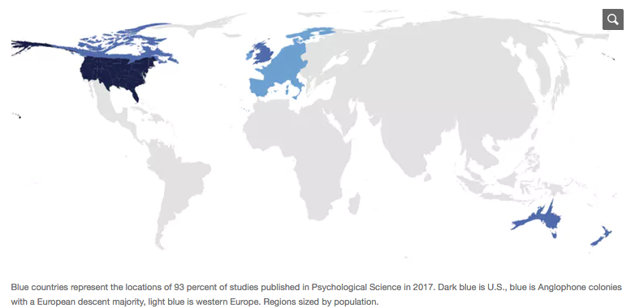
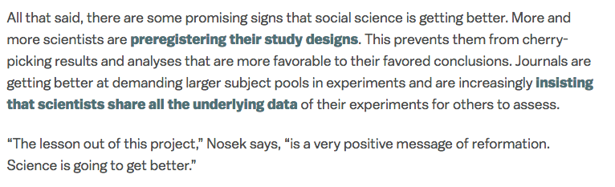

```{r setup, include=FALSE}
options(htmltools.dir.version = FALSE)
r <- getOption("repos")
r["CRAN"] <- "http://cran.cnr.berkeley.edu/"
options(repos = r)
```

<style>

.remark-slide-number {
  position: inherit;
}

.remark-slide-number .progress-bar-container {
  position: absolute;
  bottom: 0;
  height: 6px;
  display: block;
  left: 0;
  right: 0;
}

.remark-slide-number .progress-bar {
  height: 100%;
  background-color: #EB811B;
}

.orange {
  color: #EB811B;
}
</style>

# Today's Agenda

.font150[
* Quantiles

* Standard deviation

* Leader assassination DiD 

* Internal and external validity

* Replication crisis
]

---

# Quantiles

.font150[
* Sometimes it is useful to look at the distribution of a given variable

* We can split a variable in many ways:
	- Quartiles
	- Quantiles
	- Percentiles

* Which quantile is the median?
]
---

# Quantiles

.font150[
* What is the median of {2, 5, 6, 10}?

* What is the median of {1, 2, 3, 4, 20}?

* Interquartile range (IQR): the difference between the 75th and the 25th percentile    
]

---

# Standard Deviation

.font150[
* Average distance of each data point to the mean

* $SD = (\sqrt{\frac{1}{n} \sum^{N}_{i = 1} (x_{i} - \bar{x})^{2}})$
]
--

.font150[
* where $\bar{x}$ indicates the sample mean, that is, $\bar{x} = \frac{1}{n} \sum^{N}_{i = 1} x_{i}$, and $n$ is the sample size 

* Almost all data entries are located within 2 or 3 standard deviations from the mean
]
---

# R Examples

```{r tidy=FALSE, echo=FALSE}
leaders <- read.csv("https://raw.githubusercontent.com/pols1600/pols1600.github.io/master/datasets/causality/leaders.csv")
```

```{r tidy=FALSE}
median(leaders$age)
IQR(leaders$age)
quantile(leaders$age)
quantile(leaders$age, probs = seq(0, 1, by = 0.1)) # deciles
quantile(leaders$age, probs = c(.34, .55, .93)) # 34th, 55th, 93th percentiles
```
---

# R Examples

```{r}
mean(leaders$age)
sd(leaders$age)
summary(leaders$age)
```
---

class: inverse, center, middle

# Questions?

<html><div style='float:left'></div><hr color='#EB811B' size=1px width=720px></html> 

---

# Leader Assassination DD

.font150[
* **Question 5**

* Does successful leader assassination cause democratization? Does successful leader assassination lead countries to war?  Answer these questions by analyzing the data.  Be sure to state your assumptions and provide a brief interpretation of the results.]
---

# Leader Assassination DD

```{r}
str(leaders)

# create success variable
leaders$success <- ifelse(leaders$result == "dies between a day and a week" |
                            leaders$result == "dies between a week and a month" |
                            leaders$result == "dies within a day after the attack" |
                            leaders$result == "dies, timing unknown",1, 0)
```
---

# Leader Assassination DD

```{r}
# polity score before and after assassination attempt
diff.pol.succ <- mean(leaders$polityafter[leaders$success == 1]) - 
                   mean(leaders$politybefore[leaders$success == 1]) # successful 

diff.pol.succ

diff.pol.unsucc <- mean(leaders$polityafter[leaders$success == 0]) - 
                     mean(leaders$politybefore[leaders$success == 0]) # unsuccessful

diff.pol.unsucc

## difference in differences
diff.pol.succ - diff.pol.unsucc
```
---

# Leader Assassination DD

```{r tidy=FALSE}
# create variable for warbefore and warafter
leaders$warbefore <- ifelse(leaders$interwarbefore == 1 |
                              leaders$civilwarbefore == 1, 1, 0)
leaders$warafter <- ifelse(leaders$interwarafter == 1 |
                             leaders$civilwarafter == 1, 1, 0)

## compare war before to war after among successful and unsuccessful
diff.war.succ <- mean(leaders$warafter[leaders$success == 1]) - 
                   mean(leaders$warbefore[leaders$success == 1])

diff.war.unsucc <- mean(leaders$warafter[leaders$success == 0]) - 
                     mean(leaders$warbefore[leaders$success == 0])

diff.war.succ - diff.war.unsucc # difference in differences
```

.font130[
Using the difference-in-difference approach, we find very little difference in the contries' polity score and in the proportion of countries engaged in war. Leader assassination does not seem to cause countries to democratise or engage in war.]
---

# Internal and External Validity

.font150[
* Because of randomisation, we know that RCTs have strong _internal validity_

* .orange[Internal validity]: the degree to which we can attribute the results to the treatment and not to other factors

* However, observational studies have greater _external validity_

* .orange[External validity]: the extent to which the results can be generalised 
]

---

# Replication Crisis


.center[]

Website: <https://theconversation.com/you-cant-characterize-human-nature-if-studies-overlook-85-percent-of-people-on-earth-106670>

---

# Replication Crisis

.center[]

Website: <https://www.theatlantic.com/science/archive/2018/11/psychologys-replication-crisis-real/576223>

---

# Replication Crisis

.center[]

Website: <https://theconversation.com/you-cant-characterize-human-nature-if-studies-overlook-85-percent-of-people-on-earth-106670>

---

# What Should We Do?

.font150[
* .orange[Replications:] see whether the same results hold under different conditions

* .orange[Field experiments:] conduct experiments in realistic settings

* .orange[Larger sample sizes:] large samples tend to be more representative of the underlying population

* .orange[Open methods and open data:] share your code and datasets so other can verify them

* .orange[Preregistration:] state your hypotheses _before_ running the experiment

]
---

# We're Getting Better

.center[]

Website: <https://www.vox.com/science-and-health/2018/8/27/17761466/psychology-replication-crisis-nature-social-science>

---

# Wrap-up

.font150[
* Not all experiments are true, many don't replicate

* If possible, preregister your hypotheses and make your data and code available (RMarkdown can help!)

* Replicate your and other people's work

* Is science wrong? _No_, but there are many wrong findings maskerading as science

* Keep those things in mind while reading a study that seems to good to be true: _it most likely is_]

---

# Homework

.font150[
* John Oliver on the replication crisis: <https://youtu.be/0Rnq1NpHdmw>

* BBC podcast on the same problem: <https://pca.st/n5b3>

* `CAUSALITY02`
]

---

class: inverse, center, middle

# See you next week!

<html><div style='float:left'></div><hr color='#EB811B' size=1px width=720px></html> 
