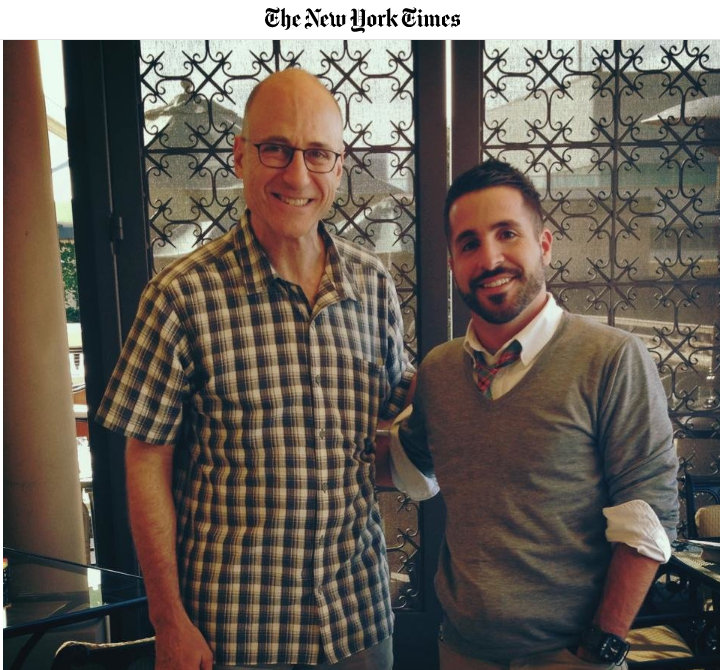
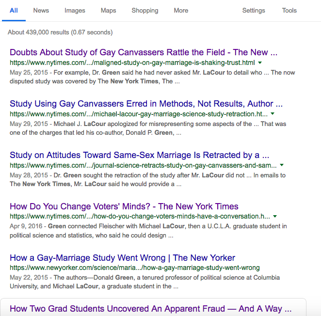
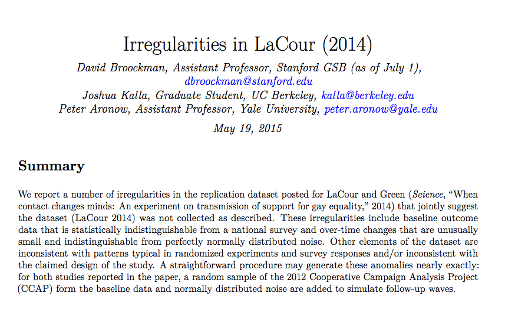
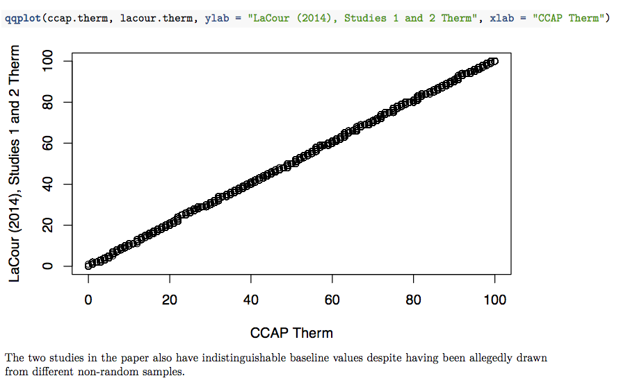
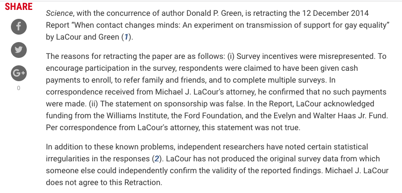

```{r setup, include=FALSE}
options(htmltools.dir.version = FALSE)
r <- getOption("repos")
r["CRAN"] <- "http://cran.cnr.berkeley.edu/"
options(repos = r)
```

<style>

.remark-slide-number {
  position: inherit;
}

.remark-slide-number .progress-bar-container {
  position: absolute;
  bottom: 0;
  height: 6px;
  display: block;
  left: 0;
  right: 0;
}

.remark-slide-number .progress-bar {
  height: 100%;
  background-color: #EB811B;
}

.orange {
  color: #EB811B;
}
</style>

# Today's Agenda

.font150[
* Brief evaluation of chapters 1 and 2

* "Changing Minds on Gay Marriage"

* Replication Crisis part 2

* But first...
]

---
class: inverse, center, middle

# Congratulations to all of you!

<html><div style='float:left'></div><hr color='#EB811B' size=1px width=720px></html> 
---

# What you have learned so far

.font150[
* Import data with `read.csv`

* Summarise your data in `R`

* `dim`, `summary`, `str`, `head`, `tail`

* `tapply`, `table`, `subset`

* `median`, `quantiles`, `sd`
]
---

# What you have learned so far

```{r}
resume <- read.csv("https://raw.githubusercontent.com/pols1600/pols1600.github.io/master/datasets/causality/resume.csv")
dim(resume)
str(resume)
unique(resume$firstname)
```
---

# What you have learned so far

```{r}
summary(resume)
```

---

# What you have learned so far

```{r}
tapply(resume$call, resume$race, mean)
tapply(resume$call, resume$firstname, length)
```
---

# What you have learned so far

```{r}
table(resume$firstname)
table(sex = resume$sex, call = resume$call)
```
---

# What you have learned so far

```{r}
black_female <- subset(resume, race == "black" & sex == "female")
head(black_female)

all_females <- subset(resume, race == "black" | race == "white" & sex == "female")
tail(all_females)
```
---

# What you have learned so far

```{r}
minwage <- read.csv("https://raw.githubusercontent.com/pols1600/pols1600.github.io/master/datasets/causality/minwage.csv")
mean(minwage$fullBefore)
median(minwage$fullBefore)
sd(minwage$fullBefore)
quantile(minwage$fullBefore, probs = c(0, .25, .5, .75, .99)) # 25th, 75th, 99th
IQR(minwage$fullBefore)
```
---

# What you have learned so far

.font150[
* Randomised control trials and observational studies. What are the pros and cons of each study?
]
--

.font150[
* Randomisation creates balance, have higher interal validity but lower external validity

* Observational studies are prone to selection bias, have confounding variables, lower internal validity, higher external validity
]
--

.font150[
* Replication crisis: not all experiments are reliable. Why?
]
--

.font150[
* Low sample size, unrepresentative samples
]
---

class: inverse, center, middle

# Questions about chapters 1 and 2

<html><div style='float:left'></div><hr color='#EB811B' size=1px width=720px></html> 
---

# Changing Minds on Gay Marriage

.font150[
* In this exercise, we analyse the data from two experiments in which households were canvassed for support on gay marriage.

* This exercise is based on: LaCour, M. J., and D. P. Green. 2014. “[When Contact Changes Minds: An Experiment on Transmission of Support for Gay Equality.](http://dx.doi.org/10.1126/science.1256151)” *Science* 346(6215): 1366–69.
]

---

# Changing Minds on Gay Marriage

.center[]
---

# Changing Minds on Gay Marriage

.font150[
* Canvassers were given a script leading to conversations that averaged about twenty minutes. A distinctive feature of this study is that gay and straight canvassers were randomly assigned to households and canvassers revealed whether they were straight or gay in the course of the conversation. The experiment aims to test the 'contact hypothesis,' which contends that out-group hostility (towards gays in this case) diminishes when people from different groups interact with one another.
]


---

# Changing Minds on Gay Marriage

.font110[
*  -------------------- ----------------------------------------------------------
 Name                 Description
 -------------------- ----------------------------------------------------------
 `study`              Study (1 or 2) 
 
 `treatment`          Treatment assignment: `No contact`, 
                      `Same-Sex Marriage Script by Gay Canvasser`,
                      `Same-Sex Marriage Script by Straight Canvasser`,
                      `Recycling Script by Gay Canvasser`, and
                      `Recycling Script by Straight Canvasser`
 
 `wave`               Survey wave (1-7). Note that Study 2 lacks wave 5 and 6.
 
 `ssm`                Support for gay marriage (1 to 5).  
                      Higher scores indicate more support.
 -------------------------------------------------------------------------------
]

---

# Changing Minds on Gay Marriage

.font150[
* Each observation of this data set is a respondent giving a response to a five-point survey item on same-sex marriage.  There are two different studies in this data set, involving interviews during 7 different time periods (i.e. 7 waves).  In both studies, the first wave consists of the interview before the canvassing treatment occurs. 

* Use the [gay.csv](https://raw.githubusercontent.com/pols1600/pols1600.github.io/master/datasets/causality/gay.csv) data set.
]

---

# Changing Minds on Gay Marriage

.font150[
* **Question 1**

* Using the baseline interview wave before the treatment is administered (wave == 1), examine whether randomisation was properly conducted. Base your analysis on the three groups of Study 1: 
  - 'Same-Sex Marriage Script by Gay Canvasser'
  - 'Same-Sex Marriage Script by Straight Canvasser'
  - 'No Contact.'
  
* Briefly comment on the results.
]

---

# Changing Minds on Gay Marriage

```{r}
gay <- read.csv("https://raw.githubusercontent.com/pols1600/pols1600.github.io/master/datasets/causality/gay.csv")

# Study 1
w1_gay <- subset(gay, wave == 1 & study == 1 & 
                 treatment == "Same-Sex Marriage Script by Gay Canvasser")
w1_straight <- subset(gay, wave == 1 & study == 1 & 
                 treatment == "Same-Sex Marriage Script by Straight Canvasser")
w1_none <- subset(gay, wave == 1 & study == 1 & treatment == "No Contact")

mean(w1_gay$ssm)
mean(w1_straight$ssm)
mean(w1_none$ssm)
```
---

# Changing Minds on Gay Marriage

.font150[
* The results show that before treatment, all three treatment groups show similar levels of baseline support for gay marriage on average. Thus, the randomisation appears to have been done correctly.
]
---

# Changing Minds on Gay Marriage

.font150[
* **Question 2**

* The second wave of survey was implemented two months after the canvassing.  Using Study 1, estimate the average treatment effects of gay and straight canvassers on support for same-sex marriage, separately (wave == 2).  Give a brief interpretation of the results.
]

---

# Changing Minds on Gay Marriage

```{r}
# Study 1
w2_gay <- subset(gay, wave == 2 & study == 1 & 
                 treatment == "Same-Sex Marriage Script by Gay Canvasser")
w2_straight <- subset(gay, wave == 2 & study == 1 & 
                 treatment == "Same-Sex Marriage Script by Straight Canvasser")
w2_none <- subset(gay, wave == 2 & study == 1 & treatment == "No Contact")

# ATE for gay canvassers
mean(w2_gay$ssm) - mean(w2_none$ssm)
# ATE for straight canvassers
mean(w2_straight$ssm) - mean(w2_none$ssm)
```
---

# Changing Minds on Gay Marriage

.font150[
* Approval of gay marriage increased on average by  `r round(mean(w2_gay$ssm) - mean(w2_none$ssm), 3)` for gay canvassers and by `r round(mean(w2_straight$ssm) - mean(w2_none$ssm), 3)` for straight  canvassers.
]
---

# Changing Minds on Gay Marriage

.font150[
* **Question 3**

* Again using study 1, please check if the results persist in wave 7 of the study.  Give a brief interpretation of the results.
]

---

# Changing Minds on Gay Marriage

```{r}
# Study 1
w7_gay <- subset(gay, wave == 7 & study == 1 & 
                 treatment == "Same-Sex Marriage Script by Gay Canvasser")
w7_straight <- subset(gay, wave == 7 & study == 1 & 
                 treatment == "Same-Sex Marriage Script by Straight Canvasser")
w7_none <- subset(gay, wave == 7 & study == 1 & treatment == "No Contact")

# ATE for gay canvassers
mean(w7_gay$ssm) - mean(w7_none$ssm)
# ATE for straight canvassers
mean(w7_straight$ssm) - mean(w7_none$ssm)
```
---

# Changing Minds on Gay Marriage

.font150[
* Approval of gay marriage increased on average by  `r round(mean(w7_gay$ssm) - mean(w7_none$ssm), 3)` for gay canvassers and by `r round(mean(w7_straight$ssm) - mean(w7_none$ssm), 3)` for straight  canvassers. The results show that the effect for gay canvassers is persistent over time.
]
---

class: inverse, center, middle

# Is it?

<html><div style='float:left'></div><hr color='#EB811B' size=1px width=720px></html> 
---

# Green and Lacour

.center[]
---

# Changing Minds on Gay Marriage

.center[]
---

# Busted!

.center[]
---

# RMarkdown

.center[]
---

# Retraction

.center[]
---

# Homework

.font150[
* QSS 3.1-3.3

* Start `MEASUREMENT01`

* Read more about the Lacour case
]

---

class: inverse, center, middle

# See you on Wednesday!

<html><div style='float:left'></div><hr color='#EB811B' size=1px width=720px></html> 
