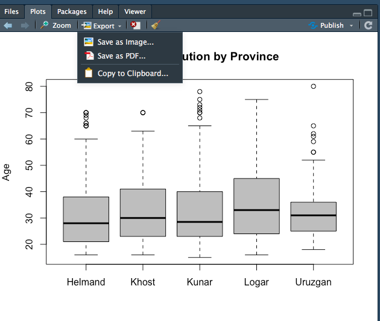
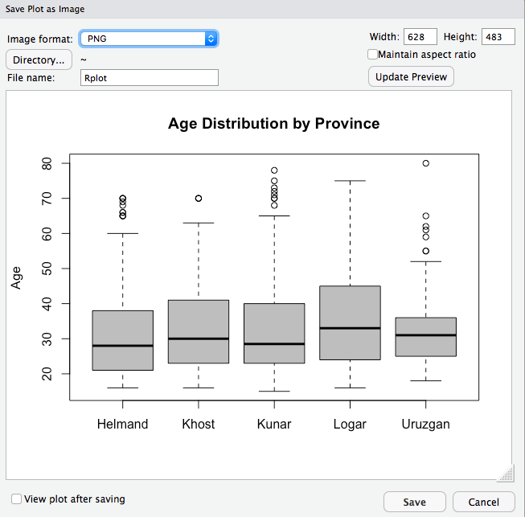
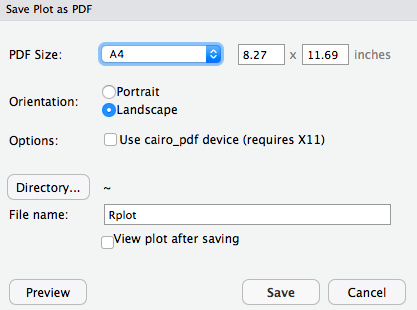

```{r setup, include=FALSE}
options(htmltools.dir.version = FALSE)
r <- getOption("repos")
r["CRAN"] <- "http://cran.cnr.berkeley.edu/"
options(repos = r)
```

<style>

.remark-slide-number {
  position: inherit;
}

.remark-slide-number .progress-bar-container {
  position: absolute;
  bottom: 0;
  height: 6px;
  display: block;
  left: 0;
  right: 0;
}

.remark-slide-number .progress-bar {
  height: 100%;
  background-color: #EB811B;
}

.orange {
  color: #EB811B;
}
</style>

# Today's Agenda

.font150[
* Visualising data: `boxplot()`

* How to save R plots

* Survey sampling methods 
]

---

# Box Plots

.font150[
* Like histograms, box plots also display the distribution of a numeric variable

* Box plots show _the median_, _quartiles_, and _IQR_

* Useful to compare different distributions side-by-side

* It is also useful to identify outliers, that is, data points that are above 1.5 times the interquartile range (IQR)

* `boxplot()`

]

---

# Box Plots

.font150[
* `boxplot()` also has a series of optional arguments:

  - `main`, `ylab`, `ylim`, `col`
  - `formula = y ~ group`, y is numeric variable and group is a factor
]

---
# Box Plots

```{r tidy=FALSE}
afghan <- read.csv("https://raw.githubusercontent.com/pols1600/pols1600.github.io/master/datasets/measurement/afghan.csv")
names(afghan)
median(afghan$age)
quantile(afghan$age, probs = c(0, .25, .5, .75, 1))
```
---

# Box Plots

```{r tidy=FALSE, fig.align='center'}
boxplot(afghan$age, main = "Distribution of age", ylab = "Age", ylim = c(10, 80))
```
---

# Box Plots and Histograms

.font150[
* To visualise the distribution of a single variable, histograms might be more informative. Compare:
]

```{r tidy=FALSE, eval=FALSE}
hist(afghan$age,
     main = "Histogram - Age",
     xlab = "Age",
     ylim = c(0, 0.04),
     freq = FALSE) 
## add a text label at (x, y) = (35, 0.35)
text(x = 35, y = 0.035, "median")
## add a vertical line representing median
abline(v = median(afghan$age))
```
---

# Histogram

```{r tidy=FALSE, echo=FALSE, fig.align='center'}
hist(afghan$age,
     main = "Histogram - Age",
     xlab = "Age",
     ylim = c(0, 0.04),
     freq = FALSE) 
## add a text label at (x, y) = (35, 0.35)
text(x = 35, y = 0.035, "median")
## add a vertical line representing median
abline(v = median(afghan$age))
```
---

# Box Plots

```{r tidy=FALSE, fig.align='center'}
boxplot(afghan$age, main = "Age Distribution", ylab = "Age", ylim = c(10, 80))
```
---

# Box Plots

.font150[
* But box plots provide an easy way to compare multiple observations at a time

* Similar to `tapply()`
]

```{r}
tapply(afghan$age, afghan$province, median, na.rm = TRUE)
```
---

# Box Plots

```{r tidy=FALSE, fig.align='center'}
boxplot(afghan$age ~ afghan$province,
        main = "Age Distribution by Province", ylab = "Age", col = "grey")
```

---

# Save R Plots

.center[]

---
# Save R Plots

.center[]

---

# Save R Plots

.center[]

---

class: inverse, center, middle

# Questions?

<html><div style='float:left'></div><hr color='#EB811B' size=1px width=720px></html> 
---

# Survey Sampling

.font130[Last primaries:]

.pull-left[
#### Democratic candidates

* Hillary Clinton 44%
* Bernie Sanders 26% 
* Joe Biden 20%
]

.pull-right[
#### Republican candidates

* Donald Trump 26%
* Ben Carson 15%
* Carly Fiorina 10%
* Jeb Bush 9%
* Marco Rubio 9%
* Ted Cruz 6%
]

.font110[Source: Huffington Post, Pollster]

.font130[
* Most polls only interview several hundred voters
]
--
.font130[
* Goal: infer what 200 million voters are thinking
]
---

# The 1936 Literary Digest Poll

.font150[
* Mail questionnaire to 10 million people

* Final sample size: over 2.3 million returned

* Addresses came from phone books and club memberships

* The young Gallup used 50,000 respondents
]


.center[
|                 | FDR's vote share | 
|:----------------|-----------------:|
| Literary Digest |               43 | 
| George Gallup   |               56 | 
| Actual Outcome  |               62 |
]
---

# The 1936 Literary Digest Poll

.font150[
* Why did the Literary Digest get the numbers so wrong?
]
--
.font150[
* .orange[Biased sample]
]

---

# Quota Sampling vs Random Sampling

.font150[
* **Quota sampling:** Sample certain groups until quota is filled

* Problem: Unobservables can bias the results
]
--
.font150[
* **Random sampling:** Random draws without replacement from the population

* Everybody has the same chance of being in the sample

* Problem: _none_, sample is unbiased! 
]
---

# Random Sampling

.font150[
* Not every single sample will match all characteristics of the population exactly

* But as the number of samples gets larger (say 1000 samples of 1000 respondents), on average the samples would be representative

* Polls are associated with _uncertainty_: plus or minus a number

* But getting a random sample is _hard_
]

---

# Difficulties

.font130[
* Problems of telephone survey
  - Random digit dialing from phone book
  - Wealthy individuals have higher changes of being called
  - Caller ID screening (unit non-response)

* Problems of internet survey
  - Non-probability sampling
  - Cheap but non-representative
  - Young, urban, rich groups are overrepresented
  - Requires statistical corrections (usually weights)
]

---

class: inverse, center, middle

# Questions?

<html><div style='float:left'></div><hr color='#EB811B' size=1px width=720px></html> 
---

# Homework

.font150[
* Think of some topics you would like to know more about

* If possible, find some papers you would like to replicate

* `MEASUREMENT02`
]

---

class: inverse, center, middle

# Have a Great Weekend!

<html><div style='float:left'></div><hr color='#EB811B' size=1px width=720px></html> 
