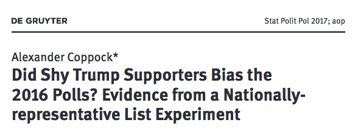
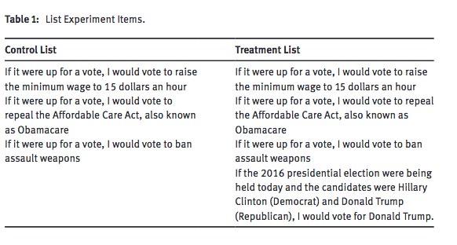
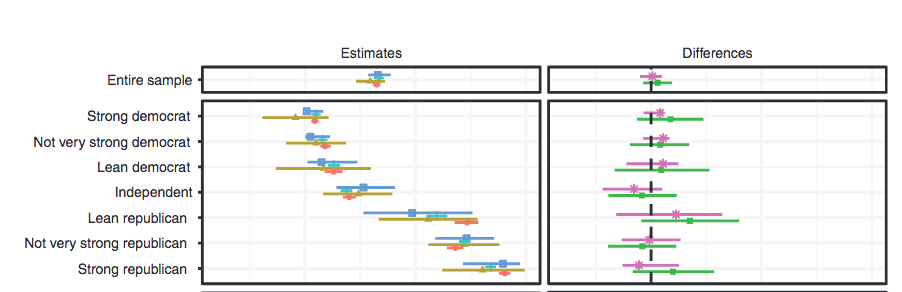

```{r setup, include=FALSE}
options(htmltools.dir.version = FALSE)
r <- getOption("repos")
r["CRAN"] <- "http://cran.cnr.berkeley.edu/"
options(repos = r)
```

<style>

.remark-slide-number {
  position: inherit;
}

.remark-slide-number .progress-bar-container {
  position: absolute;
  bottom: 0;
  height: 6px;
  display: block;
  left: 0;
  right: 0;
}

.remark-slide-number .progress-bar {
  height: 100%;
  background-color: #EB811B;
}

.orange {
  color: #EB811B;
}
</style>

# Today's Agenda

.font150[
* Brief recap

* Social desirability bias

* List experiments 

* Final project
]

---

# Descriptive Statistics

.font150[
* Quantiles, quartiles, median, IQR, SD

* Standard deviation: average distance from points to the mean
	
	- $SD = \sqrt{\frac{1}{n} \sum^{n}_{i = 1} (x_{i} - \bar{x})^{2}}$  

* Outliers: 1.5x IQR

* Median is robust to outliers

* When $n$ is large, mean and median are roughly the same
]

---

# Bar Plots

.font150[
* Bar plots, histograms, box plots 

* Bar plots:

	- Describe factor variables
	- `barplot(prop.table(table(dataset$variable)))`
]

---

# Bar Plots

```{r, fig.align='center'}
afghan <- read.csv("https://raw.githubusercontent.com/pols1600/pols1600.github.io/master/datasets/measurement/afghan.csv")
barplot(prop.table(table(afghan$violent.exp.taliban)), main = "Taliban Victimisation Rate")
```

---

# Histograms

.font150[
* Histograms

	- Describe numeric variables
	- Show the shape of the variable distribution
	- Densities are .orange[not] percentiles
	- Densities are the proportion of _each bin_
	- `hist(dataset$variable, freq = FALSE)`
]

---

# Histograms

```{r, fig.align='center'}
hist(afghan$age, main = "Age Distribution", freq = FALSE)
```


---

# Box Plots

.font150[
* Box plots

	- Distribution of a numeric variable
	- Quartiles, median, IQR, outliers
	- `boxplot(variable ~ group)` (where `~ group` is optional)
]
---

# Box Plots

```{r, fig.align='center'}
boxplot(afghan$age ~ afghan$province, main = "Age Distribution by province")
```


---

# Survey Biases

.font150[
* Last week we discussed two types of biases:

	- Individual non-response
	- Item non-response
]

---

# Survey Biases

.font150[
* Quota sampling versus random sampling

* Quote sampling doesn't control for .orange[unobservables]

* Random sampling produces groups identical on average

* Difficulties:

	- Some individuals have more chances of being selected
	- Costs
]

---

# Social Desirability Bias

.font150[
* Respondents sometimes do not state their true preferences

* Examples: support for drug use, abortion, etc

* Under- or overestimation of true proportion
]

---

# List Experiments

.font150[
* .orange[List experiments] can minimise the problem

* Grant anonymity to respondents

* Control group sees a list of statements

* Treatment group sees the same list _plus a sensitive item_

* _Assuming that respondents don't lie and that both groups would answer the same number of non-sensitive items_, we can infer their true preferences
]
---

# Racial Attitudes

.font150[
* Example based on Graeme Blair and Kosuke Imai, 2012, [Statistical Analysis of List Experiments](https://www.jstor.org/stable/41403738), _Political Analysis_ 20(1), 47-77. 
]
---

# Racial Attitudes

.font150[
* Control group: 

Now  I’m  going  to  read  you  three  things  that  sometimes  make  people  angryor upset. After I read all three, just tell me HOW MANY of them upset you. (I don’t want to know which ones, just how many.)

1) "the federal government increasing the tax on gasoline;"

2) "professional athletes getting million-dollar-plus salaries;"

3) "large corporations polluting the environment."

How many, if any, of these things upset you?
]
---

# List experiments

.font130[
* Treatment group: 

Now  I’m  going  to  read  you  three  things  that  sometimes  make  people  angryor upset. After I read all three, just tell me HOW MANY of them upset you. (I don’t want to know which ones, just how many.)

1) "the federal government increasing the tax on gasoline;"

2) "professional athletes getting million-dollar-plus salaries;"

3) "large corporations polluting the environment."

.orange[4) "a black family moving next door to you."]

How many, if any, of these things upset you?
]

---

# Racial Attitudes

```{r message=FALSE, warning=FALSE}
library(list)
data(race)
summary(race)
```

---

# Racial Attitudes

```{r tidy=FALSE}
round(mean(race$y[race$treat == 1]) - mean(race$y[race$treat == 0]), 4)
diff.in.means <- ictreg(y ~ 1, data = race, treat = "treat",
                        J = 3, method = "lm")
summary(diff.in.means)
```

---

# Shy Trump Supporter

.center[]

Coppock, Alexander. 2017. [Did Shy Trump Supporters Bias the 2016 Polls? Evidence from a Nationally-representative List Experiment]( https://alexandercoppock.com/papers/Coppock_shytrump.pdf). Statistics, Politics, and Policy. 8(1):29-40
---

# Shy Trump Supporter

.center[]

---

# Shy Trump Supporter

.center[]

---

# Shy Trump Supporter

.center[]

---

class: inverse, center, middle

# Questions?

<html><div style='float:left'></div><hr color='#EB811B' size=1px width=720px></html> 
---

class: inverse, center, middle

# Final Project

<html><div style='float:left'></div><hr color='#EB811B' size=1px width=720px></html> 
---

# Final Project

.font150[
* Due: 29th of April

* 50% of final grade

* Groups of 3 or 4. Please send me your groups until .orange[this Friday]

* 15-page essay (_not_ including R code and graphs) and a 10-minute presentation 
]

---

# Final Project

.font150[
* Randomised control trials or observational designs

* Topics of your choosing

* If you can find an article about it, the better

* Deadline?
]

---

# Final Project

.font150[
* Essay:

	- Introduction: relevance, brief summary of results
	- (Short) Literature Review: theoretical puzzle 
	- Data: descriptive statistics and graphs
	- Results: methods and results
	- Discussion: conclusion, shortcomings, future extensions
	- References
]

---

# Final Project

.font150[
* Presentation:

	- Same format, about 10 minutes long
	- Please send me a pdf with the slides before the due date
	- Bonus point if you can make [your presentation in Rmarkdown](https://bookdown.org/yihui/rmarkdown/beamer-presentation.html) (_you don't have to_)
]

---

class: inverse, center, middle

# See you on Friday!

<html><div style='float:left'></div><hr color='#EB811B' size=1px width=720px></html> 
