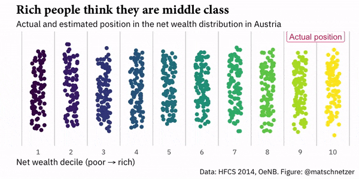

```{r setup, include=FALSE}
options(htmltools.dir.version = FALSE)
r <- getOption("repos")
r["CRAN"] <- "http://cran.cnr.berkeley.edu/"
options(repos = r)
set.seed(12345)
```

<style>

.remark-slide-number {
  position: inherit;
}

.remark-slide-number .progress-bar-container {
  position: absolute;
  bottom: 0;
  height: 6px;
  display: block;
  left: 0;
  right: 0;
}

.remark-slide-number .progress-bar {
  height: 100%;
  background-color: #EB811B;
}

.orange {
  color: #EB811B;
}
</style>

# Today's Agenda

.font150[
* Scatter plots

* Correlations
]

---

# Scatter Plots

.font150[
* Scatter plots show how two variables are related to each other

* Convention: _x_ is the independent variable (what you change), _y_ is the dependent variable (what you want to explain)

* Cartesian coordinates (x, y) of the data points

* `plot(x,y)` in R
]
---

# Scatter Plots

.font150[
* `plot()` also has many options:

	- `main`, `xlab`, `ylab`, `ylim`, `xlim`, `col` as we've seen before
	- `pch =` different plotting symbols. 
	
* You can add another variable to the same graph with `points()`
]
---

# Scatter Plots

.center[]
---

# Scatter Plots

```{r, fig.align='center',fig.width=10, fig.height=5}
set.seed(12345)                       # reproducibility
x <- rnorm(n = 100, mean = 5, sd = 2) # random numbers with normal distribution
y <- x + rnorm(100, 0, 1)             # no need to write function arguments
df <- data.frame(x,y)                 # just to see them side-by-side
head(df, 10)                          # first 10 observations
```
---

# Scatter Plots

```{r, fig.align='center',fig.width=10, fig.height=5}
plot(df$x, df$y, main = "Scatter Plot", pch = 16, col = "blue")     # plot
```

---

# Scatter Plots

```{r, fig.align='center',fig.width=10, fig.height=5}
z <- runif(n = 10, min = 0, max = 10) # add another variable 
df <- data.frame(x,y,z)
head(df, 10)
```
---

# Scatter Plots

```{r, fig.align='center',fig.width=10, fig.height=5}
plot(df$x, df$y, main = "Scatter Plot", pch = 16, col = "blue")
{{points(df$z, pch = 17, col = "red")}}      # add z to the plot
```

---

# Time-Series Plots

.font150[
* `plot()` also plots time trends

* Add `type = "l"` (line) to your code

* Additional lines with `lines()`

* Be sure to include _the same x variable in both_
]
---

# Time-Series Plots

```{r, fig.align='center',fig.width=10, fig.height=5}
set.seed(1) 
years <- seq(from = 1950, to = 2010, by = 10)
k <- rnorm(n = 7, mean = 5, sd = 5)
plot(years, k, main = "Time-Series Plot", type = "l", col = "brown")
```

---

# Time-Series Plots

```{r, fig.align='center',fig.width=10, fig.height=5}
set.seed(3)                               # different random numbers
z <- rnorm(n = 7, mean = 5, sd = 2.5)
plot(years, k, main = "Time-Series Plot", type = "l", col = "brown")
{{lines(years, z, type = "l", col = "blue")}} # add z to plot
text(2009, 8, "K variable", col = "brown")
text(2009, 4, "Z variable", col = "blue")
```

---

# The Health and Wealth of Nations

```{r, tidy=FALSE, warning=FALSE}
library(ggplot2)
library(gganimate)
library(gapminder)
head(gapminder)
```
---

# The Health and Wealth of Nations

```{r, tidy=FALSE,eval=FALSE}
# Plot
ggplot(gapminder, aes(gdpPercap, lifeExp, size = pop, colour = continent)) +
  geom_point(alpha = 0.7, show.legend = TRUE) +
  scale_colour_manual(values = continent_colors) +
  scale_size(range = c(2, 12)) +
  scale_x_log10() +
  # Here comes the gganimate specific bits
  labs(title = 'Year: {frame_time}', x = 'GDP per capita', y = 'life expectancy') +
  transition_time(year) +
  ease_aes('linear', interval = 0.0005)
```
---

# The Health and Wealth of Nations

```{r, tidy=FALSE,echo=FALSE, cache=TRUE, fig.align='center', warning=FALSE, message=FALSE, fig.width=11}
ggplot(gapminder, aes(gdpPercap, lifeExp, size = pop, colour = continent)) +
  geom_point(alpha = 0.7, show.legend = TRUE) +
  scale_colour_manual(values = continent_colors) +
  scale_size(range = c(2, 12)) +
  scale_x_log10() +
  # Here comes the gganimate specific bits
  labs(title = 'Year: {frame_time}', x = 'GDP per capita', y = 'life expectancy') +
  transition_time(year) +
  ease_aes('linear', interval = 0.0005)
```
---

# The Health and Wealth of Nations

```{r, tidy=FALSE,eval=FALSE}
# Plot by Continent
ggplot(gapminder, aes(gdpPercap, lifeExp, size = pop, colour = country)) +
  geom_point(alpha = 0.7, show.legend = FALSE) +
  scale_colour_manual(values = country_colors) +
  scale_size(range = c(2, 12)) +
  scale_x_log10() +
{{facet_wrap(~continent) +}}
  labs(title = 'Year: {frame_time}', x = 'GDP per Capita', y = 'Life Expectancy') +
  transition_time(year) +
  ease_aes('linear', interval = 0.0005)
```
---

# The Health and Wealth of Nations

```{r, tidy=FALSE,echo=FALSE, cache=TRUE, fig.align='center', warning=FALSE,message=FALSE, fig.width=11}
ggplot(gapminder, aes(gdpPercap, lifeExp, size = pop, colour = country)) +
  geom_point(alpha = 0.7, show.legend = FALSE) +
  scale_colour_manual(values = country_colors) +
  scale_size(range = c(2, 12)) +
  scale_x_log10() +
  facet_wrap(~continent) +
  labs(title = 'Year: {frame_time}', x = 'GDP per Capita', y = 'Life Expectancy') +
  transition_time(year) +
  ease_aes('linear', interval = 0.0005)
```
---

# Perceived Income Distribution in Austria

.center[]
---

class: inverse, center, middle

# Correlation

<html><div style='float:left'></div><hr color='#EB811B' size=1px width=720px></html> 
---

# Correlation

.font150[
* Most widely-used statistics to summarise bivariate relationships

* Many types of correlation coefficients, most common is _Pearson's r_

* It ranges from -1 (strongest negative correlation) to +1 (strongest positive correlation)

* 0 denotes no correlation

* Correlations only indicate .orange[linear relationships]

* Remember: .orange[correlation is not causation]
]
---

# z-score

.font150[
* z-score is the number of standard deviations an observation is above or below the mean

* z-score of an observation _i_ of variable _x_ is defined as _the value of i minus the mean of x over the standard deviation of x_. Formally:

* $z_{x_i} = \frac{x_i - \bar{x}}{S_x}$

* For instance, if a data point has a z-score of 2, it is 2 standard deviations from the mean

* As z-scores .orange[standardise] the variables, .orange[the original units of measurement don't matter]
]
---

# Correlation

.font150[
* Correlation coefficient is .orange[the average product of the z-score of _x_ and the z-score of _y_]

* Formally:

* $r_{x,y} = \frac{1}{n-1} \sum^{n}_{i=1} \big(\frac{x_i - \bar{x}}{S_x} \times \frac{y_i - \bar{y}}{S_y}\big)$

* In R: `cor(x,y)`
]
---

# Correlation

.font150[
* How do we know if a correlation is strong or not?

* _Theory_

* In social sciences, usually we consider
  - lower than 0.3 = weak
  - between 0.3 and 0.5 = moderate
  - higher than 0.5 = strong
  - (but don't quote me on that!)
]
---

# Correlation

```{r}
data(gapminder)
names(gapminder)
cor(gapminder$gdpPercap, gapminder$lifeExp)
cor(gapminder$pop, gapminder$lifeExp)
cor(gapminder$pop, gapminder$gdpPercap)
```
---

class: inverse, center, middle

# Questions?

<html><div style='float:left'></div><hr color='#EB811B' size=1px width=720px></html> 
---

# Hans Rosling - The Joy of Stats

.center[
<iframe width="560" height="315" src="https://www.youtube.com/embed/jbkSRLYSojo" frameborder="0" allow="accelerometer; autoplay; encrypted-media; gyroscope; picture-in-picture" allowfullscreen></iframe>
]

.font150[
Hans Rosling's 200 Countries, 200 Years, 4 Minutes - The Joy of Stats - BBC Four. <https://youtu.be/jbkSRLYSojo>
]

---

class: inverse, center, middle

# See You Next Week!

<html><div style='float:left'></div><hr color='#EB811B' size=1px width=720px></html> 
