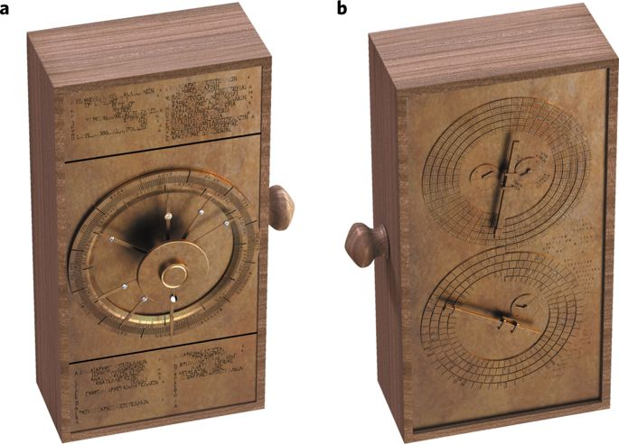
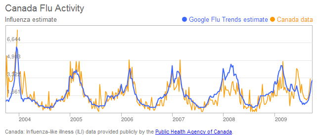
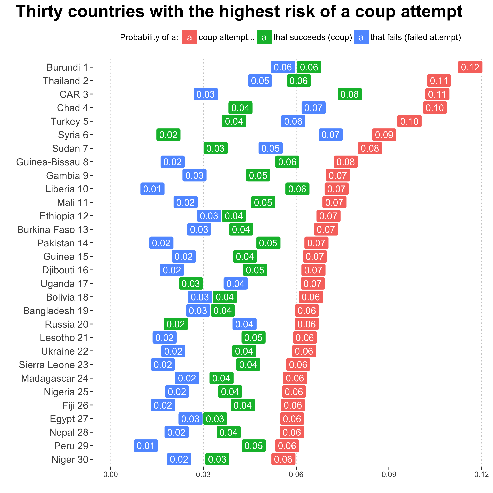
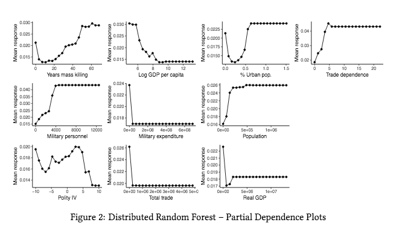
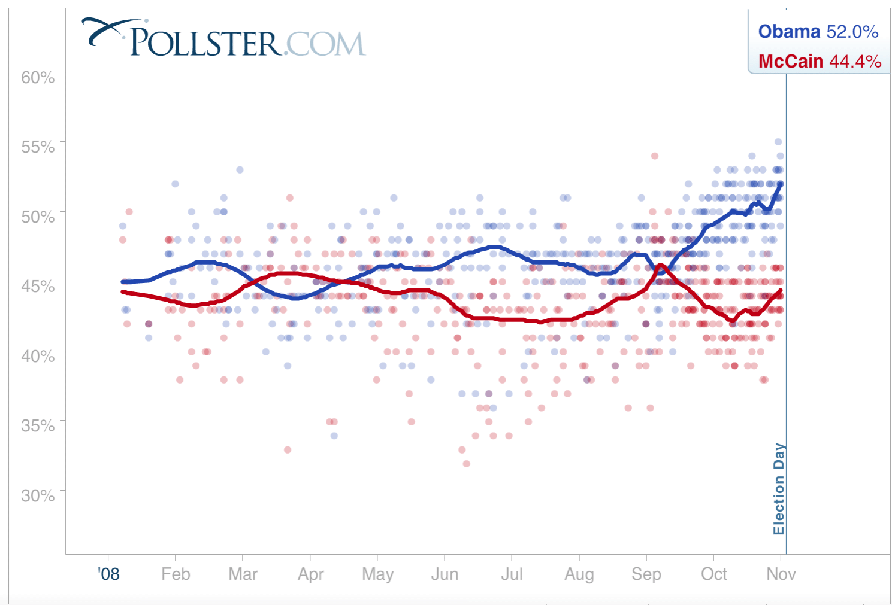
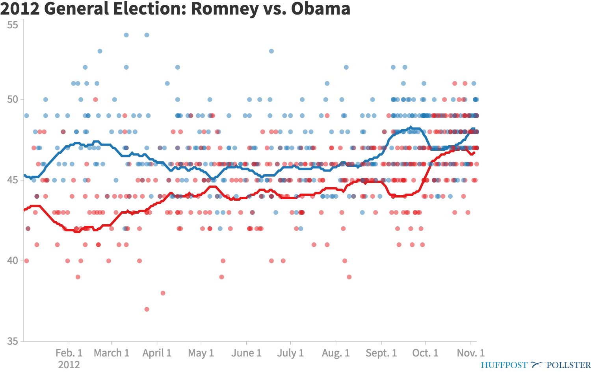

```{r setup, include=FALSE}
options(htmltools.dir.version = FALSE)
r <- getOption("repos")
r["CRAN"] <- "http://cran.cnr.berkeley.edu/"
options(repos = r)
set.seed(12345)
install.packages("pollstR")
```

<style>

.remark-slide-number {
  position: inherit;
}

.remark-slide-number .progress-bar-container {
  position: absolute;
  bottom: 0;
  height: 6px;
  display: block;
  left: 0;
  right: 0;
}

.remark-slide-number .progress-bar {
  height: 100%;
  background-color: #EB811B;
}

.orange {
  color: #EB811B;
}
</style>

# Today's Agenda

.font150[
* Why is prediction important?

* Election prediction, 538-style

* For Loops

* Conditional statements (time permitting)
]
---

class: inverse, center, middle

# Prediction

<html><div style='float:left'></div><hr color='#EB811B' size=1px width=720px></html> 
---

class: clear

background-image: url(antikythera01.png)
---

# Antikythera Mechanism

.center[]
---

# Antikythera Mechanism

.center[]
---

# Paul the Octopus

.center[]
---

# Canada Flu Activity

.center[]
---

# Coups d'État

.center[]
---

# Mass Killings

.center[]
---

# Mass Killings

.center[]
---

# 2008 US Presidential Election

.font130[
* Barack Obama won 52.9% of the national votes while McCain won 45.7%

* Polls fluctuate early but very accurate at the end
]
.center[]
---

# 2012 US Presidential Election

.font150[
* Obama: 51.1% (polls: 48.2%)

* Romney: 47.2% (polls: 46.7%)
]

.center[]
---

# How Should We "Forecast" Elections?

.font110[
* Macro political and economic fundamentals for early forecasting
]

.center[]

.font110[
* Recent method: combine them with polls
]
---

# Let's Analyse Some Polls

.font120[
* We will use a nice `R` package called `pollstR`, which scrapes the data from Huffington Post:
]

.center[]
---

# Let's Analyse Some Polls

.font150[
* Only a few lines of code does it:
]

```{r hp01,fig.align="center",tidy=F,warning=F,message=F,cache=T}
library(pollstR)
chart_name <- "2016-general-election-trump-vs-clinton"
polls2016 <- pollster_charts_polls(chart_name)[["content"]]
polls2016 <- as.data.frame(polls2016)
names(polls2016)
polls2016[1:3, c("Trump", "Clinton", "start_date", "end_date")]
```
---

# Plotting Polls over Time

.font150[
* Compute the days to the election variable
]
```{r hp02,fig.align="center",tidy=F,warning=F,message=F,cache=T}
class(polls2016$end_date)
polls2016$DaysToElection <- as.Date("2016-11-8") - polls2016$end_date
```
.font150[
* Plot results
]
```{r hp03,fig.align="center",tidy=F,warning=F,message=F,cache=T,eval=F}
plot(polls2016$DaysToElection, polls2016$Clinton,
     xlab = "Days to the Election", ylab = "Support",
     xlim = c(550, 0), ylim = c(25, 65), pch = 19,
     col = "blue")
points(polls2016$DaysToElection, polls2016$Trump,
       pch = 20, col = "red")
```
---

# Plotting Polls over Time

```{r hp04,fig.align="center",tidy=F,warning=F,message=F,cache=T,echo=F}
# Plot results
plot(polls2016$DaysToElection, polls2016$Clinton,
     xlab = "Days to the Election", ylab = "Support",
     xlim = c(550, 0), ylim = c(25, 65), pch = 19,
     col = "blue")
points(polls2016$DaysToElection, polls2016$Trump,
       pch = 20, col = "red")
```

.font130[
.center[What's wrong with this plot?]
]
---

# Plotting Polls over Time

```{r hp05,fig.align="center",tidy=F,warning=F,message=F,cache=T,echo=F}
# Plot results
plot(polls2016$DaysToElection, polls2016$Clinton,
     xlab = "Days to the Election", ylab = "Support",
     xlim = c(550, 0), ylim = c(25, 65), type = "l",
     col = "blue")
points(polls2016$DaysToElection, polls2016$Trump,
       pch = 20, col = "red", type = "l")
```

.font130[
.center[Time series looks even worse]
]
---

# Smoothing over Time

.font140[
* .orange[Moving average]: average polls within a one-week period
]
--
.font140[
* For example, on 17th of October, we will take all polls conducted within the past week
]
--
.font140[
* Window size: amount of smoothing
]
--
.font140[
* Coding strategy: for each day, we subset the relevant polls and compute the average
]
--
.font140[
* Range of the `DaysToElection` variable:
]
```{r hp06,fig.align="center",tidy=F,warning=F,message=F,cache=T}
range(polls2016$DaysToElection)
```
---

# For Loops in R

.font120[
* Basic structure
]
```{r loop01,fig.align="center",tidy=F,warning=F,message=F,cache=T,eval=F}
 for (i in X) {
    expression1
    expression2
    ...
    expressionN
}
```
.font120[
* Elements of a loop
    - `i`: counter (can use any object name other than `i`)
    - `X`: vector containing a set of ordered values the counter takes
    - `expression`: a set of expressions that will be repeatedly evaluated
    - `{ }`: curly braces to define the beginning and the end

* Indentation is important for the readability of code
]
---

# For Loops in R

.font150[
* .orange[Tip]: Code without loop first by setting the counter to a specific value
]
```{r tip,fig.align="center",tidy=F,warning=F,message=F,cache=T}
values <- c(2, 4, 6)
i <- 1
x <- values[i] * 3
cat(values[i], "times 3 is equal to", x, "\n")
```
---

# For Loops in R

.font150[
* Step by step: 
]
```{r loop02,fig.align="center",tidy=F,warning=F,message=F,cache=T,tidy=F}
# our vector
values <- c(2, 4, 6)
# empty vector for storing the results
results <- rep(NA, length(values))
# counter `i' will take values on 1, 2, ..., length(values) in that order 
for (i in 1:length(values)) {
# store the result as the ith element of `results' vector
    results[i] <- values[i] * 3
# print the values, you will not see this
    cat(values[i], "times 3 is equal to", results[i], "\n") 
}
```
---

# For Loops in R

.font150[
* Printing out an iteraction number can be helpful for debugging
]
```{r loop03,fig.align="center",tidy=F,message=F,cache=T,tidy=F}
values <- c(1, -1, 2)
results <- rep(NA, 3)
for (i in 1:3) {
    cat("iteration", i, "\n")
    results[i] <- log(values[i])
}
```
---

# 7-Day Moving Average

```{r pres01,fig.align="center",tidy=F,warning=F,message=F,cache=T,eval=F}
# Days
days <- 532:2
# Set a 7-day moving average window
window <- 7
# Fill two vectors with NAs
Clinton.pred <- Trump.pred <- rep(NA, length(days))
# Loop
for (i in 1:length(days)) {
    week.data <-
        subset(polls2016,
               subset = ((DaysToElection < (days[i] + window))
                   & (DaysToElection >= days[i])))
    Clinton.pred[i] <- mean(week.data$Clinton)
    Trump.pred[i] <- mean(week.data$Trump)
}
# Plot
plot(days, Clinton.pred, type = "l", col = "blue",
     xlab = "Days to the Election", ylab = "Support",
     xlim = c(550, 0), ylim = c(25, 65))
lines(days, Trump.pred, col = "red")
```
---

# 7-Day Moving Average

```{r pres02,fig.align="center",tidy=F,warning=F,message=F,cache=T,echo=F}
days <- 532:2
window <- 7   
Clinton.pred <- Trump.pred <- rep(NA, length(days)) # empty vectors
for (i in 1:length(days)) {
    week.data <-
        subset(polls2016,
               subset = ((DaysToElection < (days[i] + window))
                   & (DaysToElection >= days[i])))
    Clinton.pred[i] <- mean(week.data$Clinton)
    Trump.pred[i] <- mean(week.data$Trump)
}

# Smoothed Plot
plot(days, Clinton.pred, type = "l", col = "blue",
     xlab = "Days to the Election", ylab = "Support",
     xlim = c(550, 0), ylim = c(25, 65))
lines(days, Trump.pred, col = "red")
```
.font130[
.center[Maybe we should try another window]
]
---

# 3-Day Moving Average

```{r pres03,fig.align="center",tidy=F,warning=F,message=F,cache=T,eval=F}
# Days
days <- 532:2
# 3-day moving averages
window <- 3
# Empty vectors
Clinton.pred <- Trump.pred <- rep(NA, length(days))
# Loop
for (i in 1:length(days)) {
    week.data <-
        subset(polls2016,
               subset = ((DaysToElection < (days[i] + window))
                   & (DaysToElection >= days[i])))
    Clinton.pred[i] <- mean(week.data$Clinton)
    Trump.pred[i] <- mean(week.data$Trump)
}
# Plot
plot(days, Clinton.pred, type = "l", col = "blue",
     xlab = "Days to the Election", ylab = "Support",
     xlim = c(550, 0), ylim = c(25, 65))
lines(days, Trump.pred, col = "red")
```
---

# 3-Day Moving Average

```{r pres04,fig.align="center",tidy=F,warning=F,message=F,cache=T,echo=F}
days <- 532:2
window <- 3
Clinton.pred <- Trump.pred <- rep(NA, length(days)) # empty vectors
for (i in 1:length(days)) {
    week.data <-
        subset(polls2016,
               subset = ((DaysToElection < (days[i] + window))
                   & (DaysToElection >= days[i])))
    Clinton.pred[i] <- mean(week.data$Clinton)
    Trump.pred[i] <- mean(week.data$Trump)
}

# Smoothed Plot
plot(days, Clinton.pred, type = "l", col = "blue",
     xlab = "Days to the Election", ylab = "Support",
     xlim = c(550, 0), ylim = c(25, 65))
lines(days, Trump.pred, col = "red")
```
.font130[
.center[Maybe we should try _yet another_ window]
]
---

# 2-Week Moving Average

```{r pres05,fig.align="center",tidy=F,warning=F,message=F,cache=T,echo=F}
days <- 532:2
window <- 14
Clinton.pred <- Trump.pred <- rep(NA, length(days)) # empty vectors
for (i in 1:length(days)) {
    week.data <-
        subset(polls2016,
               subset = ((DaysToElection < (days[i] + window))
                   & (DaysToElection >= days[i])))
    Clinton.pred[i] <- mean(week.data$Clinton)
    Trump.pred[i] <- mean(week.data$Trump)
}

# Smoothed Plot
plot(days, Clinton.pred, type = "l", col = "blue",
     xlab = "Days to the Election", ylab = "Support",
     xlim = c(550, 0), ylim = c(25, 65))
lines(days, Trump.pred, col = "red")
```
.font130[
.center[It's getting better!]
]
---

# Let’s Add Some Informative Labels

.font150[
* Candidate names
]
```{r names,fig.align="center",tidy=F,warning=F,message=F,cache=T,eval=F}
text(400, 50, "Clinton", col = "blue")
text(400, 40, "Trump", col = "red")
```

.font150[
* Events: party conventions and debates
]
```{r conventions,fig.align="center",tidy=F,warning=F,message=F,cache=T,eval=F}
text(200, 60, "party\n conventions")
abline(v = as.Date("2016-11-8") - as.Date("2016-7-28"),
       lty = "dotted", col = "blue")
abline(v = as.Date("2016-11-8") - as.Date("2016-7-21"),
       lty = "dotted", col = "red")

text(60, 30, "debates")
abline(v = as.Date("2016-11-8") - as.Date("2016-9-26"),
       lty = "dashed")
abline(v = as.Date("2016-11-8") - as.Date("2016-10-9"),
       lty = "dashed")
```
---

# Let’s Add Some Informative Labels

```{r,fig.align="center",tidy=F,warning=F,message=F,cache=T,echo=FALSE}
days <- 532:2
window <- 14
Clinton.pred <- Trump.pred <- rep(NA, length(days)) # empty vectors
for (i in 1:length(days)) {
    week.data <-
        subset(polls2016,
               subset = ((DaysToElection < (days[i] + window))
                   & (DaysToElection >= days[i])))
    Clinton.pred[i] <- mean(week.data$Clinton)
    Trump.pred[i] <- mean(week.data$Trump)
}

# Smoothed Plot
plot(days, Clinton.pred, type = "l", col = "blue",
     xlab = "Days to the Election", ylab = "Support",
     xlim = c(550, 0), ylim = c(25, 65))

# Text
lines(days, Trump.pred, col = "red")
text(400, 50, "Clinton", col = "blue")
text(400, 40, "Trump", col = "red")
text(200, 60, "party\n conventions")
abline(v = as.Date("2016-11-8") - as.Date("2016-7-28"),
       lty = "dotted", col = "blue")
abline(v = as.Date("2016-11-8") - as.Date("2016-7-21"),
       lty = "dotted", col = "red")

text(60, 30, "debates")
abline(v = as.Date("2016-11-8") - as.Date("2016-9-26"),
       lty = "dashed")
abline(v = as.Date("2016-11-8") - as.Date("2016-10-9"),
       lty = "dashed")
```

.font130[
.center[Looks pretty good!]
]
---

class: inverse, center, middle

# Questions?

<html><div style='float:left'></div><hr color='#EB811B' size=1px width=720px></html> 
---

class: inverse, center, middle

# Have A Great Weekend!

<html><div style='float:left'></div><hr color='#EB811B' size=1px width=720px></html>  