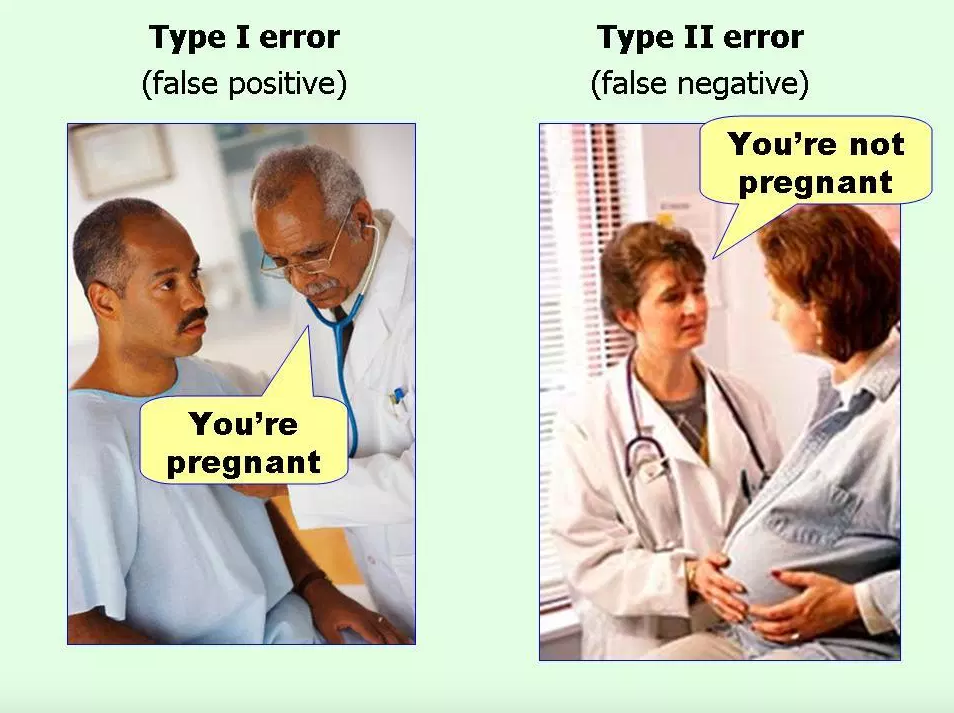

```{r setup, include=FALSE}
options(htmltools.dir.version = FALSE)
r <- getOption("repos")
r["CRAN"] <- "http://cran.cnr.berkeley.edu/"
options(repos = r)
set.seed(12345)
```

<style>

.remark-slide-number {
  position: inherit;
}

.remark-slide-number .progress-bar-container {
  position: absolute;
  bottom: 0;
  height: 6px;
  display: block;
  left: 0;
  right: 0;
}

.remark-slide-number .progress-bar {
  height: 100%;
  background-color: #EB811B;
}

.orange {
  color: #EB811B;
}
</style>

# Today's Agenda

.font150[
* Predicting the US presidential election (continued)

* Classification

* General conditional statements

* How to write your own R functions
]
---

# Prediction Error

.font150[
* We need to verify the quality of our predictions

* .orange[Prediction Error]: actual outcome - predicted outcome

* Mean prediction error: mean(error)

* Root mean square error (RMSE): $\sqrt{mean(error^2)}$
]
---

# Mean Predictor Error or RMSE?

.font150[
* Which one is better?

* They are similar, but RMSE has interesting properties:
  - Since the errors are squared before they are averaged, RMSE gives high weight to large errors
  - Thus, RMSE is more useful when large errors are particularly undesirable
]

---

# Prediction Error

.font120[
```{r hp01,fig.align="center",tidy=F,warning=F,message=F,cache=T}
# Same code we saw last week, download data
library(pollstR)
chart_name <- "2016-general-election-trump-vs-clinton"
polls2016 <- pollster_charts_polls(chart_name)[["content"]]
polls2016 <- as.data.frame(polls2016)
polls2016$DaysToElection <- as.Date("2016-11-8") - polls2016$end_date
```
]
---

# Prediction Error

```{r hp02,fig.align="center",tidy=F,warning=F,message=F,cache=T}
last.weeks.data <- subset(polls2016, subset = DaysToElection < 15) # recent polls
margin <- last.weeks.data$Clinton - last.weeks.data$Trump
margin[1:5]                   # latest 5 polls
true.margin <- 48.59 - 46.47  # election result
pred.error <- true.margin - margin
pred.error
mean(pred.error)
sqrt(mean(pred.error^2))
```
---

# National Polls Weren't Far Off

```{r hist,fig.align="center",tidy=F,warning=F,message=F,cache=T,fig.height=6}
hist(margin, main = "Poll Prediction", col = "grey",
     xlab = "Predicted Clinton's margin of victory (%)")
abline(v = true.margin, col = "red",
       lwd = 2, lty = "dotted") # line width and line type
```
---

# National Polls Weren't Far Off

```{r hist02,fig.align="center",tidy=F,warning=F,message=F,cache=T,fig.height=6}
error <- margin - true.margin
hist(error, main = "Poll Prediction Error", col = "blue",
     xlab = "Error in Predicted Clinton’s margin of victory (%)")
```
---

# Nate Silver

.font150[
"Trump outperformed his national polls by only 1 to 2 percentage points in losing the popular vote to Clinton, making them slightly closer to the mark than they were in 2012. Meanwhile, he beat his polls by only 2 to 3 percentage points in the average swing state"

Nate Silver - [The Real Story of 2016](https://fivethirtyeight.com/features/the-real-story-of-2016)
]
---

# Classification

.font150[
* Often we care about binary outcomes 

* Did Trump win electoral college?

* Did civil war occur?

* Did it rain?

* Prediction of binary outcome variable = .orange[classification problem]
]
---

# Classification

.font140[
* Wrong prediction: misclassification
  - True positive: correctly predicting civil war in country X at time T
  - False positive: incorrectly predicting civil war in country X at time T
  - True negative: correctly predicting no civil war in country X at time T
  - False negative: incorrectly predicting no civil war in country X at time T

* .orange[Type I error]: false positive

* .orange[Type II error]: false negative
]
---

# False Positives and False Negatives 

.center[]
---

class: inverse, center, middle

# Questions?

<html><div style='float:left'></div><hr color='#EB811B' size=1px width=720px></html> 
---

# General Conditional Statements

.font150[
* You already know how to write conditional statements in R: `ifelse()`

```{r if01,fig.align="center",tidy=F,warning=F,message=F,cache=T}
values <- 1:10
ifelse(values < 5, 0, 1)
```
]
---

# General Conditional Statements

.font150[
* But we can write conditional statements in a more general way:
]

.font120[
```{r if02,fig.align="center",tidy=F,warning=F,message=F,cache=T,eval=FALSE}
if (X) {
    expression1a
    ...
    expressionNa
} else if (Y) {
    expression1b
    ...
    expressionNb
} else {
    expression1c
    ...
    expressionNc
}
```
]
---

# General Conditional Statements

.font150[
* Elements of `if(){}else(){}`
  - `X`: logical statement returning either `TRUE` or `FALSE`
  - `Y`: additional statements also returning either `TRUE` or `FALSE`
  - `expression`: code chunks evaluated depending on the value of `X`
  
* Can be combined with for loops
]
---

# Example

.font120[
```{r if03,fig.align="center",tidy=F,warning=F,message=F,cache=T}
values <- 1:10                     # sequence from 1 to 10
results <- rep(NA, length(values)) # empty vector

# Loop
for (i in values) {
  if (values[i] < 5) {
    results[i] <- 0
} else if (values[i] == 5) {
    results[i] <- 5
} else {
    results[i] <- 1
}
}

# Print results
results
```
]
---

# Custom Functions in R

.font120[
* One of the best things about R is that users can create their own functions

* R packages are just collection of functions

* Custom functions save time and increase reliability. Basic syntax:

```{r fun,fig.align="center",tidy=F,warning=F,message=F,cache=T,eval=FALSE}
function_name <- function(arg_1, arg_2, ...) {
   Function body 
}
```

* Name: the name you want for your function

* Arguments: a placeholder. When a function is invoked, you pass a value to the argument. A function can have as many arguments as you want to

* Function body: what the function does
]
---

# Example: Fahrenheit to Celsius

.font120[
```{r fah,fig.align="center",tidy=F,warning=F,message=F,cache=T}
# Call the function "temp.converter" and the argument "fahrenheit"
temp.converter <- function(fahrenheit) {
  (fahrenheit - 32) / 1.8   # what the function does
}

# Testing the function
temp.converter(0)   
temp.converter(50)  
temp.converter(-40)
```
]
---

# A Fancier Function

.font140[
* Let's create a function called `is.prime()` that identifies any prime number
```{r prime,fig.align="center",tidy=F,warning=F,message=F,cache=T}
# Call the function "is.prime" and the argument "num"
is.prime <- function(num) {
   if (num == 2) {
      cat("2 is the first prime number")
   } else if (any(num %% 2:(num-1) == 0)) { 
      cat(num, "is not a prime number", "\n") 
   } else { 
      cat(num, "is a prime number", "\n")
   }
}
```
]
---

# Testing the function

.font120[
```{r prime02,fig.align="center",tidy=F,warning=F,message=F,cache=T}
is.prime(2)
is.prime(10)
is.prime(7919)
is.prime(sqrt(81))
```
]
---

class: inverse, center, middle

# Questions?

<html><div style='float:left'></div><hr color='#EB811B' size=1px width=720px></html>  
---

class: inverse, center, middle

# See you on Wednesday!

<html><div style='float:left'></div><hr color='#EB811B' size=1px width=720px></html>  