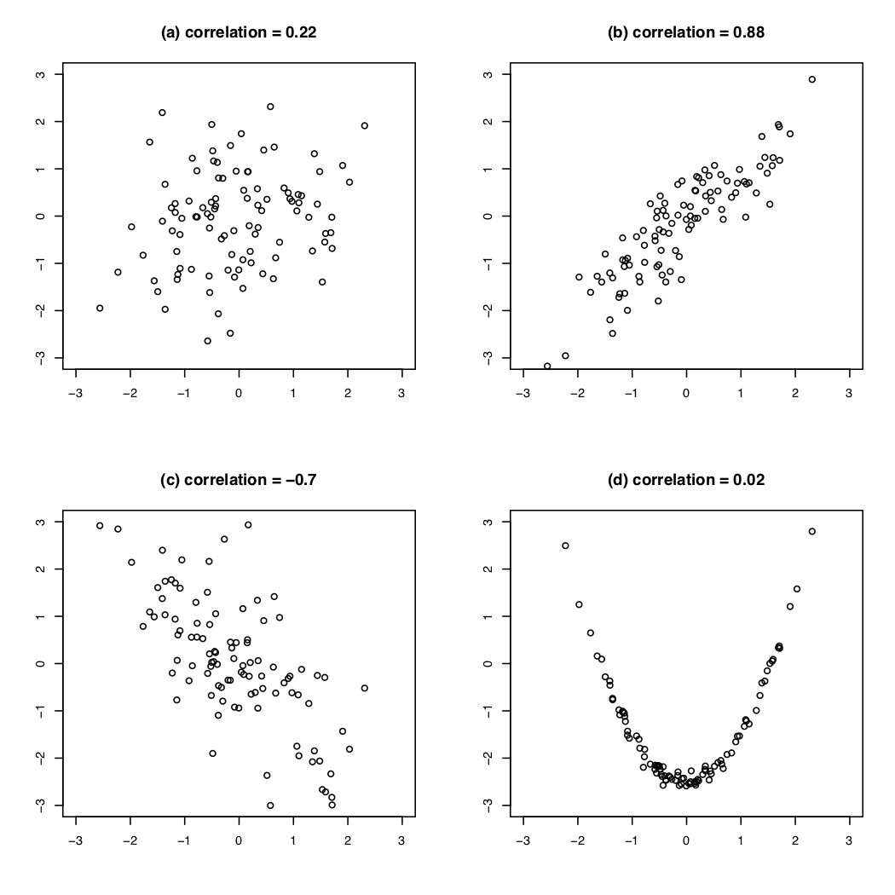

```{r setup, include=FALSE}
options(htmltools.dir.version = FALSE)
r <- getOption("repos")
r["CRAN"] <- "http://cran.cnr.berkeley.edu/"
options(repos = r)
set.seed(12345)
```

<style>

.remark-slide-number {
  position: inherit;
}

.remark-slide-number .progress-bar-container {
  position: absolute;
  bottom: 0;
  height: 6px;
  display: block;
  left: 0;
  right: 0;
}

.remark-slide-number .progress-bar {
  height: 100%;
  background-color: #EB811B;
}

.orange {
  color: #EB811B;
}
</style>

# Today's Agenda

.font150[
* Review of correlation

* From correlation to linear regression

* Regression equations
]
---

# Correlations and Scatter Plots

```{r gap01,fig.align="center",tidy=F,warning=F,message=F,cache=T,fig.height=4.5,fig.width=9}
bivariate <- read.csv("https://raw.githubusercontent.com/pols1600/pols1600.github.io/master/datasets/prediction/bivariate_data.csv")
bivariate <- subset(bivariate, Year == 2010)
plot(log(bivariate$GDP), bivariate$Child.Mortality, pch = 19, 
     main = "Log GDP Per Capita and Child Mortality")
cor(bivariate$Child.Mortality, log(bivariate$GDP), use = "complete")
``` 
---

# Correlations

.font150[
* .orange[Correlations:] the average product of the z-score of _x_ and the z-score of _y_

* $cor_{x,y} = \frac{1}{n-1} \sum^{n}_{i=1} \big(\frac{x_i - \bar{x}}{S_x} \times \frac{y_i - \bar{y}}{S_y}\big)$

* Positive correlation: upward slope

* Negative correlation: downward slope

* High correlation: tighter, close to a line

* Correlation .orange[cannot] capture nonlinear relationship
]
---

# Correlations and Scatter Plots

.center[]
---

# From Correlation to Linear Regression

.font150[
* Linear regression allows us to create predictions

* Linear regression specifies direction of relationship

* Linear regression allows us to examine more than two variables at the same time (statistical control)
]
---

# Linear Regression

.font150[
* Regression has .orange[one dependent (y)] and _for now_ .orange[one independent (x) variable]

* Goal of regression is to approximate the (linear) relationship between X and Y as best as possible

* Regression is the mathematical model to draw best fitting line through cloud of points

* In R: `lm(Y ~ X, data = yourdataset)`
]
---

# Linear Regression

.font100[
```{r gap02,fig.align="center",tidy=F,warning=F,message=F,cache=T,fig.height=4.5,fig.width=9}
plot(log(bivariate$GDP), bivariate$Child.Mortality, pch = 19, 
     main = "Log GDP Per Capita and Child Mortality",
     xlab = "Log GDP Per Capita", ylab = "Child Mortality")
{{abline(lm(Child.Mortality ~ log(GDP), data = bivariate), col = "red", lwd = 2)}}
``` 
]

.font120[For each x we have a prediction of y: .orange[what would we expect y to be given the value of x?]
]
---

# What is the equation of a line?

.font150[
* $y = mx + b$
  - $m$ is the slope
  - $b$ is the intercept
  
* .orange[Regression equation]: $Y = \alpha + \beta X + \epsilon$
  - $\alpha$ is the intercept
  - $\beta$ is the slope
  - $\epsilon$ is the error term
]
---

# Interpretation

.font150[
* $Y$:  dependent/response/outcome variable

* $\alpha$: value of $Y$ when $X = 0$

* $\beta$: increase/decrease in $Y$ when $X$ varies by one unit

* $\alpha + \beta X$: average value of $Y$ at a given value of $X$

* $\epsilon$: difference between each point and the fitted line. Assumed to have a mean of zero

* **BUT..**
]
---

# Least Squares

.font150[
* We don't know the true .orange[data generating process] (DGP)

* So we have to _estimate_ the equation using collected data

* Estimates are denoted with little hats: $\hat{\alpha}$, $\hat{\beta}$ (read as "alpha hat", "beta hat")

* We can use $\hat{\alpha}$, $\hat{\beta}$ and $X$ to create _predicted values of_ $Y$

* $\hat{Y} = \hat{\alpha} + \hat{\beta}X$, predicted/fitted value

* $\hat{\epsilon} = Y - \hat{Y} =$ true $Y$ - predicted $Y$

* $\hat{\epsilon}$ is a good measure of model fit
]
---

# How Do We Estimate the Parameters?

.font150[
* .orange[We minimise the _sum of the squared residuals (SSR)_]

$$\textsf{SSR} = \sum_{i=1}^n \hat\epsilon_i^2 = \sum_{i=1}^n (Y_i - \hat{Y_{i}})^2 = \sum_{i=1}^n (Y_i - \hat\alpha - \hat\beta X_i)^2$$
* This also minimises the root mean squared error: $RMSE = \sqrt{\frac{1}{n}\textsf{SSR}}$
]
---

# Regression by Hand

.font150[
* $\hat\alpha = \bar{Y} - \hat\beta \bar{X}$

* $\hat\beta = \frac{\sum_{i=1}^n (Y_i - \overline{Y})(X_i - \overline{X})}{\sum_{i=1}^n (X_i - \overline{X})^2}$

OR...
]
---

# Regression by Hand

.font150[
OR...

* $\hat\beta = \textsf{correlation of X and Y} \times \frac{\textsf{standard deviation of Y}}{\textsf{standard deviation of X}}$

* Regression line always goes through the point of averages $\hat{X},\hat{Y}$

* $\hat{Y}  = (\overline{Y} - \hat\beta \overline{X}) + \hat\beta \overline{X} = \overline{Y}$
]
---

# Example

.font120[
* Enough math! R makes it very easy to estimate linear models with `lm()`

```{r lm01,fig.align="center",tidy=F,warning=F,message=F,cache=T}
lm(Child.Mortality ~ log(GDP), data = bivariate)
```
* $Y = 276.58 - 26.13X + \epsilon$

* $Y$ is child mortality in 100,000 births

* .orange[How can we interpret the equation?]
]
---

# GDP Per Capita and Life Expectancy

.font120[
```{r gapminder-lm,fig.align="center",tidy=F,warning=F,message=F,cache=T}
library(gapminder)
gapminder$gdppc1000 <- gapminder$gdpPercap/1000 # use $1,000s as unit
lm(lifeExp ~ gdppc1000, data = gapminder)   # life expectancy ~ GDPpc
```
How would you interpret that result?
]
---

class: inverse, center, middle

# Questions?

<html><div style='float:left'></div><hr color='#EB811B' size=1px width=720px></html>  
---

# Homework

.font150[
* `swirl()` PREDICTION1
]
---

class: inverse, center, middle

# See you on Friday!

<html><div style='float:left'></div><hr color='#EB811B' size=1px width=720px></html>  