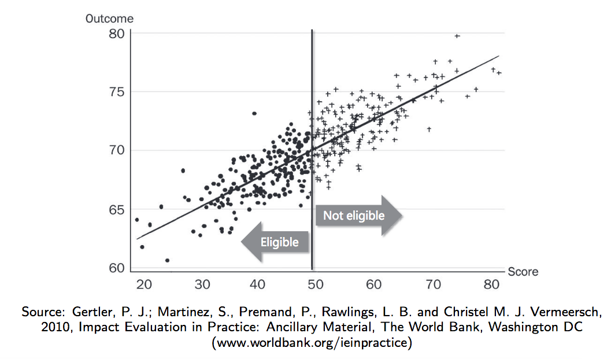
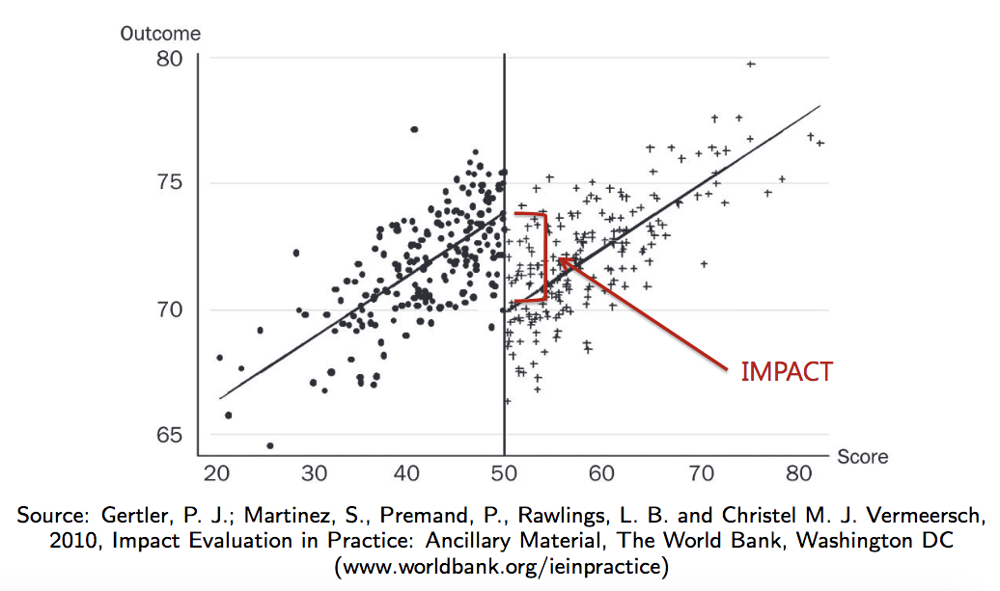
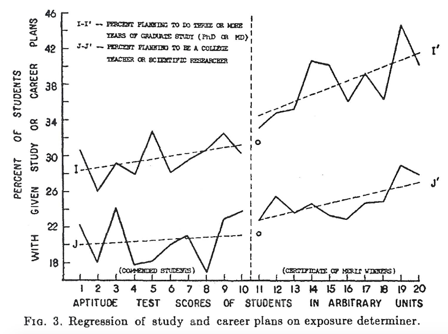
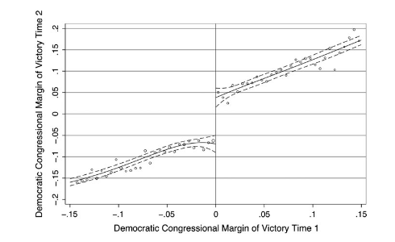
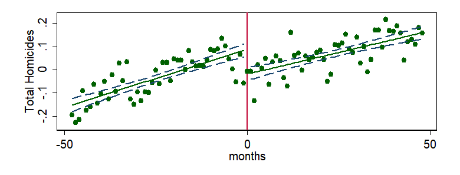
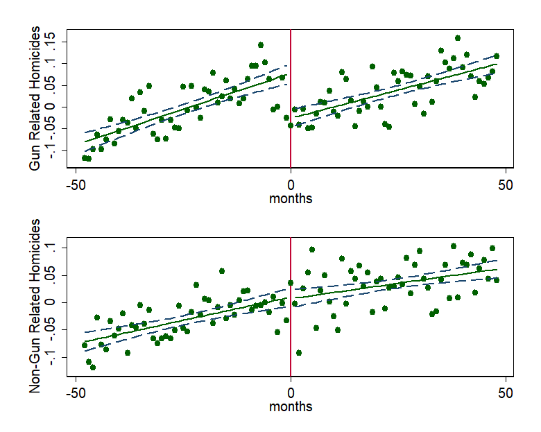

```{r setup, include=FALSE}
options(htmltools.dir.version = FALSE)
r <- getOption("repos")
r["CRAN"] <- "http://cran.cnr.berkeley.edu/"
options(repos = r)
set.seed(12345)
```

<style>

.remark-slide-number {
  position: inherit;
}

.remark-slide-number .progress-bar-container {
  position: absolute;
  bottom: 0;
  height: 6px;
  display: block;
  left: 0;
  right: 0;
}

.remark-slide-number .progress-bar {
  height: 100%;
  background-color: #EB811B;
}

.orange {
  color: #EB811B;
}
</style>

# Regression Discontinuity Design (RDD)

.font150[
* As we have discussed before, sometimes it is unfeasible to conduct an experiment to evaluate a question of interest. E.g.:

  - Education and income
  - Incumbency and reelection rates
  - Gun laws and homicides
  - Drunk driving and accidents
  
* Observations tend to have _systematic differences_

* .orange[However:] some candidates might be suitable for comparison
]
---

# Regression Discontinuity Design (RDD)

.font150[
* RDD's basic setup: treatment is assigned according to a **precise rule** based on another variable

  - Test scores, voting percentage, legislation timing, drinking age

* Useful for analysis in a "rule-based" world (administrative programs, elections, etc.)

* People who barely passed and who barely failed are comparable in many dimensions

* RDDs are a _quasi-experimental_ method at the cutoff (_and only at the cutoff_!)
]
---

# Basic RDD Setup

.center[]
---

# Basic RDD Setup

.center[]

.font150[
**Note:** we only measure _local average treatment effect_ (LATE)
]
---

# RDD Assumptions

.font150[
* Assignment "as good as random": the forcing variable is the _only_ source variation

  - If graphs show _no other discontinuities_, the design is more credible
  
* Individuals _cannot choose_ if they are in the treatment or control group (_no sorting_)

* If treatment is not deterministic (fuzzy RDD), statistical adjustements are necessary
]

---

# Effect of Scholarship 

.font150[
* [Thistlethwaite and Campbell (1960)](https://obsstudies.org/wp-content/uploads/2017/01/regression_discontinuity_all_comments-1.pdf) study the effects of collegescholarships on later students’ achievements

* Observation: scholarship winners have different attitudes

* Are scholarship winners more likely to pursue further education or become teachers?

* Spoiler: yes!
]
---

# Effect of Scholarship 

.center[]
---

# More examples

.font150[
* David E. Broockman (2009). [Do Congressional Candidates Have Reverse Coattails? Evidence from a Regression Discontinuity Design](http://web.stanford.edu/~dbroock/published%20paper%20PDFs/broockman%20rdd%20reverse%20coattails.pdf)
]

.center[]

---

# Concealed Carry Ban and Homicides

.font150[
* Rodrigo Schneider (2019). [Crime and political effects of a concealed carry ban in Brazil](https://drive.google.com/file/d/0B1QCQasYG8iHaWJVZ0Z3VDJ2eEE/view)

]

.center[]
---

# Concealed Carry Ban and Homicides

.font150[
* Testing the assumption that the law has caused the decline in homicide rates
]
.center[]
---

# Let's Estimate Our Own Model

.font120[
* _Question:_ does minimum legal drinking age (MLDA) have an effect on mortality? Let's find out

```{r mm01,fig.align="center",tidy=F,warning=F,message=F,cache=T}
library(foreign) # load dta files
library(rdd)     # run RDD model
df <- read.dta("http://masteringmetrics.com/wp-content/uploads/2015/01/AEJfigs.dta")
rdd1 <- RDestimate(all ~ agecell, data = df, cutpoint = 21)
rdd1
```
]
---

# MLDA and Mortality

.font110[
```{r mm02,fig.align="center",tidy=F,warning=F,message=F,cache=T,fig.height=6.5}
plot(rdd1)
title(main = "All Causes of Death",
      xlab = "Age", ylab = "Mortality rate from all causes (per 100,000)")
abline(v = 21, lwd = 2, lty = "dashed", col = "red")
```
]
---

# Motor Vehicle Accidents

.font110[
```{r mm03,fig.align="center",tidy=F,warning=F,message=F,cache=T,fig.height=6}
rdd2 <- RDestimate(mva ~ agecell, data =  df, cutpoint = 21)
plot(rdd2)
title(main = "Motor Vehicle Accidents Death",
      xlab = "Age", ylab = "Mortality rate per 100,000")
abline(v = 21, lwd = 2, lty = "dashed", col = "red")
```
]
---

# Other Causes of Death

.font110[
```{r mm04,fig.align="center",tidy=F,warning=F,message=F,cache=T,fig.height=6}
rdd3 <- RDestimate(internal ~ agecell, data =  df, cutpoint = 21)
plot(rdd3)
title(main = "Other Causes of Death",
      xlab = "Age", ylab = "Mortality rate per 100,000")
abline(v = 21, lwd = 2, lty = "dashed", col = "red")
```
]
---

class: inverse, center, middle

# Questions?

<html><div style='float:left'></div><hr color='#EB811B' size=1px width=720px></html>  
---

class: inverse, center, middle

# See you on Wednesday!

<html><div style='float:left'></div><hr color='#EB811B' size=1px width=720px></html>  