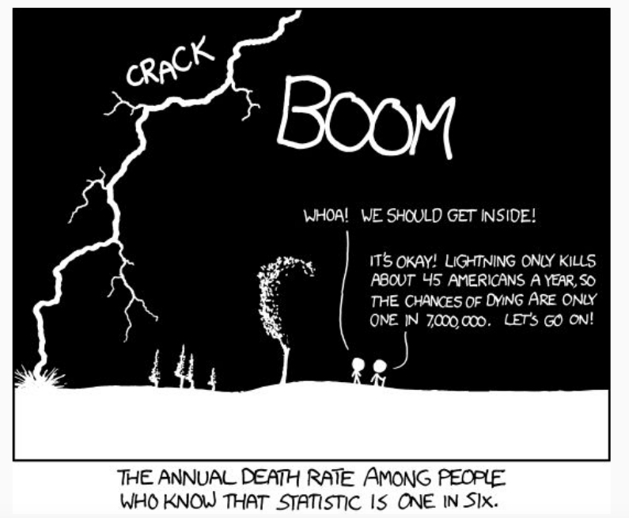
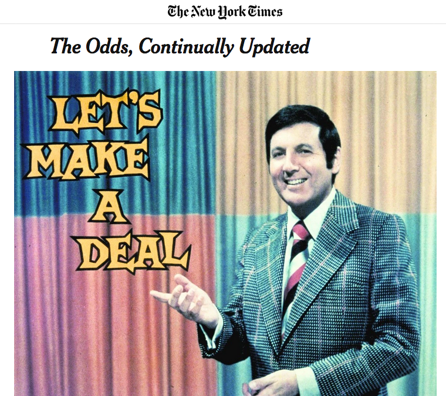
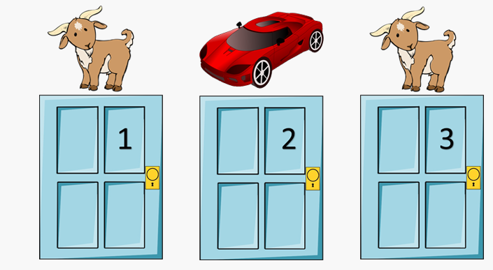

```{r setup, include=FALSE}
options(htmltools.dir.version = FALSE)
r <- getOption("repos")
r["CRAN"] <- "http://cran.cnr.berkeley.edu/"
options(repos = r)
set.seed(12345)
```

<style>

.remark-slide-number {
  position: inherit;
}

.remark-slide-number .progress-bar-container {
  position: absolute;
  bottom: 0;
  height: 6px;
  display: block;
  left: 0;
  right: 0;
}

.remark-slide-number .progress-bar {
  height: 100%;
  background-color: #EB811B;
}

.orange {
  color: #EB811B;
}
</style>

# Conditional Probability

.center[]
---

# Conditional Probability

.font130[
* Sometimes information about one event can help inform us aboutlikelihood of another event

* Examples?
]
--
.font130[
* What is the probability of rolling a 5 and then a 6?

* What is the probability of rolling a 5 and then a 6 given that we rolled a 5 first?

* If it is cloudy outside, gives us additional information about likelihood of rain

* If we know that one party will win the House, makes it more likely that party will win certain Senate races
]
---

# Independence

.font150[
* If the occurrence of one event (A) gives us information about the likelihood of another event, then the two events are .orange[not independent]

* .orange[Independence] of two events implies that information about one event does not help us in knowing whether the second event will occur

* For many real world examples, independence does not hold

* Knowledge about other events allows us to improve guesses/probability calculations
]
---

# Independence

.font150[
* When two events are independent, the probability of both happening is equal to the individual probabilities multiplied together

* And what is the probability of one event when it is conditional to each another?
]
---

# Conditional Probability

.font150[
* $P(A | B)$

* _Probability of A given/conditional that B has happened_
]
--
.font150[
* $P(A | B) = \frac{P(A and B)}{P(B)}$

* _Probability of A and B happening (joint) divided by probability of B happening (marginal)_
]
--
.font150[
* Definitions:

  - $P(A and B)$ - joint probability

  - $P(A)$ - marginal probability
]
---

# Conditional Probability

.font150[
* P(rolled 5 then 6) = ?
]
--
.font150[
* P(rolled 5 then 6) = $\frac{1}{36}$

* P(rolled 5 then 6 | 5 first) =  $\frac{P(5 then 6)}{P(5)}$
]
--
.font150[
* $\frac{\frac{1}{36}}{\frac{1}{6}} = \frac{1}{6}$
]
---

# Conditional Probability

.font150[
* The probability that it is Friday and that a student is absent is 0.03. What is the probability that student is absent, given that it is Friday?

* $P(absent | Friday) = ?$
]
--
.font150[
* $P(absent | Friday) = \frac{0.03}{0.2} = 0.15$
]
---

# Conditional Probability

.font150[
* $P(A | B) = \frac{P(A and B)}{P(B)}$

* Also means:

* $P(A and B) = P(A | B) P(B)$

* Just multiply both sides by $P(B)$ to get rid of the denominator
]
---

# Independence

.font150[
* If A and B are independent, then
  - $P(A | B) = P(A) \&  P(B | A) = P(B)$
  
  - $P(A and B) = P(A) \times P(B)$

* If $A|C$ and $B|C$ are independent, then
  - $P(A and B | C) = P(A |C) \times P(B | C)$
]
---

class: inverse, center, middle

# You Already Know All That!

<html><div style='float:left'></div><hr color='#EB811B' size=1px width=720px></html>  
---

# You Already Know All That 

.font150[
* Let's again use our `resume` dataset
]
--
.font130[
```{r cv01,fig.align="center",tidy=F,warning=F,message=F,cache=T}
resume <- read.csv("https://raw.githubusercontent.com/pols1600/pols1600.github.io/master/datasets/causality/resume.csv")
names(resume)
head(resume)
```
]
---

# Resume

.font130[
* Now please tell me what the two commands below do, and what the results mean
```{r cv02,fig.align="center",tidy=F,warning=F,message=F,cache=T}
mean(resume$call)
tapply(resume$call, resume$race, mean)
```
]
--
.font130[
* First result: getting a phone call overall

* Second result: getting a phone call .orange[conditional on race]
]
---

# Subset

.font140[
* The `subset` function in `R` is nothing but a tool to get conditional probabilities

```{r cv03,fig.align="center",tidy=F,warning=F,message=F,cache=T}
black <- subset(x = resume$call,
                subset = resume$race == "black")
mean(black)
```
]
--
.font140[
* Compare:
```{r cv04,fig.align="center",tidy=F,warning=F,message=F,cache=T}
tapply(resume$call, resume$race, mean)
```
]
---

# Prop.table and joint probability

.font150[
* We can easily calculate joint probabilities with `prop.table(table())`
```{r cv05,fig.align="center",tidy=F,warning=F,message=F,cache=T}
prop.table(table(call = resume$call, resume$race))
```
]
---

# Prop.table and joint probability

.font120[
```{r cv06,fig.align="center",tidy=F,warning=F,message=F,cache=T}
prop.table(table(call = resume$sex, resume$race))
prop.table(table(resume$sex))
prop.table(table(resume$race))
```
]
---

# Another Example

.font130[
| Annual income     | Didn't Take POLS1600 | Took POLS1600 | TOTAL |
| :---------------- | :------------------- | :------------ | :---- |
| Under 50,00       | 36                   | 24            | 60    |
| 50,000 to 100,000 | 109                  | 56            | 165   |
| Over 100,000      | 35                   | 40            | 75    |
| Total             | 180                  | 120           | 300   |

* What is the probability of any student making over $100,000?
]
--
.font130[
* What is the probability of a student making over $100,000, conditional that she took POLS1600?
]
--
.font130[
* What is the probability of a having taken POLS1600, conditional on  making over $100,000?
]
---

# The Monty Hall Problem

.center[]
---

# The Monty Hall Problem!

.center[]
---

# The Monty Hall Problem

.font140[
"Many readers of vos Savant's column refused to believe switching is beneficial despite her explanation. After the problem appeared in Parade, approximately 10,000 readers, including nearly 1,000 with PhDs, wrote to the magazine, most of them claiming vos Savant was wrong (Tierney 1991). Even when given explanations, simulations, and formal mathematical proofs, many people still do not accept that switching is the best strategy (vos Savant 1991a). _Paul Erdős, one of the most prolific mathematicians in history, remained unconvinced until he was shown a computer simulation demonstrating the predicted result_ (Vazsonyi 1999)."

<https://en.wikipedia.org/wiki/Monty_Hall_problem>
]
---

# The Monty Hall Problem

.center[
<iframe width="560" height="315" src="https://www.youtube.com/embed/_X5erR9LKUs" frameborder="0" allow="accelerometer; autoplay; encrypted-media; gyroscope; picture-in-picture" allowfullscreen></iframe>
]

.font150[Probability: The Monty Hall Problem: <https://youtu.be/_X5erR9LKUs>]
---

class: inverse, center, middle

# Questions?

<html><div style='float:left'></div><hr color='#EB811B' size=1px width=720px></html>  
---

class: inverse, center, middle

# See you on Wednesday!

<html><div style='float:left'></div><hr color='#EB811B' size=1px width=720px></html>  