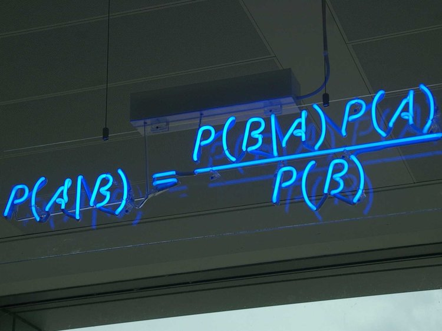
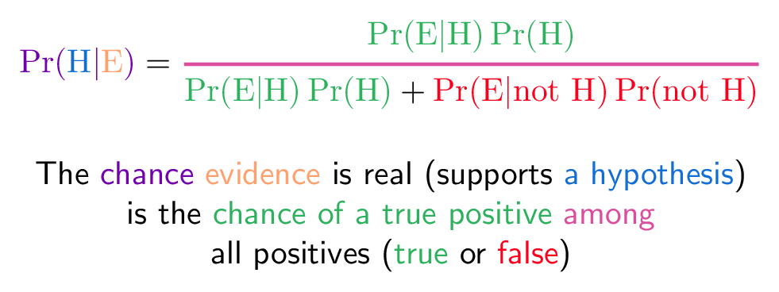
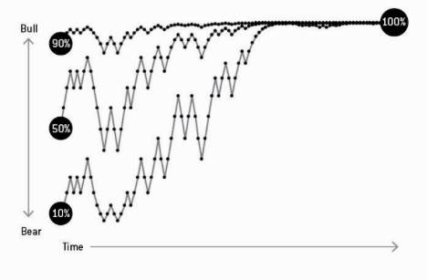

```{r setup, include=FALSE}
options(htmltools.dir.version = FALSE)
r <- getOption("repos")
r["CRAN"] <- "http://cran.cnr.berkeley.edu/"
options(repos = r)
set.seed(12345)
```

<style>

.remark-slide-number {
  position: inherit;
}

.remark-slide-number .progress-bar-container {
  position: absolute;
  bottom: 0;
  height: 6px;
  display: block;
  left: 0;
  right: 0;
}

.remark-slide-number .progress-bar {
  height: 100%;
  background-color: #EB811B;
}

.orange {
  color: #EB811B;
}
</style>

# Today's Agenda

.font150[
* Brief review:
  - Permutations
  - Combinations
  - Conditional probabilities
  
* Bayes' theorem/rule
]
---

# Review: Permutation

.font140[
* Permutation is just a fancy name for _the number of ways we can arrange things_

* Example: in how many ways can we arrange 3 people?
]
--
.font140[
* We can count:
* ABC / ACB / BAC / BCA / CAB / CBA -- _6 ways_
]
--
.font140[
* Or we can think like this: 
  - How many people can we pick for the first seat? 3
  - How many people we can pick for the second seat? 2
  - And for the last one? 1
  
* Therefore, we have $3 \times 2 \times 1 = 3! = 6$ 
]
---

# Review: Permutation

.font150[
* In how many ways can 5 people sit in 3 chairs?
]
--
.font150[
* 5 in the first chair, 4 in the second, 3 in the third... _and that's all_: $5 \times 4 \times 3$
 $$\frac{5 \times 4 \times 3 \times 2 \times 1}{2 \times 1} = \frac{5!}{2!}$$
 
* Formula = $\frac{n!}{(n - k)!}$, where $n$ is the number of people and $k$ is the number of places/seats 
]
---

# Review: Combinations

.font150[
* Combinations are similar to permutations, except that _the ordering doesn't matter_

* So ABC, ACB, BAC, BCA, CAB, CBA are 6 permutations but _only one combination_

* To calculate how many combinations one can get, we can .orange[take the number of permutations then divide by the possible combinations]

* We do that to _because we're counting the same group in different ways_
]
---

# Example: Combinations

.font150[
* We have 6 people and 3 chairs. How many permutations are there? And how many combinations?
]
--
.font150[
* Permutations: $6 \times 5 \times 4 = 120$
]
--
.font150[
* Combinations: We know can arrange the same 3 people in 6 different ways
* ABC / ACB / BAC / BCA / CAB / CBA
* So we can just divide the total of permutations to the ways we can pick 3 people to discount the excess counting: $\frac{120}{6} = 20$ combinations
]
---

# Review: Combinations

.font150[
* Formula: $\frac{n!}{k!(n-k)!}$

* We take $\frac{n!}{(n-k)!}$, the permutations, then divide by $k!$, the number of repeated permutations (the formula multiplies the fraction by $k!$ to cancel the denominator)

* In `R`:
```{r comb01,fig.align="center",tidy=F,warning=F,message=F,cache=T}
choose(6, 3)
```
]
---

# Review: Conditional Probability

.font150[
* If we have prior information about something, this changes the way we calculate events

* Many real world events are conditional to one another

$$P(A|B) = \frac{P(A \operatorname{and} B)}{P(B)}$$

* $P(A \operatorname{and} B)$ probability of $A$ and $B$ happening together

* $P(B)$ marginal probability of $B$
]
---

# Example: Conditional Probability

.font120[
* Researchers surveyed 100 students on which superpower they would most like to have. This two-way table displays data for the respondents: 

| Superpower   | Male | Female | **Total** |
| :----------- | :--- | :----- | :-------- |
| Fly          | 26   | 12     | 38        |
| Invisibility | 12   | 32     | 44        |
| Other        | 10   | 8      | 18        |
| **Total**    | 48   | 52     | 100       |

* Find the probability that the student was male, given the student chose to fly as their superpower]
--
.font120[
* $P(Male|Fly) = \frac{P(MaleAndFly)}{P(Fly)} = \frac{26}{38} \approx 0.68$
]
---

# A Slightly Harder Example

.font140[
* John's two favourite foods are bagels and pizza. $A$ represents the event he eats bagel for breakfast and $B$ represents the event that he eats pizza for lunch.

* On a random day, the probability John will eat a bagel, $P(A)$, is $0.6$, the probability he will eat pizza is $P(B) = 0.5$, and the conditional probability that he eats a bagel for breakfast, given that he eats pizza for lunch is $P(A|B) = 0.7$

* Based on this information, what is $P(B|A)$, that is, the probability that John will eats pizza for lunch given that he eats a bagel for breakfast?
]
---

# Step-by-step

.font150[
* P(A) = 0.6; P(B) = 0.5; P(A|B) = 0.7
* P(B|A)?
]
--
.font110[$$P(A|B) = \frac{P(A \operatorname{and} B)}{P(B)}$$]
--
.font110[$$P(B|A) = \frac{P(A \operatorname{and} B)}{P(A)}$$]
--
.font110[$$P(A|B) \times P(B) = P(A \operatorname{and} B)$$]
--
.font110[$$P(B|A) \times P(A) = P(A \operatorname{and} B)$$]
--
.font110[$$P(A|B) \times P(B) = P(A \operatorname{and} B) = P(B|A) \times P(A)$$]
--
.font110[$$0.7 \times 0.5 = 0.35 = P(A \operatorname{and} B) = P(B|A) \times 0.6$$]
--
.font110[$$\frac{0.35}{0.6} = P(B|A) \approx 0.58$$]
---

# Let's See that Again

.font150[
$$P(A|B) = \frac{P(A \operatorname{and} B)}{P(B)}$$
$$P(B|A) = \frac{P(A \operatorname{and} B)}{P(A)}$$
$$P(A|B) \times P(B) = P(A \operatorname{and} B) = P(B|A) \times P(A)$$
$$P(A|B) = \frac{P(B|A) \times P(A)}{P(B)}$$
]
---

# Bayes' Theorem

.center[]
---

# Bayes' Theorem

.font150[
* $P(A)$ = prior probability

* $P(A | B)$: posterior probability of event $A$ given observed data $B$

* $P(B | A)$: probability of observing $B$ given $A$

* $P(B)$: probability of observing $B$.... including both true and false positives!
]
---

# False Positive

.center[]
---

# Bayes' Theorem

.center[]
---

# Medical Test

.font150[
* Imagine you have a serious disease. It is a rare disease, it happens only to 0.1% of the population. The test identifies the disease correctly in 99% of the cases, but incorrectly in 1% of them. If your test is positive, what is the probability you actually have the disease?
]
---

# Medical Test

.font150[
$$P(H|E) = \frac{P(E|H) \times P(H)}{P(E)}$$
$$P(H|E) = \frac{P(E|H) \times P(H)}{P(E|H) \times P(H) + P(E|H^c) \times P(H^c)}$$
$$P(disease|test+) = \frac{P(test+|disease) \times Prior(disease)}{P(test+) = \operatorname{true and false positives}}$$
]
---

# Medical Test

.font150[
* Imagine you have a serious disease. It is a rare disease, it happens only to 0.1% of the population. The test identifies the disease correctly in 99% of the cases, but incorrectly in 1% of them. If your test is positive, what is the probability you actually have the disease?

$$P(H|E) = \frac{.99 \times .001}{.001 \times .99 + .999 \times .01} \approx .09 \approx 9\%$$
]
---

# Medical Test

.font150[
* Out of 1,000 people, 1 will actually have the disease

* But 10 people will be tested positive _and will not have the disease_

* Which means that 11 people will be tested positive overall

* So we have $\frac{1}{11} \approx .09 \approx 9\%$
]
---

# Will the Sun Rise Tomorrow?

.center[]

---

# Bayesian Updating

.center[]
---

# xkcd

.center[]

---

class: inverse, center, middle

# Questions?

<html><div style='float:left'></div><hr color='#EB811B' size=1px width=720px></html>  
---

class: inverse, center, middle

# See you next week!

<html><div style='float:left'></div><hr color='#EB811B' size=1px width=720px></html>  