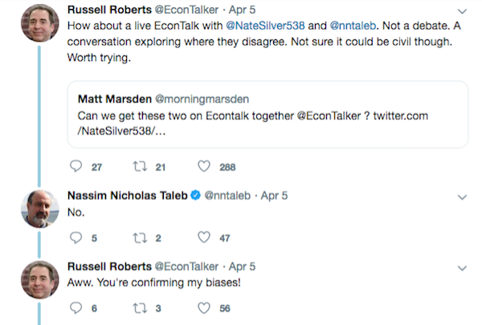
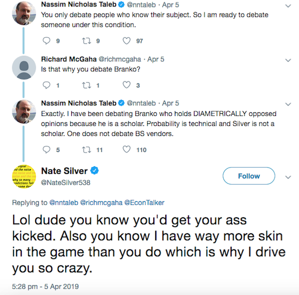
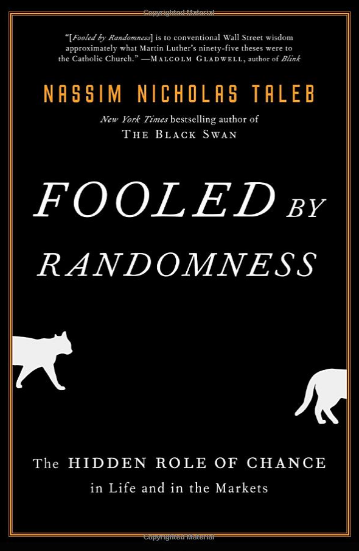
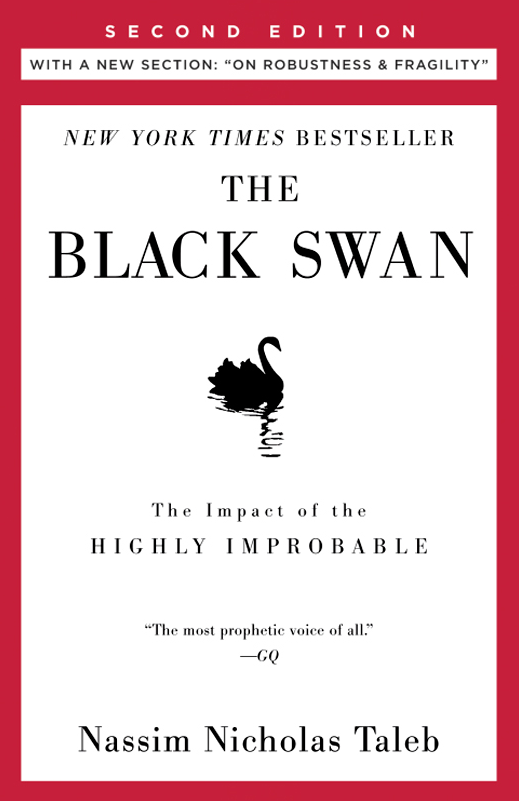
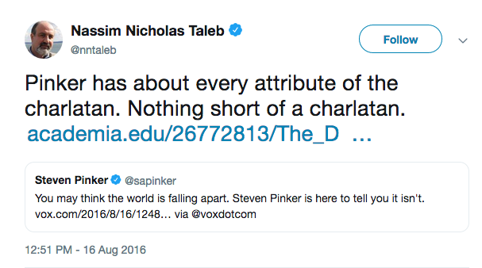
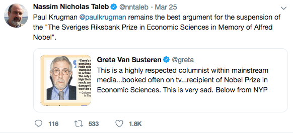
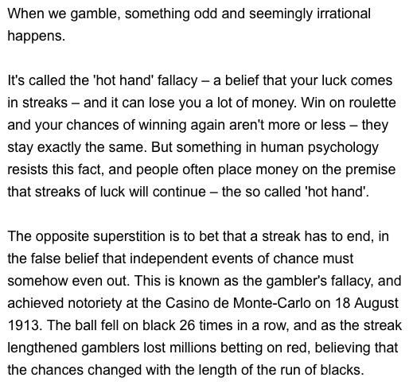
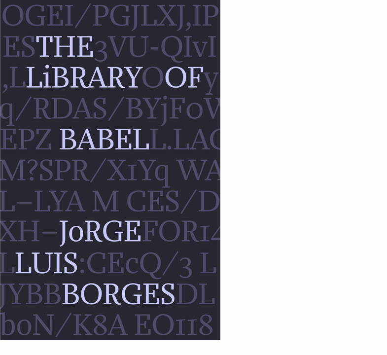

```{r setup, include=FALSE}
options(htmltools.dir.version = FALSE)
r <- getOption("repos")
r["CRAN"] <- "http://cran.cnr.berkeley.edu/"
options(repos = r)
set.seed(12345)
```

<style>

.remark-slide-number {
  position: inherit;
}

.remark-slide-number .progress-bar-container {
  position: absolute;
  bottom: 0;
  height: 6px;
  display: block;
  left: 0;
  right: 0;
}

.remark-slide-number .progress-bar {
  height: 100%;
  background-color: #EB811B;
}

.orange {
  color: #EB811B;
}
</style>

# Today's Agenda

.font150[
* Two large sample theorems:

* The Law of Large Numbers
  - Gambler's Fallacy
  - Infinite Monkey Theorem
    
* The Central Limit Theorem
]

---

class: inverse, center, middle

# But before that...

<html><div style='float:left'></div><hr color='#EB811B' size=1px width=720px></html>  

---

# News on the Taleb/Silver Debate

.center[]
---

# News on the Taleb/Silver Debate

.center[]
---

# Taleb/Pinker

.center[]

.font150[
.center[<https://www.vox.com/2015/5/21/8635369/pinker-taleb>]
]

---

# Recommended: Fooled by Randomness

.center[]
---

# Recommended: Black Swan

.center[]

---

# Taleb on Pinker

.center[]

---

# Taleb on Krugman

.center[]
---

# But if you criticise him...

.center[]

---

# Law of Large Numbers

.font130[
* In many probabilistic models, certain patterns emerge as the sample size increases

* .orange[Law of Large Numbers:] If we have a sample of i.i.d. observations from random variable $X$ with expectation $\mathbb{E}(X)$, then

$$\bar{X}_{{n}} = \frac{1}{N} \sum_{i = 1}^{N} X_{i} \rightarrow \mathbb{E}(X)$$]
--
.font130[
* .orange[i.i.d.:] independent and identically distributed random variable. 

* In English: As the number of draws increases, the sample mean $\bar{X}_{{n}}$ approaches $\rightarrow$ the variable's distribution expectation $\mathbb{E}(X)$
]
---

# Law of Large Numbers

.font150[
* Examples

	- Rolling a die, 500 times
	- Flipping a coin, also many times
	- Drawing respondents from a population of supporters and non-supporters for politician A
	- Statistical simulations
]
---

# Simulation: Coin Tossing

.font150[
```{r coin01,fig.align="center",tidy=F,warning=F,message=F,cache=T,fig.height=7,eval=FALSE}
draws <- seq(from = 1, to = 500)  # coin tosses

avgs <- rep(NA, length(draws))    # empty vector

for(i in 1:length(draws)){
    samp <- sample(c(0, 1), draws[i], replace = T)
    avgs[i] <- mean(samp) # sampling w/ replacement
}

plot(draws, avgs, type = "l", ylim = c(0, 1),
     main = "Bernoulli with Prob. 0.5") # plot
abline(h = 0.5, col = "red", lwd = 2)  # expectation 
```
]
---

# Simulation: Coin Tossing

.font130[
```{r coin02,fig.align="center",tidy=F,warning=F,message=F,cache=T,fig.width=10,fig.height=8,echo=FALSE}
draws <- seq(from = 1, to = 500) # number of draws

avgs <- rep(NA, length(draws))   # empty vector 

for(i in 1:length(draws)){       # sample numbers, take mean
    samp <- sample(c(0,1), draws[i], replace = T)
    avgs[i] <- mean(samp)
}

plot(draws, avgs, type = "l", ylim = c(0, 1),
     main = "Bernoulli with Prob. 0.5") # plot
abline(h = 0.5, col = "red", lwd = 2)   # add line
```
]
---

# Simulation: Rolling a Die 

.font130[
```{r die01,fig.align="center",tidy=F,warning=F,message=F,cache=T,eval=FALSE}
draws <- seq(from = 1, to = 500) # number of draws

avgs <- rep(NA, length(draws))   # empty vector 

for(i in 1:length(draws)){       
    samp <- sample(c(1:6), draws[i], replace = T)
    avgs[i] <- mean(samp)  # sampling w/ replacement
}

plot(draws, avgs, type = "l", ylim = c(0, 6),
     main = "Uniform [1, 6]") # plot
abline(h = 3.5, col = "red", lwd = 2)         # expectation
```
]
---

# Simulation: Rolling a Die 

.font150[
```{r die02,fig.align="center",tidy=F,warning=F,message=F,cache=T,fig.height=8,fig.width=10,echo=FALSE}
draws <- seq(from = 1, to = 500)

avgs <- rep(NA, length(draws))

for(i in 1:length(draws)){
    samp <- sample(c(1:6), draws[i], replace = T)
    avgs[i] <- mean(samp)
}

plot(draws, avgs, type = "l", ylim = c(0, 6))
abline(h = 3.5, col = "red", lwd = 2)
```
]
---

# Gambler's Fallacy

.font150[
* The Law of Large Numbers, as the name implies, is only valid for .orange[large samples]

* There is _no principle_ that supports the idea that after a few positive draws a negative draw must appear to "balance" the results

* Example: after 10 heads, _another head can come up_. Why?
]
--
.font150[
* .orange[Because the events are independent]
]
---

# Monte Carlo Casino

.center[]

.center[<http://www.bbc.com/future/story/20150127-why-we-gamble-like-monkeys>]

---

# Jorge Luis Borges

.center[]

.font150[.center[https://en.wikipedia.org/wiki/Jorge_Luis_Borges]]
---

# Infinite Monkey Theorem

.center[]

.font150[
* "...a half-dozen monkeys provided with typewriters would, in a few eternities, produce all the books in the British Museum. Strictly speaking, one immortal monkey would suffice." (La Biblioteca Total, 1939)
]
---

# The Total Library

.font130[
"Everything would be in the Library's blind volumes. Everything: the detailed history of the future, Aeschylus' _The Egyptians_, the exact number of times that the waters of the Ganges have reflected the flight of a falcon, the secret and true nature of Rome, the encyclopedia Novalis would have constructed, my dreams and half-dreams at dawn on August 14, 1934, the proof of Pierre Fermat's theorem, [...] the song the sirens sang, the complete catalog of the Library, the proof of the inaccuracy of that catalog. Everything: but for every sensible line or accurate fact there would be millions of meaningless cacophonies, verbal farragoes, and babblings. Everything: but all the generations of mankind could pass before the dizzying shelves—shelves that obliterate the day and on which chaos lies—ever reward them with a tolerable page."
]
---

# The Library of Babel

.center[]

.font150[
.center[<https://en.wikipedia.org/wiki/The_Library_of_Babel>]
]

---

# Central Limit Theorem

.font140[
* In practice we observe only the sample mean and _do not know the expectation_

* .orange[The central limit theorem] shows that the distribution of the sample mean approaches the normal distribution as the sample size increases

* Again, not the sample itself approaches the normal distribution, .orange[but only the sample means]

* Z-score of the sample mean converges in distribution to the standard normal distribution or $\mathcal{N}(0,1)$ as the sample size increases

* Interestingly the result is true .orange[for almost any distribution!]
]
---

# Central Limit Theorem

.font150[
* Experiment: flip a coin 10 times and record the number of heads

* Repeat experiment above 1000 times
]
---

# Central Limit Theorem

.font110[
```{r clt01,fig.align="center",tidy=F,warning=F,message=F,cache=T,fig.height=5}
avgs <- rep(NA, 1000)
for(i in 1:1000){
  samp <- rbinom(1000, 10, p=0.5)
  avgs[i] <- mean(samp)
}
plot(density(avgs))
```
]
---

# Central Limit Theorem

.font150[
* Visualisation: <https://seeing-theory.brown.edu/probability-distributions/index.html>
]
---

# Central Limit Theorem

.font150[
* _Why do we care about it?_

* Hypothetically repeated polls with sample size $N$

* As the number of polls increase, we get closer and closer to the true population mean, _regardless of the distribution of the each particular poll_

* Since we are taking the means of each poll, rare events become even more rare

* It is really hard to get a "weird average" versus to get a "weird individual." That difficulty in getting a weird average is what pulls the plot into a nice tight bell curve 
]

---
class: inverse, center, middle

# See you on Friday!

<html><div style='float:left'></div><hr color='#EB811B' size=1px width=720px></html>  
