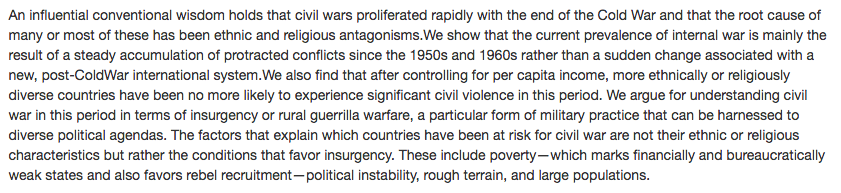
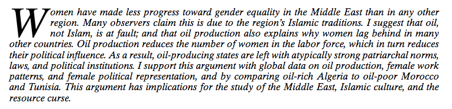
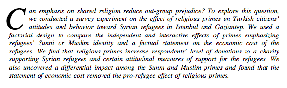
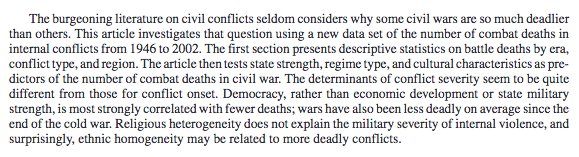
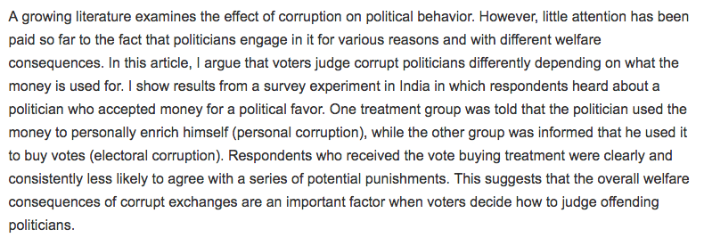
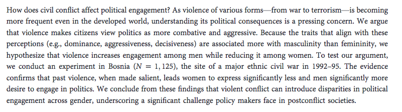

```{r setup, include=FALSE}
options(htmltools.dir.version = FALSE)
r <- getOption("repos")
r["CRAN"] <- "http://cran.cnr.berkeley.edu/"
options(repos = r)
set.seed(12345)
```

<style>

.remark-slide-number {
  position: inherit;
}

.remark-slide-number .progress-bar-container {
  position: absolute;
  bottom: 0;
  height: 6px;
  display: block;
  left: 0;
  right: 0;
}

.remark-slide-number .progress-bar {
  height: 100%;
  background-color: #EB811B;
}

.orange {
  color: #EB811B;
}
</style>

# Final Project

.font130[
* Deadline: .orange[29th of April]

* 3,000-4,000 words (excluding `R` code and graphs)

* PDF format. You can write the main text in Word, LaTeX or RMarkdown, whichever you find easier to use

* You must provide an RMarkdown appendix file with complete R code and graphs

* RStudio add-in to count words: <https://github.com/benmarwick/wordcountaddin>

* 10-minute presentation

* 50% of your final grade
]
---

# Format

.font150[
* Introduction (1-1.5 pages)
    - What the paper is about
    - Why the topic is important today
    - What are the main results and conclusions

* Data (1 page)
    - Where did you get the data
    - In what format the data were available
    - How you imported the dataset into R
]

---

# Format

.font130[
* Descriptive Statistics (2-3 pages)
    - Show graphs and correlations _for main variables only_ 
    - Again: _just the most important variables_
    - What do the descriptive statistics indicate regarding the main question of the paper?
    
* Replication (3-4 pages)
    - Describe the paper's main results
    - Stay as closely as possible to the original findings
    - Report the coefficients, standard errors, and significance levels
]
---

# Format
    
.font150[
* Extension (2 pages)
    - Add a new analysis to the paper. Maybe delete some control variables, transform them, add new ones?
    - Do the main results hold or change?
    
* Discussion and Conclusion (1-1.5 page)
    - How could the authors improve the paper?
    - Any future research you would recommend?
]
---

# Suggested Topics

.font150[
* "Ethnicity, Insurgency, and Civil War"

* "Oil, Islam, and Women"

* "Brother or Burden: An Experiment on Reducing Prejudice Toward Syrian Refugees in Turkey"

* "Explaining the Severity of Civil Wars"

* "Punishing Personal and Electoral Corruption: Experimental Evidence from India"

* "The Gendered Effects of Violence on Political Engagement"
]
---

# Ethnicity, Insurgency, and Civil War

.center[]

.font130[
* Article: <https://www.cambridge.org/core/journals/american-political-science-review/article/ethnicity-insurgency-and-civil-war/B1D5D0E7C782483C5D7E102A61AD6605>

* Replicate table 1 (5 logit models)

* `model <- glm(dependent ~ independent1 + independent2 + ... + independentX, data = dataset, family = "binomial")`
]
---

# Oil, Islam, and Women

.center[]

.font150[
* Article: <https://doi.org/10.1017/S0003055408080040>
* Replicate table 2 (with standardised coefficients)
]
---

# Brother or Burden

.center[]

.font130[
* Article: <https://www.cambridge.org/core/journals/political-science-research-and-methods/article/brother-or-burden-an-experiment-on-reducing-prejudice-toward-syrian-refugees-in-turkey/3801D8A794F0EE37A7528ABD677F33CA>
* Replicate table 1
]

---

# Explaining the Severity of Civil Wars 

.center[]

.font130[
* Article: <https://journals.sagepub.com/doi/10.1177/0022002705284828>
* Replicate table 2
]
---

# Personal and Electoral Corruption

.center[] 

.font140[
* Article: <https://journals.sagepub.com/doi/full/10.1177/2053168016645136>
* Replicate table 1
]

---

# The Gendered Effects of Violence on Political Engagement

.center[]

.font130[
* Article: <https://sci-hub.tw/https://www.journals.uchicago.edu/doi/full/10.1086/701764>
* Replicate table 1
* Interaction models: `lm(dependent ~ ind01 + ind02 + I(ind1*ind2), data = dataset)`
]
---

# Tips

.font150[
* Don't worry if your coefficients are not exactly the same as the authors'

* Check if your findings are similar and if they remain positive or negative

* Also don't worry about clustered standard errors, fixed effects, or any other terms you don't know

* Most datasets are available on the [Harvard Dataverse](https://dataverse.harvard.edu/) or on the article's website. You have access to all of them through Brown

* Let me know if you cannot find your article after 2 days
]
---

# Tips

.font150[
* Some models were estimated with Stata, another statistical software. Stata commands _won't work_ in R, but you should be able to translate them into R code

* To create tables in Markdown, use:
    - <https://help.github.com/en/articles/organizing-information-with-tables> 
    - Or <https://www.tablesgenerator.com/markdown_tables>

* _Replications take time_: start early and share the work with your colleagues
]
---

# Presentations

.font150[
* Send me a pdf of your slides along with your assignment on the .orange[29th of April]

* Late submissions will be penalised

* If you use Powerpoint, please bring your computer to class

* Presentations should be short and straight to the point: .orange[10 minutes per group]

* No more than .orange[10 slides]: focus on the issues you encountered and on your main results

* Let me know if you need any help!
]

---

class: inverse, center, middle

# Good luck!

<html><div style='float:left'></div><hr color='#EB811B' size=1px width=720px></html>  
