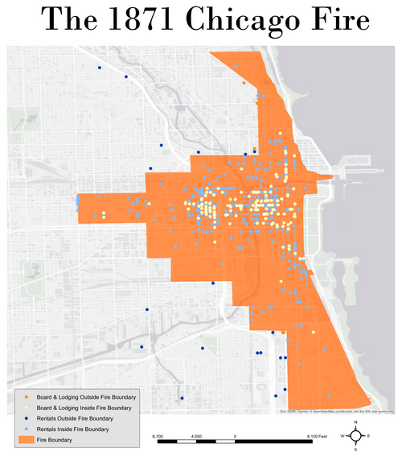
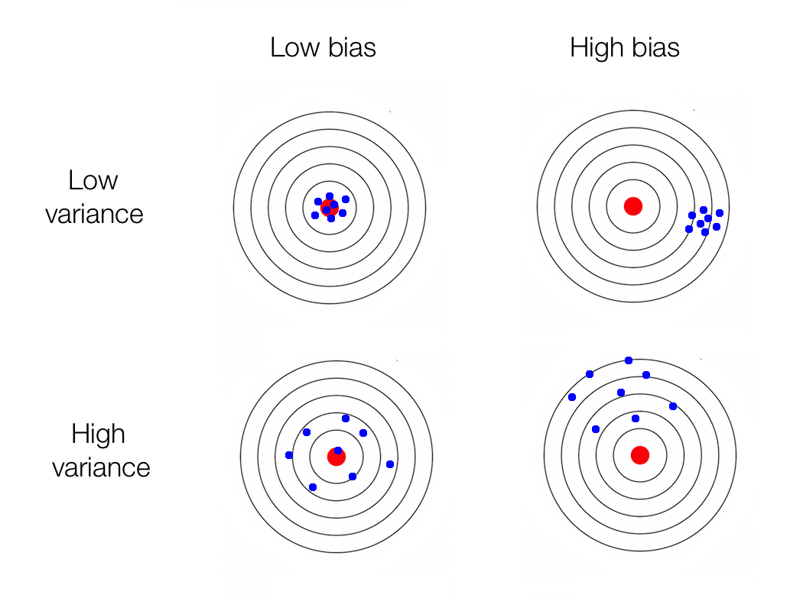
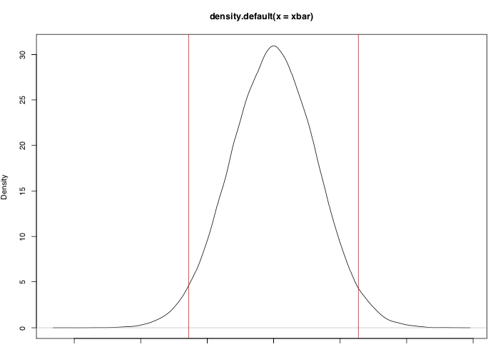
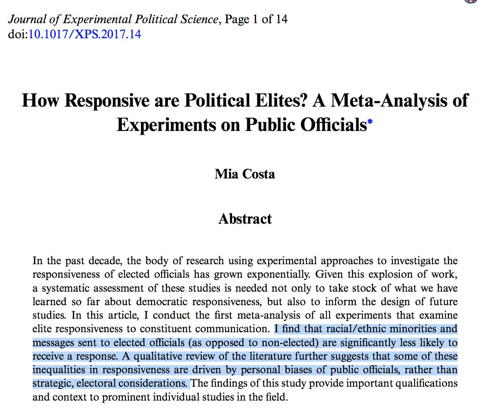
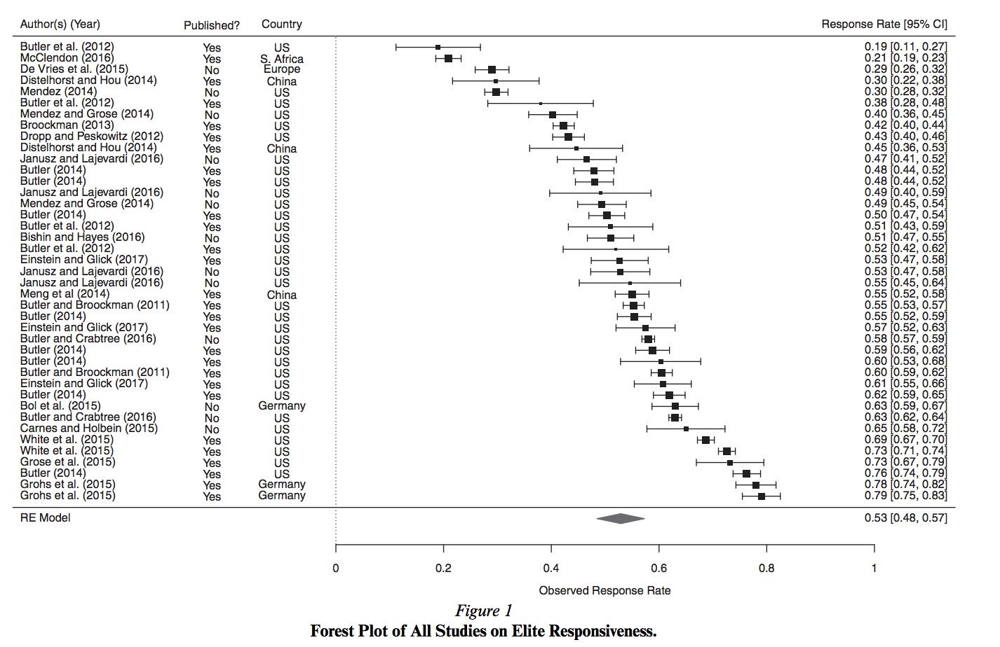

```{r setup, include=FALSE}
options(htmltools.dir.version = FALSE)
r <- getOption("repos")
r["CRAN"] <- "http://cran.cnr.berkeley.edu/"
options(repos = r)
set.seed(12345)
```

<style>

.remark-slide-number {
  position: inherit;
}

.remark-slide-number .progress-bar-container {
  position: absolute;
  bottom: 0;
  height: 6px;
  display: block;
  left: 0;
  right: 0;
}

.remark-slide-number .progress-bar {
  height: 100%;
  background-color: #EB811B;
}

.orange {
  color: #EB811B;
}
</style>

# Pinochet Regime

.center[]
---

# Chicago Fire

.center[]

---
# Chicago Fire

.center[]

---
# Chicago Fire

.center[]

---

# What You've Learned 

.font130[
* Introduction to probability
  - Frequentist/Bayesian 
  - Permutations
  - Combinations

* Probability distributions
  - Bernoulli
  - Uniform
  - Normal
  
* Two probability theorems
  - Law of large numbers
  - Central limit theorem
]

---

# Statistical Inference

.font150[
* Goal: trying to estimate something unobservable from observable data

* What we want to estimate: .orange[parameter] $\theta$ $\rightsquigarrow$ unobservable

* What you do observe: .orange[data]

* What should we do?]
--

.font150[
* We use data to compute an estimate of the parameter $\hat\theta$]
--

.font150[
* (Notation: hat = estimator)
]

---

# Parameters and Estimators

.font150[
* .orange[Parameter:] the quantity that we are interested in

* .orange[Estimator:] method to compute parameter of interest
]
---

# Parameters and Estimators

.font150[
* .orange[Parameter:] support for Beto O'Rourke in student population

* .orange[Estimator:] sample proportion of support
]
--

.font150[
* .orange[Parameter:] average causal effect of aspirin on headache

* .orange[Estimator:] difference in mean between treatment and control
]
---

# Quality of Estimators

.font150[
* For the rest of this course, the question becomes:

* .orange[How good is our estimator?]

  - How close in expectation is the estimator to the truth?
  
  - How certain or uncertain are we about the estimate?
]
---

# Quality of Estimators

.font150[
* How good is $\hat\theta$ as an estimate of $\theta$?

* Ideally, we want to know the .orange[estimation error] $= \hat\theta - \theta_{truth}$

* But we can never calculate this. Why?
]
--

.font150[
* $\theta_{truth}$ is unknown
]
--

.font150[
* .orange[If we knew what the truth was, we didn't need an estimate]
]
---

# Quality of Estimators

.font150[
* Instead, we consider two hypothetical scenarios:

  - How well would $\hat\theta$ perform over _repeated data generating processes_? .orange[bias]
  
  - How well would $\hat\theta$ perform _as the sample size goes to infinity_? .orange[consistency]
]
---

# Bias

.font150[
* Imagine the estimate being a random variable itself

* Drawing infinitely many samples of students asking about Beto

* What is the average of the sample average? Or what is the expectation of the estimator?

* bias = $\mathbb{E}$ (estimation error) $= \mathbb{E}$ (estimate - truth) $= \mathbb{E} (\bar{X}) - p = 0$
]
---

# Bias - Important!

.font150[
* .orange[An unbiased estimator does not mean that it is always exactly correct!]
]
--
.font150[
* .orange[Remember:] bias measures whether in expectation (on average) the estimator is giving us the truth
]
---

# Consistency

.font150[
* Essentially saying that the law of large numbers applies to the estimator, i.e.:

* .orange[An estimator is said to be consistent if it converges to the parameter (truth) if N goes to $\infty$ 
]
]
---

# Variability

.font150[
* Next, we have to consider how certain we are about our results

* Consider two estimators:

  - slightly _biased_, on average off by a bit, but always by the same margin
  
  - unbiased, but misses target left and right
]
---

# Bias and Variance

.center[]

---

# Variability

.font150[
* We characterise the variability of an estimator by using the standard deviation of the sampling distribution

* _How do we find that?_

* Remember, the sampling distribution is the distribution of our statistic over hypothetical infinitely many samples
]
--

.font150[
* .orange[We can't estimate it!]

* We can't take infinitely many samples of any statistics (otherwise it would be better to sample the whole population directly!)
]
---

#  Standard Error

.font150[
* We estimate the standard deviation of the sampling distribution from the observed data

* .orange[Standard error]

* Repeating: _The standard error is an estimated standard deviation of the sampling distribution_

* Each estimator/statistic has unique sampling distribution, e.g. difference in means
]
---

# Standard Error

.font150[
* We often don’t even know the sampling distribution of our estimators

* How could we approximate it?
]
--

.font150[
* .orange[Central limit theorem!]
]
---

# Confidence Intervals

.font150[
* Central limit says:

* $\overline{X} \approx N(\mathbb{E}(X), \frac{\mathbb{V}(X)}{N})$

* Regardless of the distribution of $X$
]
---

# Confidence Intervals

.font150[
* We can use the approximation to the sampling distribution, $\overline{X} \approx N(\mathbb{E}(X), \frac{\mathbb{V}(X)}{N})$ to construct .orange[confidence intervals]

* Confidence intervals give a range of values that is likely to contain the true value

* Usually we select 95% confidence level
]
---

# Confidence Intervals

.font150[
* _For large samples_, we calculate CIs as follows:

* Select a value for $\alpha$, usually 0.05 

* Then, take the _critical value_: $z_{\frac{\alpha}{2}}$, which equals $1 − \frac{\alpha}{2}$ quantile of the standard normal distribution

* And we define the confidence interval as:

$$CI(\alpha) = \overline{X} - z_{\frac{\alpha}{2}} \times SE, \overline{X} + z_{\frac{\alpha}{2}} \times SE$$

]
---

# Confidence Intervals

.font150[
* Where do the critical values come from?

* .orange[The curve of the normal distribution]:
  
  - Symmetric around 0 
  - Total area under the curve is 100% 
  - Area between -1 SD and 1 SD is ~68% 
  - .orange[Area between -2 SD and 2 SD is ~95%]
  - Area between -3 SD and 3 SD is ~99.7% 
  
* The precise value for 95% is 1.96 SD
]
---

# Confidence Intervals

.center[]

.font140[
Critical values are the exact vales between which the standard normal distribution will include $(1-\alpha) \times 100\%$ of the area
]

---

# Confidence Intervals

.font140[
* The interpretation of the confidence interval is _not_ straightforward

* _It is not_ 95% chance that the interval contains the true value

* It means: "Over a hypothetically repeated data generating process, confidence intervals contain the true value of parameter with the probability specified by the confidence level" (Imai, 2018)

* In other words: if we repeat the experiment again and again, 95% of the confidence intervals would contain the true value of the parameter
]
---

# Confidence Intervals

.font150[
* Simulation: <https://shiny.rit.albany.edu/stat/confidence/>
]

---

# Confidence Intervals

.font130[
* Scientists are generally interested if the confidence interval contains a certain value

* _Confidence intervals that do not contain zero are considered statistically significant_

* As a rule of thumb, if you take the mean plus or minus 2 x standard errors, and the interval does not contain zero, we say that $p < 0.05$

* But there is still a 5% chance that your interval _does not contain the true value_!

* How can you know if _the particular interval you have_ is in the 95% that contains the true value or in the 5% that does not?
]
--
.font130[
* .orange[YOU CANNOT KNOW]
]

---

# Confidence Intervals

.font150[
* How to address that issue?

  - Replications
  - Meta Analyses
]
---

# Meta Analyses

.center[]

---

# Meta Analyses

.center[]
---

class: inverse, center, middle

# Questions?

<html><div style='float:left'></div><hr color='#EB811B' size=1px width=720px></html>  

---

class: inverse, center, middle

# See you on Wednesday!

<html><div style='float:left'></div><hr color='#EB811B' size=1px width=720px></html>  
