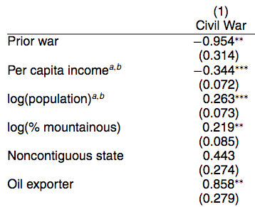
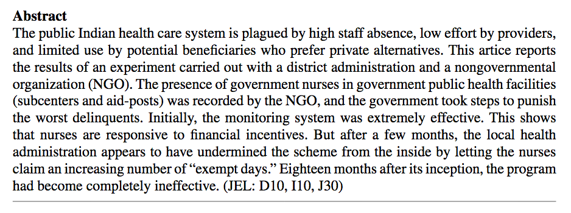
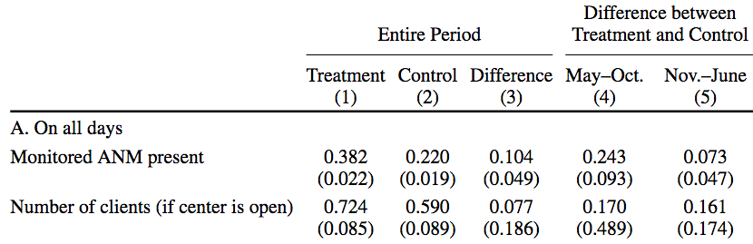
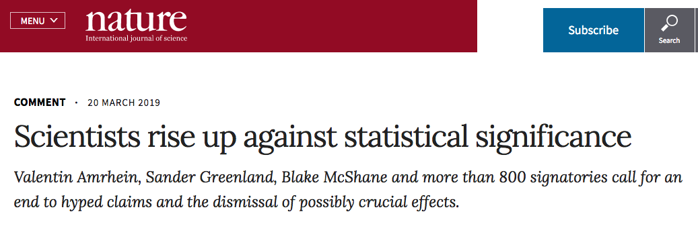
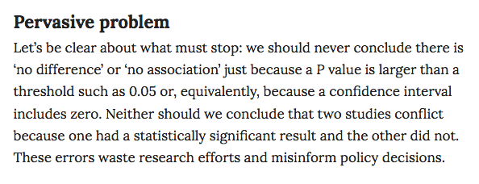
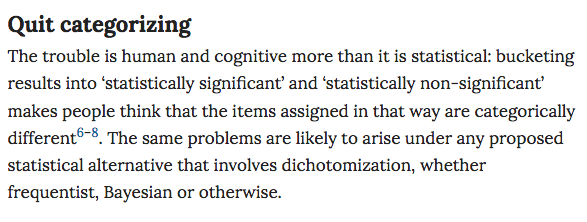
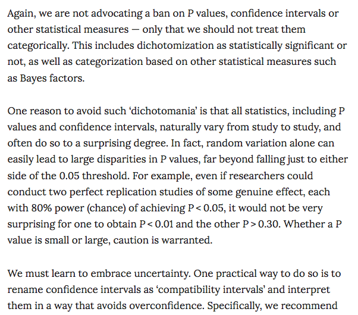

```{r setup, include=FALSE}
options(htmltools.dir.version = FALSE)
r <- getOption("repos")
r["CRAN"] <- "http://cran.cnr.berkeley.edu/"
options(repos = r)
set.seed(12345)
```

<style>

.remark-slide-number {
  position: inherit;
}

.remark-slide-number .progress-bar-container {
  position: absolute;
  bottom: 0;
  height: 6px;
  display: block;
  left: 0;
  right: 0;
}

.remark-slide-number .progress-bar {
  height: 100%;
  background-color: #EB811B;
}

.orange {
  color: #EB811B;
}
</style>

# Confidence Intervals

.font130[
* $\alpha$ is the probability of rejecting the null hypothesis when it is in fact true

* Select a value for $\alpha$, usually 0.05. 

* So we expect every 1 in 20 (5/100) confidence intervals to be false if we use $\alpha = 0.05$

* Then, we select the _critical value_: $z = 1 - \alpha$. This is a point of the test distribution (usually the normal) that determines whether to reject the null hypothesis

* $z$ is the number of standard deviations of the distribution

* We usually use 1.96, often rounded to 2
]
---

# Confidence Intervals

.font150[
* The confidence interval you will see most often is this one: 

$$CI(\alpha) = \overline{X} - 1.96 \times SE, \overline{X} + 1.96 \times SE$$

* Why? Beause if you take the mean of the normal distribution and add $\pm 2 \times SE$ you will cover 95% of the area

* .orange[When evaluating effects, we usually judge them based on whether the 95% confidence interval covers zero or not]

* If it covers zero, there is a possibility that the effect is, well, zero. Zero effect = no relationship between variables
]
---

# Average Treatment Effects

.font150[
* How do we estimate the ATE in RTCs?

* Difference in means between treatment and control group

* Sample average in treated group $\overline{X}_{t}$ and control group $\overline{X}_{c}$

* SE treated: $\hat{SE}_{t} = \sqrt{\frac{\hat{\sigma}^{2}_{t}}{N_{t}}}$

* SE control: $\hat{SE}_{c} = \sqrt{\frac{\hat{\sigma}^{2}_{c}}{N_{c}}}$

* What do we use for $\sigma^2$? The variance of the sample, as we don't have the variance of the full sampling distribution

]
---

# Average Treatment Effects

.font150[
* We can use these SEs to construct confidence intervals around each of the averages

* But we need to construct SEs _around the difference in means itself_ $(\overline{X}_{t} - \overline{X}_{c})$

* $\hat{SE}_{t-c} = \sqrt{\frac{\mathbb{V}(X_{t})}{N_{t}} + \frac{\mathbb{V}(X_{c})}{N_{c}}}$
]
---

# Average Treatment Effects

.font140[
* We can use the standard error to construct a 95% confidence interval for the difference in means:

* Example: ATE = 3.5, SE = 2.65

* What is the confidence interval?
]
--
.font140[
* $CI(0.05) = 3.5 - 1.96 \times 2.65 = -1,694$
* $CI(0.05) = 3.5 + 1.96 \times 2.65 = 8.694$

* Is the difference statistically significant?
]
--
.font140[
* _No_, as the difference between the treatment and control groups can be zero
]
---

# The summary function in R

.font150[
* R has a convenient function to see if the results are statistically significant 

* `summary(name_of_your_model)`

* It shows the coefficient, the standard error, and the significance level all at once
]

---

# Example 1 - Resume

```{r resume01,fig.align="center",tidy=F,warning=F,message=F,cache=T}
resume <- read.csv("https://raw.githubusercontent.com/pols1600/pols1600.github.io/master/datasets/causality/resume.csv")
model1 <- lm(call ~ race, data = resume)
summary(model1)
```
---

# Example 1 - Resume

```{r resume02,fig.align="center",tidy=F,warning=F,message=F,cache=T}
resume <- read.csv("https://raw.githubusercontent.com/pols1600/pols1600.github.io/master/datasets/causality/resume.csv")
model2 <- lm(call ~ sex, data = resume)
summary(model2)
```
---
# Example 1 - Resume

```{r resume03,fig.align="center",tidy=F,warning=F,message=F,cache=T}
resume <- read.csv("https://raw.githubusercontent.com/pols1600/pols1600.github.io/master/datasets/causality/resume.csv")
model3 <- lm(call ~ race + sex, data = resume)
summary(model3)
```
---

# Example 2 - Child Mortality

```{r women01,fig.align="center",tidy=F,warning=F,message=F,cache=T}
mortality <- read.csv("https://raw.githubusercontent.com/pols1600/pols1600.github.io/master/datasets/prediction/bivariate_data.csv")
summary(lm(Child.Mortality ~ log(GDP) + PolityIV, data = mortality))
```
---

# Confidence Intervals

.font150[
* To recap:

* When you're reading articles or writing your own, there's an easy way to see if the effect is statistically significant with $pvalue < 0.05$

* Only three steps:

  - Check the model coefficient
  - Check the standard error and multiply it by two
  - Sum and subtract the value from the coefficient. If it gives you zero, it's not significant. If it doesn't include zero, it is statistically significant
]
---

# Example 3 - Civil Wars

.center[]
---

# Example 3 - Civil Wars

.center[]
---

# Example 4 - Nurses

.center[]
---

# Example 4 - Nurses

.center[]
---

# Linear Models

.font150[
* Next week, we will discuss in further details the statistical assumptions behind the linear model
]
---

# Statistical Significance Controversy

.center[]

.font150[
<https://www.nature.com/articles/d41586-019-00857-9>
]
---

# Statistical Significance Controversy

.center[]
---

# Statistical Significance Controversy

.center[]
---

# Statistical Significance Controversy

.center[]

---

class: inverse, center, middle

# Questions?

<html><div style='float:left'></div><hr color='#EB811B' size=1px width=720px></html>  

---

class: inverse, center, middle

# See you next week!

<html><div style='float:left'></div><hr color='#EB811B' size=1px width=720px></html>  
