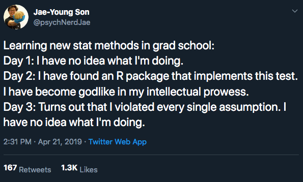
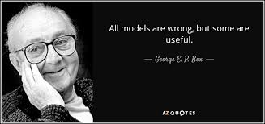
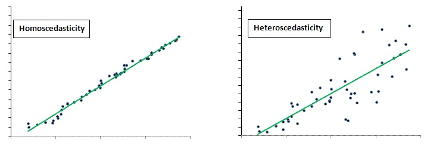
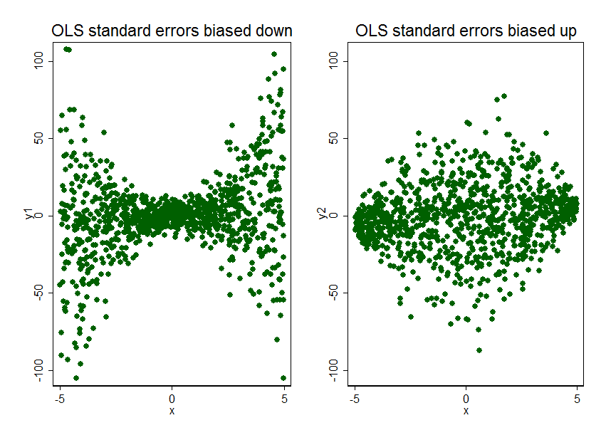

```{r setup, include=FALSE}
options(htmltools.dir.version = FALSE)
r <- getOption("repos")
r["CRAN"] <- "http://cran.cnr.berkeley.edu/"
options(repos = r)
set.seed(12345)
```

<style>

.remark-slide-number {
  position: inherit;
}

.remark-slide-number .progress-bar-container {
  position: absolute;
  bottom: 0;
  height: 6px;
  display: block;
  left: 0;
  right: 0;
}

.remark-slide-number .progress-bar {
  height: 100%;
  background-color: #EB811B;
}

.orange {
  color: #EB811B;
}
</style>

# Today's Agenda

.font150[
* Regression with uncertainty

* Assumptions: exogeneity and homoscedasticity

* Robust standard errors

* `estimatr` package

* Logistic regression
]
---

# Model Assumptions

.center[]
---

# Model Assumptions

.center[]

---

# Regression with Uncertainty

.font150[
* Recall the model: $$y_i \ = \ \beta_0 + \beta_1 x_i + \epsilon_i,$$ 

* where $\mathbb{E}(\epsilon_i) = 0$ and $\mathbb{V}(\epsilon_i)=\sigma^2$

* Estimation of parameters via .orange[least squares:] 

  $$\textsf{minimize SSR} \quad \textsf{where} \quad \textsf{SSR} \ = \ \sum_{i=1}^n \hat\epsilon_i^2 \ =$$ $$\sum_{i=1}^n (y_i - \hat\beta_0 - \hat\beta_1 x_i)^2$$
]
---

# Exogeneity and Homoskedasticity 

.font150[
* Key Assumptions:

  - .orange[Exogeneity:] the mean of $\epsilon_i$ does not depend on $x_i$ 
      $$\mathbb{E}(\epsilon_i \mid x_i) \ = \ \mathbb{E}(\epsilon_i) \ = \ 0$$
      
  - .orange[Homoscedasticity:] the variance of $\epsilon_i$ does not
      depend on $x_i$
      $$\mathbb{V}(\epsilon_i \mid x_i) \ = \ \mathbb{V}(\epsilon_i) \ = \ \sigma^2$$
]
--
.font150[
* When is each assumption violated?

* What to do in those cases?
]
---

# Exogeneity

.font150[
* Exogeneity means that the unobserved causes of the dependent variable are _uncorrelated_ with the variables we include in our model

* This is a _very strong assumption_ in observational studies

* Why? Because of _omitted variable bias_

* .orange[Omitted variable bias:] when there is another factor that causes the independent variables, but we didn't include them in our model
  - We didn't think of it
  - Hard to measure
]

---

# Omitted Variable Bias

.font150[
* A type of bias when we don't include the right control variables

* If an important variable is missing, the coefficients will be incorrect

* The independent variables we have can either become statistically significant or not, negative or positive, we cannot know for sure

* Difficult to verify in observational studies
]
---

# Omitted Variable Bias

.center[]
---

# Omitted Variable Bias

.center[]
---

# Omitted Variable Bias

.center[]
---

# Omitted Variable Bias

.center[]
---

# Exogeneity

.font150[
* What to do in those cases?

* Very little in terms of statistical analysis

* The best solution is to run _a randomised experiment_, whenever feasible

* Why?
]
--
.font150[
* If the treatment is allocated at random we know it is not correlated with _anything_

* So there is lower risk of omitted variable bias
]
---

# Homoscedasticity

.font150[
* Homoscedasticity means that the value of standard errors are constant along all values of our independent variables

* _This is often not the case either_

* But there is an easy statistical fix for the problem: .orange[robust standard errors]

* Robust standard errors are usually (but not always) larger than regular standard errors

* So they are _more conservative_: it is more difficult for a result to be statistically significant
]
---

# Homoscedasticity

.center[]
---

# Homoscedasticity

.center[]
---

# Robust Standard Errors

.font150[
* Heteroscedasticity can happen in both experimental and observational studies

* `R` has many packages that compute robust standard errors

* New, easy to use package: `estimatr`

* `lm_robust(Y ~  X, data = your_data)`
]
---

# Robust Standard Errors

.font100[
```{r rse01,fig.align="center",tidy=F,warning=F,message=F,cache=T}
mortality <- read.csv("https://raw.githubusercontent.com/pols1600/pols1600.github.io/master/datasets/prediction/bivariate_data.csv")
summary(lm(Child.Mortality ~ log(GDP) + PolityIV, mortality))
```
]
---

# Robust Standard Errors

.font100[
```{r rse02,fig.align="center",tidy=F,warning=F,message=F,cache=T}
library(estimatr)
summary(lm_robust(Child.Mortality ~ log(GDP) + PolityIV, mortality))
```
]
---

# Clustered Standard Errors

.font150[
* Clustered standard errors are a special kind of robust standard errors

* They account for heteroskedasticity across "clusters" of observations (such as states, schools, or individuals)

* Used when the data consist of repeated observations of the same units over time
    - E.g.: 10 countries from 1970 to 1980

* Clustered standard errors are also easily estimated with `estimatr`
]
---

# Clustered Standard Errors

.font100[
```{r cluster01,fig.align="center",tidy=F,warning=F,message=F,cache=T}
library(estimatr)
summary(lm_robust(Child.Mortality ~ log(GDP) + PolityIV, clusters = Country.code, mortality))
```
]
---

# Suggestions

.font150[
* Always use robust standard errors

* They correct for heteroscedasticity when necessary, but do nothing when standard errors are homoscedastic

* .orange[They do not change the value of the coefficients], so your effect size is the same

* No need to do any additional calculations, just use the `lm_robust()` function from `estimatr`

* If you have panel data (repeated observations from the same units over time), use clustered standard errors
]
---

# Logistic Regression

.font130[
* Many dependent variables follow a binomial distribution (0 or 1)

* E.g.: vote (yes or no), pass/fail, win/lose, alive/dead, healthy/sick

* It is possible to estimate a linear model with a binary dependent variable

* However, it is very likely that the homoscedasticity assumption is violated

* Two solutions:
    - Robust/Clustered standard errors
    - _Logistic regression_
]
---

# Logistic Regression

.font150[
* Logistic regression transforms the linear model so that the values are restricted to 0 or 1

* Linear model: $Y = \beta_0 + \beta_1 x_1 + ...+ \epsilon$

* Logistic regression: $Y = \frac{1}{1 + exp^{- (\beta_0 + \beta_1 x_1 + ...+ \epsilon)}}$

* Good for modelling probabilities

* In R: `glm(Y ~ X1 + X2, binomial("logit"), yourdata)`

* Somewhat tricky to interpret
]
---

# Logistic Regression

.center[]

---

# Logistic Regression

.font100[
```{r log01,fig.align="center",tidy=F,warning=F,message=F,cache=T}
# download and open a zipped .dta file from a URL

temp <- tempfile() # create temporary file
download.file("https://web.stanford.edu/group/ethnic/publicdata/repdata.zip", temp)

library(haven) # read Stata .dta

civilwars <- read_dta(unz(temp, "repdata.dta")) # load dta
unlink(temp) # delete temporary file

names(civilwars)
```
]
---

# Logistic Regression

.font100[
```{r log02,fig.align="center",tidy=F,warning=F,message=F,cache=T}
civilwars$ethonset <- ifelse(civilwars$ethonset >= 1, 1, civilwars$ethonset)
summary(glm(ethonset ~ lgdpenl1 + polity2l, binomial("logit"), civilwars))
```
]
---

# Linear model - Robust SEs

.font100[
```{r log03,fig.align="center",tidy=F,warning=F,message=F,cache=T}
summary(lm_robust(ethonset ~ lgdpenl1 + polity2l, civilwars))
```
]
---

# Linear model - Clustered SEs

.font100[
```{r log04,fig.align="center",tidy=F,warning=F,message=F,cache=T}
summary(lm_robust(ethonset ~ lgdpenl1 + polity2l, cluster = country, civilwars))
```
]
---

# Logistic or Linear Regression?

.font150[
* If you run a linear model with robust standard errors, the results are similar to those from the logistic regression

* Varies according to the discipline: 
    - In statistics and political science, researchers prefer logistic regressions
    - In economics, they use linear models
    
* If you're writing an article, use both and check if your results are consistent
]

---

class: inverse, center, middle

# Questions?

<html><div style='float:left'></div><hr color='#EB811B' size=1px width=720px></html>  
---

class: inverse, center, middle

# See you on Friday!

<html><div style='float:left'></div><hr color='#EB811B' size=1px width=720px></html>  
