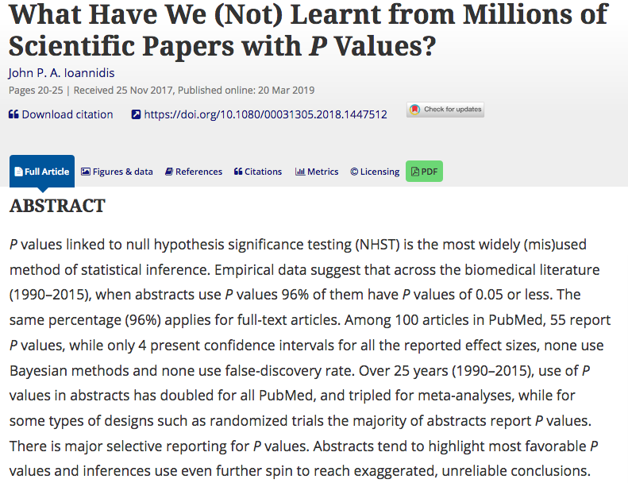
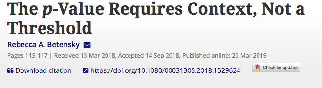
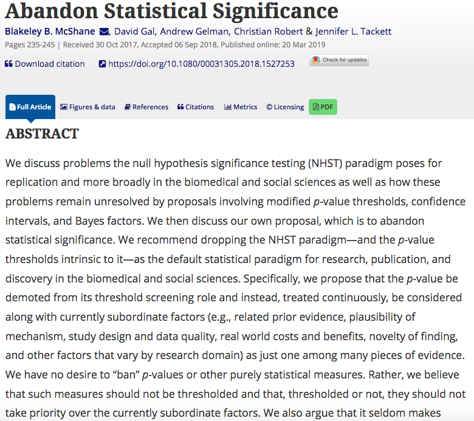
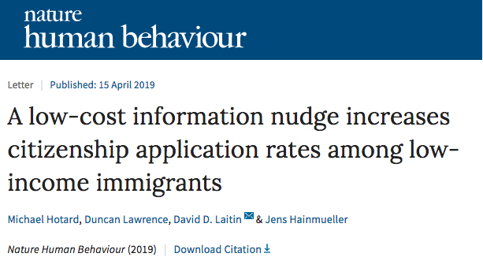
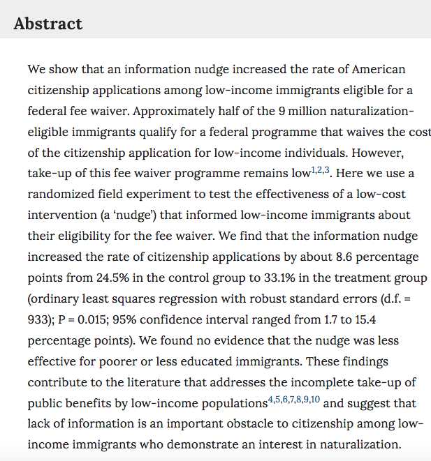
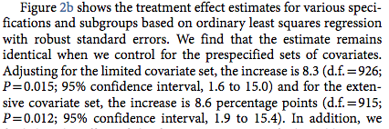
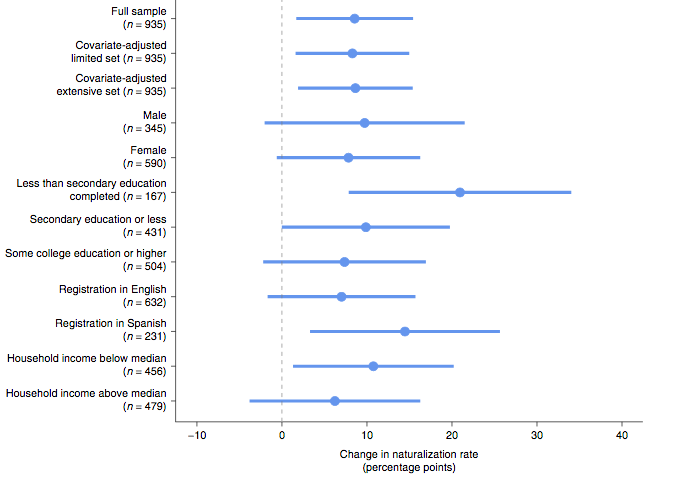

```{r setup, include=FALSE}
options(htmltools.dir.version = FALSE)
r <- getOption("repos")
r["CRAN"] <- "http://cran.cnr.berkeley.edu/"
options(repos = r)
set.seed(12345)
```

<style>

.remark-slide-number {
  position: inherit;
}

.remark-slide-number .progress-bar-container {
  position: absolute;
  bottom: 0;
  height: 6px;
  display: block;
  left: 0;
  right: 0;
}

.remark-slide-number .progress-bar {
  height: 100%;
  background-color: #EB811B;
}

.orange {
  color: #EB811B;
}
</style>

# Today's Agenda

.font150[
* Questions about final project

* Review:

  - Uncertainty
  - Standard errors
  - Confidence intervals
  - Hypothesis testing
  - Ordinary least squares regression
  - P-values
  - (Robust) Standard errors
]
---

class: inverse, center, middle

# How is the project going?

<html><div style='float:left'></div><hr color='#EB811B' size=1px width=720px></html>  
---

# Review: Uncertainty

.font150[
* It is usually unfeasible to analyse the entire population

* So if we want to test a hypothesis, we can rarely know for sure what is the value of the population .orange[parameter] $\theta$
  - How many Americans support Donald Trump?
  - If we give cash to all poor Argentinians, would their health improve?
  - How what is the effect of a new blood pressure medicine in all adult males?
  
* We must take a sample of the population of interest and estimate some quantity of interest $\hat{\theta}$
]
---

# Review: Uncertainty

.font150[
* Goal of inferential statistics: .orange[accurate and precise estimates]

  - Accurate: not very far from the true quantity of interest
  - Precise: with low levels of uncertainty
  
* In an ideal world, we should have no estimation error: $\hat{\theta} = \theta$

* But we often only have _one sample_ from our population

* We have to be clear about how .orange[uncertain] our estimates are
]
---

# Review: Standard Errors

.font150[
* The way we convey uncertainty in statistics is with .orange[standard errors]

* .orange[Standard error] is the _theoretical standard deviation_ of the population distribution

* But we do not have access to that distribution

* So we _assume_ the distribution is normal and use what we know about it

* We know that, from the mean, plus or minus 2 standard deviations cover 95% of the area of the normal distribution
]
---

# Review: Confidence Intervals

.font150[
* .orange[Confidence intervals] are a range of potential values of the unknown population parameter

* Since we do not know the true parameter value, we have to accept it might be anywhere in a given interval

* By convention, we use _2 standard errors from the model coefficient_ (both to the right and left) as our confidence interval

* It means we assume our model estimate is true, then we add uncertainty to it 
]
---

# Review: Confidence Intervals

.font150[
* Remember: confidence intervals _do not_ represent 95% chance that the interval contains the true value

* It means that, should we repeat the same experiment again and again, 95% of the time the confidence interval would contain the true population value

* But unfortunately we often just have _one_ experiment

* So, again, we assume our experiment is in the 95% that contains the true value

* Meta-analysis: collect many studies and test them together
]
---

# Review: Hypothesis Testing

.font140[
* Often are interested if one variable $X$ has an effect on another variable $Y$

  - Does capitalism cause democratisation?
  - Does oil make a country more corrupt?
  - Does foreign aid foster economic growth?
  
* So we set up two hypotheses:

  - $X$ does not have an effect on $Y = H_0$
  - $X$ does not have an effect on $Y = H_1$
  
* How are they called?]
--
.font150[
* .orange[Null and alternative hypotheses]
]
---

# Review: P-Value

.font150[
* .orange[P-value] is the chance that, if $H_0$ is true, we would observe a result like, or rarer than, the result we have at hand

* By convention, we use $p < 0.05$
  - If there is less than 5% probability we could observe a given result if there was no effect of $X$ on $Y$, we assume it is not by chance alone

* If $p < 0.05$, we say the result is _statistically significant_

* .orange[Statistical significance does not imply practical significance]
]
---

class: clear

.center[]
---

class: clear

.center[]

---

class: clear

.center[]
---

# Review: OLS and lm()

.font150[
* _But while we do not abandon p-values_...
]
--
.font150[
* ... we still have to learn how to read and use them

* `summary(model <- lm(Y ~ X, data = dataset))` shows the coefficients, standard errors and associated p-values
]
---

# OLS Example 

.font100[
```{r ols01,fig.align="center",tidy=F,warning=F,message=F,cache=T}
library(Zelig) # simulated data
data(voteincome)

summary(lm(income ~ education + age + female, data = voteincome))
```
]
---

# Review: OLS Assumptions

.font150[
* For our coefficients to be unbiased, the linear model has to meet two assumptions:

  - .orange[Exogeneity:] no omitted variable that correlates with independent variables (parents' iq and books, academic achievement)
  - .orange[Homoscedasticity:] data points should be evenly distributed along the regression line
  
* How to fix the first? And the second?
]
--
.font150[
* First: .orange[randomisation]. Why?

* Second: .orange[robust standard errors]
]
---

# Review: Robust Standard Errors

.font150[
* Fixes the problem of .orange[heteroscedasticity]
  - Distance from points to line (variance) is not constant
  
* Easy to implement: 
  - `sandwich`
  - `estimatr` 
  
* If you're running a linear model, when should you use them?
]
--
.font150[
* .orange[_Always!_]
]
---

# Review: lm_robust()

.font150[
```{r lmrob01,fig.align="center",tidy=F,warning=F,message=F,cache=T}
mortality <- read.csv("https://raw.githubusercontent.com/pols1600/pols1600.github.io/master/datasets/prediction/bivariate_data.csv")
library(estimatr)
```
]
---

# Review: lm_robust()

.font110[
```{r lmrob02,fig.align="center",tidy=F,warning=F,message=F,cache=T}
m1 <- lm_robust(Child.Mortality ~ log(GDP) + PolityIV, mortality)
summary(m1)
```
]
---

# Review: Clustered Robust SEs

.font150[
* Social science data are often organised in clusters:

  - Average SAT scores for 5 schools from 2000 to 2010
  - Gini index for 100 countries from 1945 to 2010
  - Daily blood pressure measuments for 1,000 people for 2 months
  
* _Some observations are clearly correlated with each other_: Gini index in Argentina in 1970 is correlated with the measure in 1971

* Our standard errors are biased because of that: clusters are not evenly distributed
]
---

# Review: Clustered Robust SEs

.font150[
```{r cse01,fig.align="center",tidy=F,warning=F,message=F,cache=T}
# Downlad Fearon and Laitin (2003) data

temp <- tempfile() # create temporary file
download.file("https://web.stanford.edu/group/ethnic/publicdata/repdata.zip", temp)
library(haven) # read Stata .dta
civilwars <- read_dta(unz(temp, "repdata.dta"))
unlink(temp)
```
]
---

# Review: Clustered Robust SEs

.font150[
```{r cse02,fig.align="center",tidy=F,warning=F,message=F,cache=T}
head(civilwars[,c(5,2,20)], 10)
```
]
---

# Review: Clustered Robust SEs

.font110[
```{r cse03,fig.align="center",tidy=F,warning=F,message=F,cache=T}
# add clusters = Country.code
m1 <- lm_robust(Child.Mortality ~ log(GDP) + PolityIV,
                clusters = Country.code, data = mortality)
summary(m1)
```
]
---

class: clear

.center[]

.font150[
<https://doi.org/10.1038/s41562-019-0572-z>
]
---

class: clear

.center[]
---

class: clear

.center[]

---
class: clear

.center[]
---

class: inverse, center, middle

# Questions?

<html><div style='float:left'></div><hr color='#EB811B' size=1px width=720px></html>  
---

class: inverse, center, middle

# See you next week!

<html><div style='float:left'></div><hr color='#EB811B' size=1px width=720px></html>  
