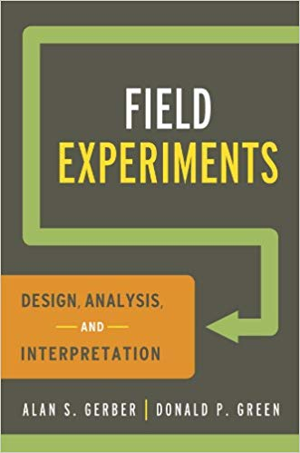

```{r setup, include=FALSE}
options(htmltools.dir.version = FALSE)
r <- getOption("repos")
r["CRAN"] <- "http://cran.cnr.berkeley.edu/"
options(repos = r)
set.seed(12345)
```

<style>

.remark-slide-number {
  position: inherit;
}

.remark-slide-number .progress-bar-container {
  position: absolute;
  bottom: 0;
  height: 6px;
  display: block;
  left: 0;
  right: 0;
}

.remark-slide-number .progress-bar {
  height: 100%;
  background-color: #EB811B;
}

.orange {
  color: #EB811B;
}
</style>

# Congratulations!

.font150[
* You've made it to the end of this course

* We've seen many things since the start of the semester

* What you've learned:
    - Two computer languages: R and Markdown
    - Plot graphs, calculate correlations, check descriptive statistics 
    - Calculate permutations, combinations and understand probability
    - Test hypotheses, run statistical models, read scientific literature
]
---

class: inverse, center, middle

# What to do next?

<html><div style='float:left'></div><hr color='#EB811B' size=1px width=720px></html>  
---

# What To Do Next?

.font150[
* Keep on learning statistics

* Improve your coding skills

* Know more about the mathematical foundations of statistical modelling

* Learn how to run different types of experiments
]
---

# More Statistics

.font130[
* [ECON 1629: Applied Research Methods for Economists](https://canvas.brown.edu/courses/1016763/assignments/syllabus)
    - Covers OLS, fixed effects, diff-in-diff, regression discontinuity, experiments (undergraduate)
    
* [ECON 1660: Big Data](https://dan.bjorkegren.com/bigdata/)
    - Introduction to machine learning with Python (undergraduate)
    
* [POLS 2000 - Strategies of Inquiry and Research Design](https://coursetools.brown.edu/syllabus/POLS:2000:2019-Spring:S01)
    - Teaches not only stats (focus on natural and lab experiments), but research design in general
    - Your current maths and R skills are _more than sufficient_ to follow this course
    - Ask for permission to attend: graduate students only
]
---

# More Statistics

.font150[
* [Coursera: Data Science Specialisation](https://www.coursera.org/specializations/jhu-data-science)
    - R, Git, build basic machine learning algorithms (10 modules)
    
* [Coursera: Deep Learning Specialisation](https://www.coursera.org/specializations/deep-learning)
    - More advanced (requires introductory linear algebra and calculus)
    - Build your own neural networks and other artificial intelligence algorithms (5 courses)
]
---

# More Programming

.font150[
* [DataCamp](https://www.datacamp.com/)
    - Best website I know to learn R, Python, SQL, and other data science skills
    - "Career tracks" are _very_ good
]
.center[]
---

# More Mathematics

.font150[
* [Khan Academy](https://www.khanacademy.org/)
    - Modules on (pre-)calculus, linear algebra and probability
    
* Any maths course from the Econ department
    - List of courses [here](https://bulletin.brown.edu/the-college/concentrations/mtec/)
]
---

# More Experiments

.center[]

.font150[
* [ICPSR Summer school](https://www.icpsr.umich.edu/icpsrweb/sumprog/) 

* [Summer course in field experiments (Florence, Italy)](https://www.icpsr.umich.edu/icpsrweb/sumprog/courses/0259)
]
---

class: inverse, center, middle

# Presentation #1

<html><div style='float:left'></div><hr color='#EB811B' size=1px width=720px></html>  
